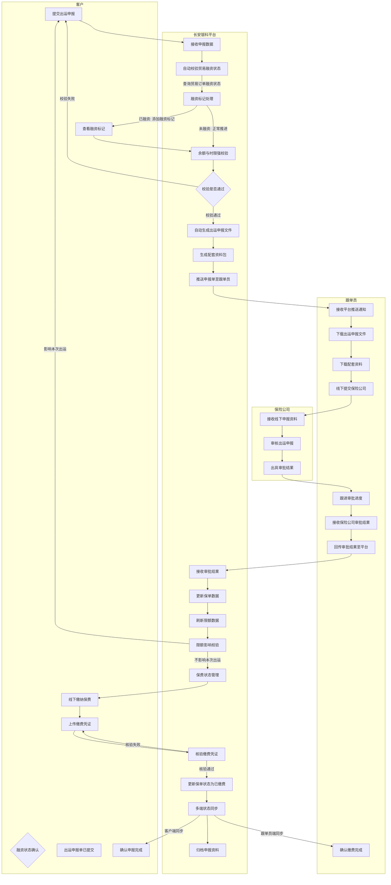
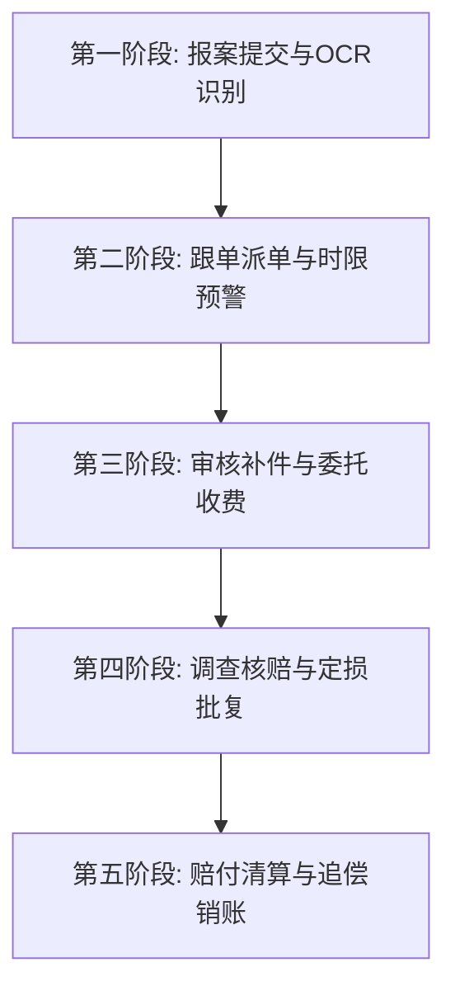

# 长安银科保险管理系统 - 产品原型设计文档

> 版本：v2.8
> 更新日期：2026-05-22
> 依据：原始需求字段信息.md

***

## 一、产品业务流程图

### 1.1 保险投保流程涌道图

```C
flowchart TD
    subgraph 客户
        A1[开始] --> A2[填写投保需求]
        A2 --> A3[提交基础信息]
        A3 --> A4[提交买方信息]
        A4 --> A5[提交贸易信息]
        A5 --> A6[提交投保信息]
        A6 --> A7[审核进度跟踪]
        A7 --> A8{审核结果}
        A8 -->|通过| A9[保单生成]
        A8 -->|驳回| A10[修改资料]
        A10 --> A3
        A9 --> A11[支付保费]
        A11 --> A12[保单生效]
    end
    
    subgraph 长安银科平台
        B1[接收投保申请] --> B2[投保资料数字化]
        B2 --> B3[资料初审]
        B3 --> B4[生成投保单]
        B4 --> B5[提交保险公司]
        B5 --> B6[跟踪审核进度]
        B6 --> B7[反馈审核结果]
        B7 --> B8[保单登记归档]
    end
    
    subgraph 跟单员
        C1[客户资料审查] --> C2[买方资质核实]
        C2 --> C3[贸易背景真实性核查]
        C3 --> C4[补充资料请求]
        C4 --> C5[资料完整性确认]
        C5 --> C6[提交平台审核]
    end
    
    subgraph 保险公司
        D1[接收投保单] --> D2[买方资信调查]
        D2 --> D3[信用限额审批]
        D3 --> D4[核保出单]
        D4 --> D5[保费计算]
        D5 --> D6[出具保单]
    end
    
    A6 --> B1
    B2 --> C1
    C6 --> B5
    B5 --> D1
    D6 --> B8
    B7 --> A7
```

**流程说明：**

| 阶段   | 角色   | 关键任务             | 输出物    |
| ---- | ---- | ---------------- | ------ |
| 投保申请 | 客户   | 填写投保需求、提交企业及买方信息 | 投保申请单  |
| 资料初审 | 跟单员  | 审查资料完整性、核实买方资质   | 审核意见   |
| 资信调查 | 保险公司 | 买方资信评估、信用限额审批    | 资信调查报告 |
| 核保出单 | 保险公司 | 风险评估、保费计算、出具保单   | 正式保单   |
| 保费支付 | 客户   | 缴纳保费             | 缴费凭证   |
| 保单生效 | 平台   | 保单登记、状态更新        | 生效保单   |

### 1.2 保单管理流程涌道图

```C
flowchart TD
    subgraph 客户
        A1[保单查询]
        A2[信用限额申请]
        A3[出运申报]
        A4[保费缴纳]
        A5[收汇跟踪]
        A6{收汇结果}
        A7[保单变更申请]
        A8[续保申请]
        A9[资料补充]
        A10[确认变更]
        A11[确认续保]
        A12[启动理赔]
    end
    
    subgraph 长安银科平台
        B1[保单数字化管理]
        B2[限额申请受理]
        B3[资料完整性校验]
        B4{资料是否完整}
        B5[出运申报校验]
        B6[保费状态管理]
        B7[收汇监控]
        B8[逾期预警]
        B9[理赔触发]
        B10[保单变更处理]
        B11[变更审批]
        B12[续保管理]
        B13[空窗期监控]
        B14[系统规则校验]
        B15[数据同步更新]
    end
    
    subgraph 跟单员
        C1[限额申请审核]
        C2[买方资质核实]
        C3[贸易背景核查]
        C4[出运申报复核]
        C5[保费催收提醒]
        C6[收汇跟进]
        C7[逾期案件处理]
        C8[保单变更审核]
        C9[续保协助]
        C10[补充资料请求]
        C11[资料完整性确认]
    end
    
    subgraph 保险公司
        D1[限额审批]
        D2[资信调查]
        D3[出运确认]
        D4[保费结算]
        D5[保单批改]
        D6[续保核保]
        D7[限额调整]
        D8[保单信息反馈]
    end
    
    A1 --> B1
    A2 --> B2
    B2 --> B3
    B3 --> B4
    B4 -->|是| C1
    B4 -->|否| C10
    C10 --> A9
    A9 --> B3
    C1 --> C2
    C2 --> C3
    C3 --> C11
    C11 --> D1
    D1 --> D2
    D2 -->|审批通过| D8
    D2 -->|审批驳回| A2
    D8 --> B15
    B15 --> A3
    A3 --> B5
    B5 --> B14
    B14 -->|校验通过| C4
    B14 -->|校验失败| A3
    C4 --> D3
    D3 -->|确认| B15
    B15 --> A4
    A4 --> B6
    B6 --> C5
    C5 --> D4
    D4 --> B15
    A5 --> B7
    B7 --> C6
    C6 --> A6
    A6 -->|正常| B1
    A6 -->|逾期| B8
    B8 --> B9
    B9 --> A12
    A7 --> B10
    B10 --> C8
    C8 --> B11
    B11 -->|通过| D5
    B11 -->|驳回| A7
    D5 --> B15
    B15 --> A10
    A8 --> B12
    B12 --> B13
    B13 -->|空窗期| A8
    B12 --> C9
    C9 --> D6
    D6 -->|通过| B15
    D6 -->|驳回| A8
    B15 --> A11
```

**流程说明：**

| 阶段   | 客户操作        | 长安银科平台          | 跟单员                 | 保险公司           |
| ---- | ----------- | --------------- | ------------------- | -------------- |
| 保单查询 | 查询保单状态      | 保单数字化管理         | -                   | -              |
| 限额申请 | 提交限额申请、资料补充 | 受理、资料校验         | 审核申请、核实资质、核查背景、资料确认 | 资信调查、审批限额、信息反馈 |
| 出运申报 | 提交出运信息      | 校验、规则校验、数据同步    | 复核                  | 确认出运           |
| 保费缴纳 | 缴纳保费        | 状态管理、数据同步       | 催收提醒                | 保费结算           |
| 收汇跟踪 | 跟踪收汇        | 监控、逾期预警、理赔触发    | 跟进、逾期处理             | -              |
| 保单变更 | 申请变更、确认     | 变更处理、审批、数据同步    | 审核                  | 保单批改           |
| 续保申请 | 申请续保、确认     | 续保管理、空窗期监控、数据同步 | 协助                  | 续保核保           |

**核心业务规则：**

| 规则类型   | 触发条件       | 执行动作     | 预警机制   |
| ------ | ---------- | -------- | ------ |
| 限额闲置预警 | 买方连续60天无出运 | 黄灯预警提醒   | 系统自动通知 |
| 限额自动撤销 | 买方连续90天无出运 | 限额失效     | 红灯阻断   |
| 保费未缴冻结 | 保费到期未缴     | 冻结出运申报权限 | 弹窗提示   |
| 空窗期拦截  | 保单到期未续保    | 禁止新出运申报  | 红色警告   |
| 超限额申报  | 申报金额>可用限额  | 阻断申报     | 实时校验   |

### 1.3 保险理赔流程涌道图

```C
flowchart TD
    subgraph 客户
        A1[出险报案] --> A2[提交单证材料]
        A2 --> A3[OCR识别校验]
        A3 --> A4[补充缺失资料]
        A4 --> A5[签署委托协议]
        A5 --> A6[缴纳服务费]
        A6 --> A7[跟踪理赔进度]
        A7 --> A8[接收赔付通知]
        A8 --> A9[收款确认]
    end
    
    subgraph 长安银科平台
        B1[报案受理] --> B2[自动派单]
        B2 --> B3[时限预警监控]
        B3 --> B4[资料审核]
        B4 --> B5[补件管理]
        B5 --> B6[委托收费]
        B6 --> B7[资料打包提交]
        B7 --> B8[核赔跟踪]
        B8 --> B9[赔付登记]
        B9 --> B10[RWA系统同步]
    end
    
    subgraph 跟单员
        C1[案件接单] --> C2[单证完整性审核]
        C2 --> C3[缺失资料追索]
        C3 --> C4[委托协议跟进]
        C4 --> C5[费用确认]
        C5 --> C6[资料提交保险公司]
        C6 --> C7[核赔进度跟进]
        C7 --> C8[赔付实收登记]
    end
    
    subgraph 保险公司
        D1[接收理赔资料] --> D2[海外调查]
        D2 --> D3[损失核定]
        D3 --> D4[定损批复]
        D4 --> D5[赔付计算]
        D5 --> D6[赔款划拨]
    end
    
    subgraph 融资机构
        E1[权益转让登记] --> E2[自动销账冲账]
        E2 --> E3[额度释放]
    end
    
    A1 --> B1
    B2 --> C1
    C6 --> D1
    D6 --> B9
    B9 --> E1
    B9 --> A8
```

**五阶段详细流程：**

| 阶段   | 业务描述        | 核心操作       | 时限要求   |
| ---- | ----------- | ---------- | ------ |
| 报案提交 | 客户在线发起理赔报案  | 上传单证、OCR校验 | 拖欠30日内 |
| 跟单派单 | 系统自动分配跟单员   | 派单、时限监控    | 即时     |
| 审核补件 | 核验资料完整性     | 补件追索、委托收费  | 视情况    |
| 调查核赔 | 保险公司核定损失    | 海外调查、定损批复  | 30天    |
| 赔付清算 | 划拨赔款、同步融资系统 | 实收登记、权益转让  | 15天    |

### 1.4 完整业务流程总览

```C
flowchart TD
    subgraph 投保阶段
        A1[客户投保申请] --> A2[跟单员审核] --> A3[保险公司核保] --> A4[保单生效]
    end
    
    subgraph 保单管理阶段
        A4 --> B1[限额申请] --> B2[出运申报] --> B3[保费缴纳] --> B4[收汇跟踪]
    end
    
    subgraph 理赔阶段
        B4 --> C1{收汇异常?}
        C1 -->|是| C2[出险报案] --> C3[理赔审核] --> C4[损失核定] --> C5[赔付支付]
        C1 -->|否| C6[流程完成]
    end
    
    subgraph RWA联动
        C5 --> D1[权益转让] --> D2[自动销账] --> D3[额度释放]
    end
    
    style A1 fill:#f9f,stroke:#333,stroke-width:2px
    style A4 fill:#9f9,stroke:#333,stroke-width:2px
    style C5 fill:#9f9,stroke:#333,stroke-width:2px
```

***

## 二、技术方案

### 2.1 技术栈选择

| 技术          | 选择               | 说明                |
| ----------- | ---------------- | ----------------- |
| **前端框架**    | Vue 3            | 采用Composition API |
| **UI组件库**   | TDesign Vue Next | 腾讯企业级UI组件库        |
| **构建工具**    | Vite             | 快速开发构建工具          |
| **路由管理**    | Vue Router 4     | SPA路由管理           |
| **状态管理**    | Pinia            | 轻量级状态管理           |
| **CSS预处理器** | SCSS             | 样式复用与变量管理         |

### 2.2 项目结构

```
cayk-bx-ui/
├── src/
│   ├── api/                    # API接口管理（暂为空，待实现）
│   │   └── modules/
│   │       ├── insurance.js    # 保险购买相关API（待实现）
│   │       ├── policy.js       # 保单管理相关API（待实现）
│   │       ├── claim.js        # 理赔管理相关API（待实现）
│   │       ├── clerk.js        # 跟单员管理相关API（待实现）
│   │       └── statistics.js   # 数据统计相关API（待实现）
│   ├── assets/
│   │   └── styles/             # 全局样式
│   │       └── variables.scss  # 主题变量
│   ├── components/             # 公共组件
│   │   └── common/             # 通用组件
│   │       ├── DataTable.vue
│   │       ├── DetailPanel.vue
│   │       ├── EmptyState.vue
│   │       ├── InsuranceForm.vue
│   │       ├── SearchFilter.vue
│   │       ├── StatCard.vue
│   │       └── StatusTag.vue
│   ├── layouts/
│   │   └── MainLayout.vue      # 主布局（侧边栏+内容区+角色切换）
│   ├── pages/                  # 页面组件（共22个）
│   │   ├── insurance/          # 保险购买模块（5页）
│   │   │   ├── InsurancePurchase.vue        # 投保信息管理
│   │   │   ├── InsurancePurchaseFormPage.vue # 新增投保/编辑/详情
│   │   │   ├── InsuranceApply.vue           # 投保流程管理
│   │   │   ├── InsuranceQuestionnaire.vue   # 投保问卷调查
│   │   │   └── InsuranceReport.vue          # 投保数据报表
│   │   ├── policy/             # 保单管理模块（6页）
│   │   │   ├── PolicyList.vue               # 保单信息管理
│   │   │   ├── PolicyTrade.vue              # 贸易信息管理
│   │   │   ├── CreditLimit.vue              # 信用限额管理
│   │   │   ├── ShipmentDeclare.vue          # 出运申报管理
│   │   │   ├── PolicyProcess.vue            # 流程管理
│   │   │   └── PolicyPerformance.vue        # 保单履约报表
│   │   ├── claim/              # 理赔管理模块（3页）
│   │   │   ├── ClaimList.vue                # 理赔信息管理
│   │   │   ├── ClaimProcess.vue             # 理赔流程管理
│   │   │   └── ClaimReport.vue              # 理赔报表管理
│   │   ├── clerk/              # 跟单员管理模块（4页）
│   │   │   ├── ClerkList.vue                # 跟单员信息
│   │   │   ├── ClerkPermission.vue          # 权限管理
│   │   │   ├── ClerkTask.vue                # 业务管理（含任务分配/抢单）
│   │   │   └── ClerkPerformance.vue         # 考核管理
│   │   └── statistics/         # 数据统计模块（2页）
│   │       ├── BusinessStats.vue            # 业务数据统计
│   │       └── RiskAnalysis.vue             # 风险数据分析
│   ├── router/
│   │   └── index.js            # 路由配置（共23条路由含重定向）
│   ├── stores/                 # Pinia状态管理
│   │   ├── user.js             # 用户/角色管理
│   │   └── business.js         # 业务数据（含完整CRUD和种子数据）
│   ├── App.vue
│   └── main.js
├── index.html
├── package.json
├── vite.config.js
└── README.md
```

***

## 三、导航结构设计

### 3.1 整体导航架构

采用**左侧导航栏 + 顶部Header**的经典后台管理模式。

一级导航栏新增小图标，二级导航栏无需小图标；二级导航栏位置靠中间偏左位置展示；

### 3.2 菜单项详细配置

| 一级菜单       | 一级图标         | 二级菜单     | 路由路径            | 可见角色               | 说明   |
| -------------- | ---------------- | ------------ | ------------------- | ---------------------- | ------ |
| **保险购买**   | document-popular | 投保信息管理 | /insurance/purchase | 客户、长安银科、跟单员 | <br /> |
| <br />         | <br />           | 投保数据报表 | /insurance/report   | 客户、长安银科、跟单员 | <br /> |
| <br />         | <br />           | 投保流程管理 | /insurance/apply    | 客户、长安银科、跟单员 | <br /> |
| **保单管理**   | file             | 保单信息管理 | /policy/list        | 客户、长安银科、跟单员 | <br /> |
| <br />         | <br />           | 贸易信息管理 | /policy/trade       | 长安银科、跟单员       | <br /> |
| <br />         | <br />           | 信用限额管理 | /policy/limit       | 长安银科、跟单员       | <br /> |
| <br />         | <br />           | 出运申报管理 | /policy/shipment    | 客户、长安银科、跟单员 | <br /> |
| <br />         | <br />           | 保单流程管理 | /policy/process     | 长安银科、跟单员       | <br /> |
| <br />         | <br />           | 保单履约报表 | /policy/performance | 长安银科               | <br /> |
| **保险理赔**   | error-circle     | 理赔信息管理 | /claim/list         | 客户、长安银科、跟单员 | <br /> |
| <br />         | <br />           | 理赔流程管理 | /claim/process      | 长安银科、跟单员       | <br /> |
| <br />         | <br />           | 理赔报表管理 | /claim/report       | 长安银科               | <br /> |
| **跟单员管理** | user             | 跟单员信息   | /clerk/list         | 长安银科               | <br /> |
| <br />         | <br />           | 权限管理     | /clerk/permission   | 长安银科               | <br /> |
| <br />         | <br />           | 业务管理     | /clerk/task         | 长安银科、跟单员       | <br /> |
| <br />         | <br />           | 考核管理     | /clerk/performance  | 长安银科、跟单员       | <br /> |
| **数据统计**   | chart            | 业务数据统计 | /stats/business     | 长安银科、跟单员       | <br /> |
| <br />         | <br />           | 风险数据分析 | /stats/risk         | 长安银科               | <br /> |

***

## 四、流程与状态设计

### 4.1 保险购买流程功能清单

| 流程节点         | 操作主体 | 办理时限      | 客户端资料清单                      | 平台功能支持           | 备注                                |
| ------------ | ---- | --------- | ---------------------------- | ---------------- | --------------------------------- |
| 提交投保材料       | 客户   | /         | ①企业法人营业执照 ②进出口企业资格证书 ③买方基本信息 | AI解析资料自动填充客户基本信息 | AI应用：支持客户上传资料清单，AI解析后填充至"客户基本信息"处 |
| 填写投保申请       | 客户   | /         | 《投保单》《买方信息采集表》               | 生成标准化投保文件        | 根据客户填写内容生成保险公司要求的投保单、买方信息采集表      |
| 提交补充资料       | 跟单员  | /         | 根据跟单员反馈                      | 补充资料清单管理         | 跟单员反馈补充资料清单                       |
| 资料提交         | 跟单员  | /         | 盖章版《投保单》《买方信息采集表》            | 文件审核流程           | -                                 |
| 买方资信调查       | 保险公司 | 1个月       | 买方信息、授权文件                    | 补充资料录入           | -                                 |
| 信用限额审批       | 保险公司 | 2周        | /                            | 限额审批流程           | 核准主要买家的初始信用限额                     |
| 信保核保         | 保险公司 | /         | /                            | 核保流程管理           | -                                 |
| 出具保单         | 保险公司 | /         | /                            | 保单数字化            | 生成《保单明细表》《费率表》等                   |
| **保费缴纳（新增）** | 客户   | 收到发票后10日内 | 缴费凭证                         | 缴费记录保存           | 未按期缴纳触发保单中止与风险预警                  |

### 4.2 审核审批流程设计

#### 3.2.1 整体业务说明

本流程为保险投保单线上化审批业务，分为 **C 端客户发起端**、**跟单员审核端**、**长安银科平台审核端** 三大角色链路，定义单据生命周期状态、页面功能、角色操作权限、审批动作、数据同步规则、驳回回流异常流程，统一业务口径，适配前端开发、后端逻辑、功能测试、联调验收全场景使用。

#### 3.2.2 C 端客户业务流程

**投保信息管理列表页面能力：**

- 列表统一展示客户名下所有投保单数据，支持基础信息查看、单据筛选、状态筛选
- 客户拥有 查看、编辑 自身投保单信息权限，可完善、修改投保相关资料
- 列表操作栏固定配置操作按钮：审核（原提交审核按钮改名）

**提交审核业务规则：**

- 客户完成投保信息填报与核对后，点击【审核】发起线上审批
- 提交成功后，投保单状态自动变更为 待审核
- 列表统一展示全流程状态标识，包含草稿、待审核、已驳回、审核通过
- 处于驳回状态的单据，客户可二次编辑修改内容，重新点击审核再次发起审批

**客户侧权限边界：**

- 仅可操作本人名下投保单据，无查看他人单据权限
- 无任何审核、审批、驳回权限，仅负责资料维护与提报
- 可查看平台端录入的驳回原因，作为修改依据

#### 3.2.3 跟单员审核端流程

**审核入口路径：**
跟单员进入：保险购买模块 → 投保流程管理页面，查看分配给自己的投保申请单据

**单据展示规则：**

- 页面展示客户已提报且处于 `clerk_review` 状态的投保单
- 支持按客户名称、投保时间、状态筛选
- 显示待处理数量提醒

**跟单员审核权限：**

- 可查看投保单全部详情
- 可发起补充资料请求，填写需要客户补充的资料清单
- 可提交审核至长安银科平台
- 可驳回申请（需填写驳回原因）

**审核操作规则：**

- **补充资料**：发现资料不完整时，填写补充资料清单并发送给客户，状态变更为 `pending_supplement`
- **提交审核**：资料核验无误后，提交至长安银科平台审核，状态变更为 `pending_review`
- **驳回**：投保资料不合规、信息有误，拒绝本次申请并填写驳回原因，状态变更为 `rejected`

**跟单员专属能力：**

- 查看客户历史投保记录
- 查看买方资信初步评估
- 生成补充资料清单模板

#### 3.2.4 长安银科平台端审核审批流程

**审核入口路径：**
平台运营 / 审核人员进入：保险购买模块 → 保单管理页面，统一接收全量客户提交的投保申请单据

**单据展示规则：**
页面统一展示客户已提报投保单，初始待处理状态为 待审核 / 待审批

**审核权限严格界定：**

- 平台审核角色 仅支持查看投保单全部详情 ， 禁止编辑、修改、篡改客户任何投保资料
- 无新增、删除客户投保单权限，仅做审批判定动作

**审批操作规则：**
操作栏提供两类固定审批操作，无其他冗余操作：

- 审核通过：审批核验无误，确认受理投保申请，完成本级审批流程
- 驳回：投保资料不合规、信息有误、不符合投保要求，拒绝本次申请
- 驳回 强制录入驳回原因，必填项不可空，用于客户明确整改方向

#### 3.2.5 系统状态枚举定义

| 状态     | 状态码                 | 说明                  | 操作提示        |
| ------ | ------------------- | ------------------- | ----------- |
| 暂存     | draft               | 客户保存后状态，可自由编辑修改     | 可编辑、删除      |
| 待跟单员审核 | clerk\_review       | 客户已申请投保，等待跟单员初审     | 查看进度        |
| 待补充资料  | pending\_supplement | 跟单员要求补充资料，等待客户补充    | 查看补充清单、上传资料 |
| 待平台审核  | pending\_review     | 跟单员审核通过，等待平台审批      | 查看进度        |
| 已完成    | approved            | 平台审批完成，流程正常办结       | 查看保单        |
| 已驳回    | rejected            | 平台或跟单员驳回申请，等待客户修改重提 | 可编辑、重新提交审核  |

#### 3.2.6 双向状态自动同步机制

- 跟单员或平台完成审核操作后，系统实时触发数据同步接口，自动同步状态至 C 端客户账号
- 跟单员审核通过 → 客户端状态同步更新为：待平台审核
- 跟单员要求补充资料 → 客户端状态同步更新为：待补充资料，同步展示补充资料清单
- 平台审核通过 → 客户端状态同步更新为：审核通过
- 跟单员或平台执行驳回并填写原因 → 客户端状态同步更新为：已驳回，同步展示完整驳回原因
- 所有状态变更留痕记录，后端留存操作人、操作时间、审批结果、驳回内容日志

#### 3.2.7 正常流程与异常回流流程规则

**标准正常流程：**
客户填报投保信息 → 保存草稿 → 确认无误提交审核 → 系统自动分配跟单员 → 跟单员初审 → （如需补充资料→客户补充→重新提交）→ 跟单员提交平台审核 → 平台核验通过 → 状态同步办结，流程结束

**异常驳回回流流程（跟单员驳回）：**
客户提交审核→跟单员审核不通过→录入驳回原因并驳回→C 端同步状态与原因→客户查看问题修改资料→重新提交审核→再次进入跟单员待审队列，循环直至审批通过

**异常驳回回流流程（平台驳回）：**
客户提交审核→跟单员审核通过→平台审核不通过→录入驳回原因并驳回→C 端同步状态与原因→客户查看问题修改资料→重新提交审核→再次进入跟单员待审队列，循环直至审批通过

**补充资料回流流程：**
客户提交审核→跟单员发现资料不全→发起补充资料请求→C 端同步状态与补充清单→客户补充资料→重新提交审核→跟单员再次审核

#### 3.2.8 落地通用约束（研发 & 测试通用）

- 前后端状态字段保持一致，状态流转不可逆向乱跳
- 驳回原因持久化存储，支持前端展示、后端查询、数据导出
- 审核按钮做灰度控制，草稿状态可点击，已审核通过状态置灰不可重复提交
- 平台端编辑入口全封禁，从页面层、接口层双重限制修改权限
- 所有操作行为生成操作日志，满足业务溯源、风控核查需求

### 4.3 保单管理流程功能清单

根据《保单管理流程示意图》，保单数字化及其生命周期管理涵盖**七大核心阶段**，细分为以下核心业务子流程：

**生命周期概览：**

```
保单录入/数字化（OCR+人工校对）
       ↓
    合同签署（在线电子签章）
       ↓
    保费支付（扫码/转账/在线）
       ↓
    保单生效激活（状态更新）
       ↓
 ┌───信用限额管理（申请→资信调查→审批→动态调整）───┐
 │                       ↓                           │
 │              出运申报（余额+时限校验）                │
 │                       ↓                           │
 │              保费核定与缴纳                          │
 │                       ↓                           │
 │      收汇跟踪（正常→流程完成 / 逾期→启动理赔）        │
 │                       ↓                           │
 │           保单维护（变更/续保/退保）                  │
 └─── RWA金融与资产融资平台双向同步 ───────────────────┘
```

#### 3.3.1 信用限额分配与管理流程

- **业务背景**：信用限额是贸易出运保障的生命线，涉及动态资信评估及严苛的时限控制。
- **流程步骤**：
  1. **客户发起限额申请**：客户根据贸易需求，在线录入拟交易买方名称、注册号、付款期及申请额度，提交《买方信用限额申请表》。
  2. **第三方资信评估**：平台自动触发API，调取第三方征信数据库生成海外买方评级及集中度合规检测（单一买方<=20%，单一国家<=30%）。
  3. **保险公司KYC与额度批复**：跟单员将评估单提报给合作保险公司核保人员，核保人员完成最终KYC后，在线发出限额批复函，核定可用授信限额。
  4. **额度动态调整与闲置注销（核心业务规则）**：
     - **闲置期预警**：限额生效后，若系统监测到某买方**连续60天**无任何出运申报，自动标记“黄灯闲置预警”，提醒客户经理或客户做一笔小额出运申报以保活。
     - **闲置期撤销**：若**连续90天**（3个月）无任何出运申报，系统触发**强阻断红灯逻辑**，限额自动撤销。再次交易必须重新发起限额申请及资信调查。
     - **限额冻结/下调**：买方发生拖欠逾期或风险信号时，保险公司在线一键冻结/调低限额，系统立刻限制其新增出运申报，但此前已申报部分仍受保障。

#### 3.3.2 出运申报与时限校验流程

- **业务背景**：货物实际发运后，客户必须在约定期限内完成申报，系统自动校验融资状态并生成申报资料，经平台推送至跟单员线下提交保险公司审批，审批通过后联动更新保单及限额数据，引导客户完成保费缴纳。

- **完整业务流程**：



- **流程步骤详解**：

  1. **客户提交申报**：客户发运货物后，在系统录入发票号、发票金额、出运日期、贸易付款期限等基本信息，关联有效买方及保单号后提交出运申报。

  2. **融资状态自动校验**（新增）：
     - 系统自动查询该笔贸易订单在RWA（应收账款资产融资）管理平台中的融资状态。
     - **已融资**：系统自动在申报单上添加"已融资"标记，关联融资合同编号，后续保费缴纳及理赔流程同步融资标记。
     - **未融资**：正常推进申报流程，不添加额外标记。

  3. **余额与时限强校验**：
     - **余额校验**：系统自动计算`本次申报金额`≤`该买方可用信用限额`。若超额，自动弹窗超限阻断，提示补充申请增额。
     - **时限校验**：系统检测发运日期，必须在出运日后10个工作日内（香港买方为3天内）提交申报，超时提交触发迟申报橙色预警，自动标记"理赔风险提示"。
     - **保费冻结校验**：检测该保单保费缴纳状态，若保费逾期未缴则冻结出运申报权限。
     - **空窗期校验**：检测保单续保状态，若处于空窗期则拦截申报。

  4. **申报资料自动生成**（新增）：
     - 校验通过后，系统自动调用模板引擎生成标准化《出运申报文件》（PDF格式）。
     - 同步生成配套资料包，包括：
       - 《出运申报单》- 含申报编号、买方信息、出运详情、金额等
       - 《商业发票清单》- 关联的发票明细汇总
       - 《限额使用报告》- 当前买方限额余额及使用率
       - 《出运申报汇总表》- 可导出Excel格式
     - 所有生成文件自动归档至该笔申报记录的"资料附件"列表。

  5. **平台推送至跟单员**（新增）：
     - 系统自动将申报单及全套生成资料推送至跟单员工作台。
     - 跟单员接收平台推送通知，在线预览/下载所有申报文件。
     - 跟单员线下将纸质/电子资料提交至保险公司进行审批。

  6. **保险公司线下审批**（新增）：
     - 保险公司接收申报资料后完成审核。
     - 跟单员跟进审批进度，获取保险公司审批结果（通过/驳回）。
     - 跟单员将审批结果回传至平台，录入保险公司意见。

  7. **保单数据更新与限额联动**（新增）：
     - 平台接收审批结果后，自动更新关联保单的申报记录状态。
     - **限额数据刷新**：系统自动计算并更新该买方已用限额及剩余可用限额。
     - **限额影响校验**：刷新后系统自动检测限额是否影响本次出运（若因其他申报占用导致限额不足，触发预警提示）。
     - 保单数据同步更新至客户端和跟单员端。

  8. **保费缴纳与凭证上传**：
     - 客户收到保费通知后，线下完成保费缴纳。
     - 客户在系统上传缴费凭证（银行回单/转账截图等），填写缴费日期、金额、流水号。
     - 平台对缴费凭证进行核验：
       - 核验缴费金额是否与保费通知单一致。
       - 核验缴费账户信息是否匹配。
       - 核验通过后，更新保单保费状态为"已缴费"。

  9. **多端状态同步**（新增）：
     - 保单状态更新为"已缴费"后，系统自动同步至：
       - **客户端**：显示"缴费完成"，可查看缴费凭证归档记录。
       - **跟单员端**：显示"缴费完成"，可查看缴费确认详情。
       - **平台端**：完整记录缴费凭证及核验日志。

**出运申报状态定义：**

| 状态编码 | 状态名称 | 说明 | 触发条件 | 操作角色 |
| ------- | -------- | ---- | -------- | -------- |
| pending_declare | 待申报 | 货物已出运，待提交申报 | 货物发运后 | 客户提交申报 |
| declaring | 申报中 | 申报资料整理中 | 客户开始填写 | 客户编辑资料 |
| declared | 已申报 | 已提交申报，待平台处理 | 客户提交成功 | 系统自动进入下一状态 |
| sd_platform_review | 平台校验中 | 系统进行融资校验和规则校验 | 客户提交后自动触发 | 系统自动处理 |
| sd_finance_checked | 融资校验完成 | 已完成融资状态校验 | 系统校验完成后 | - |
| sd_docs_generated | 资料已生成 | 申报文件及配套资料已生成 | 校验通过后自动生成 | 系统自动处理 |
| sd_clerk_pending | 待跟单员处理 | 已推送至跟单员 | 资料生成后自动推送 | 跟单员下载提交 |
| sd_insurer_review | 保险公司审批中 | 资料已提交至保险公司 | 跟单员提交后 | 保险公司审批 |
| sd_insurer_approved | 保险公司已通过 | 保险公司审批通过 | 审批通过 | 跟单员回传结果 |
| sd_insurer_rejected | 保险公司已驳回 | 保险公司驳回申报 | 审批驳回 | 跟单员回传结果 |
| sd_limit_updated | 限额已更新 | 限额数据已完成刷新 | 审批结果回传后 | 系统自动处理 |
| pending_premium | 待支付保费 | 等待客户缴纳保费 | 限额更新完成后 | 客户线下缴费 |
| premium_uploaded | 凭证已上传 | 客户已上传缴费凭证 | 客户上传凭证后 | 平台核验凭证 |
| premium_verified | 凭证已核验 | 缴费凭证核验通过 | 核验通过后 | 平台更新状态 |
| completed | 已完成 | 出运申报全部完成 | 状态同步完成后 | 流程结束 |

**出运申报流程操作说明：**

| 角色 | 可执行状态 | 操作名称 | 操作说明 |
| ---- | --------- | -------- | -------- |
| 客户 | pending_declare / declaring | 提交出运申报 | 填写出运信息和发票信息后提交 |
| 客户 | sd_insurer_rejected | 查看驳回原因 | 查看保险公司驳回意见并重新申报 |
| 客户 | pending_premium | 线下缴纳保费 | 线下完成保费缴纳 |
| 客户 | pending_premium | 上传缴费凭证 | 上传银行回单/转账截图等凭证 |
| 跟单员 | sd_clerk_pending | 下载出运申报文件 | 下载系统生成的申报文件及配套资料 |
| 跟单员 | sd_clerk_pending | 下载配套资料 | 下载限额报告、发票清单等资料 |
| 跟单员 | sd_clerk_pending | 线下提交保险公司 | 将资料线下提交保险公司审批 |
| 跟单员 | sd_insurer_review | 跟进审批进度 | 跟进保险公司审批进度 |
| 跟单员 | sd_insurer_approved | 回传审批通过结果 | 录入保险公司通过意见 |
| 跟单员 | sd_insurer_rejected | 回传审批驳回结果 | 录入保险公司驳回意见 |
| 跟单员 | premium_verified | 确认缴费完成 | 确认客户缴费已完成 |
| 系统 | declared → sd_platform_review | 自动校验融资状态 | 查询RWA平台融资状态并标记 |
| 系统 | sd_finance_checked → sd_docs_generated | 自动生成申报资料 | 调用模板引擎生成PDF及配套资料 |
| 系统 | sd_docs_generated → sd_clerk_pending | 自动推送至跟单员 | 推送给跟单员工作台 |
| 系统 | sd_insurer_approved → sd_limit_updated | 自动更新限额数据 | 刷新限额并检测影响 |
| 系统 | premium_verified → completed | 多端状态同步 | 客户端、跟单员端同步更新 |

**融资校验规则：**

| 校验项 | 规则说明 | 结果 | 标记 |
| ------ | -------- | ---- | ---- |
| 融资状态查询 | 根据关联贸易订单编号查询RWA平台融资状态 | 已融资 / 未融资 | 已融资标记 + 融资合同编号 |
| 已融资标记 | 申报单标记"已融资"，关联融资合同编号 | 添加标记 | 后续流程同步融资状态 |
| 未融资处理 | 未查询到融资记录，正常推进申报 | 无标记 | - |

**系统自动生成资料清单：**

| 资料名称 | 格式 | 内容说明 | 生成方式 |
| -------- | ---- | -------- | -------- |
| 出运申报单 | PDF | 申报编号、买方信息、出运详情、金额、币种 | 系统模板自动生成 |
| 商业发票清单 | PDF | 关联发票号、发票金额、发票日期明细 | 系统模板自动生成 |
| 限额使用报告 | PDF | 当前买方限额余额、已用额度、使用率 | 系统从数据自动生成 |
| 出运申报汇总表 | Excel | 可导出的批量申报汇总数据 | 系统自动生成 |
| 融资状态确认函（可选） | PDF | 已融资时附加的融资状态证明 | 系统自动生成 |

***

#### 3.3.3 保单变更（批改）流程

- **业务背景**：保单执行期间，由于被保险人名称、联系方式、新增买方或费率变动，需发起保单变更。
- **流程步骤**：
  1. **提出变更申请**：客户在线录入变更内容（如变更被保险人、新增买方、调整费率额度等），上传证明材料。
  2. **平台生成变更表单**：系统自动调用数据填充，生成标准《保险合同变更申请书》。
  3. **跟单员核验与上报**：跟单员对客户上传的盖章变更材料进行真实性审查，审核通过后提交给保险公司。
  4. **保险公司批复与批单生成**：保险公司审批通过后出具《批单》，系统完成结构化数据覆盖，变更正式生效。

#### 3.3.4 保险续保流程

- **业务背景**：保单通常有效期为12个月，为避免保障出现"空窗期"，需提前触发续保。
- **流程步骤**：
  1. **到期预警**：保单止期**前30天**，系统后台任务自动向客户及跟单员发送续保通知，限额列表同步展示"即将到期"标签。
  2. **续保评估与买方清理**：客户提起续保申请，系统自动生成上一年度的限额利用率与赔付率报表。低于50%利用率的活跃限额提示进行缩减清理，赔付率超60%的触发续保费率上浮预警。
  3. **核保出单**：跟单员将续保申请提交至保险公司，保险公司完成审批并开具新一年度的保单。
  4. **空窗期校验拦截**：若原保单已到期且新保单未成功激活，系统强制拦截此期间的所有出运申报，提醒客户续保未完成前无法获得保障。

**续保申请状态定义：**

| 状态编码 | 状态名称 | 说明 | 触发时机 | 角色操作 |
| ------- | -------- | ---- | -------- | -------- |
| renew_inkasso_review | 平台审核 | Inkasso平台对待续保申请进行初审 | 客户提交续保申请后 | Inkasso生成续保资料、推送给跟单员 |
| renew_supplement | 待补充资料 | 需要补充相关材料 | 资料不全时 | Inkasso推送客户补充资料 |
| renew_customer_supplement | 客户补充资料 | 客户正在补充材料 | 客户开始补充 | 客户上传补充资料 |
| renew_customer_supplemented | 补充资料完成 | 客户补充材料完成 | 客户提交补充材料 | 客户推送平台审核 |
| renew_platform_review | 平台审核 | Inkasso平台对补充材料进行复核 | 客户提交审核后 | Inkasso审核通过 |
| renew_clerk_review | 跟单员审核 | 跟单员对续保申请进行审核 | 平台审核通过后 | 跟单员审核通过/驳回 |
| renew_clerk_resubmit | 待重新提交 | 跟单员审核后重新提交至保险公司 | 跟单员审核通过后 | 跟单员提交续保申请 |
| renew_insurer_review | 保险公司审核 | 保险公司对续保申请进行核保 | 跟单员提交后 | 保险公司审核批准/驳回 |
| renew_insurer_approved | 保险公司已批准 | 保险公司批准续保 | 核保通过 | 跟单员同步新保单信息 |
| renew_insurer_rejected | 保险公司已驳回 | 保险公司驳回续保申请 | 核保未通过 | 跟单员发起补充请求 |
| renew_active | 已生效 | 新保单已生效 | 新保单同步完成 | Inkasso发起保费交纳 |
| renew_pending_payment | 待缴费 | 等待客户缴纳保费 | 保单生效后 | 客户上传缴费凭证 |
| renew_payment_uploaded | 凭证已上传 | 客户已上传缴费凭证 | 客户上传凭证后 | Inkasso维护缴费凭证 |
| renew_payment_verified | 凭证已验证 | 缴费凭证已验证 | Inkasso确认凭证后 | 跟单员同步缴费信息 |
| renew_paid | 已缴费 | 续保保费已完成缴纳 | 缴费同步完成 | 流程结束 |

**续保流程操作说明：**

| 角色 | 可执行状态 | 操作名称 | 操作说明 |
| ---- | --------- | -------- | -------- |
| Inkasso | renew_inkasso_review（无资料） | 生成续保资料 | 生成续保申请书及相关附件 |
| Inkasso | renew_inkasso_review（有资料） | 推送给跟单员 | 将续保申请推送给跟单员进行审核 |
| Inkasso | renew_supplement | 推送客户补充资料 | 通知客户补充所需材料 |
| Inkasso | renew_platform_review | 审核通过 | 审核客户补充的材料并通过 |
| Inkasso | renew_active | 保费交纳申请 | 发起保费缴纳流程 |
| Inkasso | renew_payment_uploaded | 维护缴费凭证 | 验证和维护缴费凭证信息 |
| 跟单员 | renew_clerk_review | 审核通过 | 审核续保申请并批准 |
| 跟单员 | renew_clerk_review | 驳回 | 驳回续保申请并说明原因 |
| 跟单员 | renew_insurer_review | 保险公司批准 | 确认保险公司审批结果 |
| 跟单员 | renew_insurer_review | 保险公司驳回 | 记录保险公司驳回原因 |
| 跟单员 | renew_insurer_approved | 同步新保单 | 同步保险公司出具的新保单信息 |
| 跟单员 | renew_insurer_rejected | 发起补充请求 | 要求客户补充相关材料重新申请 |
| 跟单员 | renew_clerk_resubmit | 提交续保申请 | 将续保申请重新提交至保险公司 |
| 跟单员 | renew_payment_verified | 同步缴费凭证 | 同步确认缴费凭证信息 |
| 客户 | renew_customer_supplement | 补充材料 | 上传补充的相关材料 |
| 客户 | renew_customer_supplemented | 推送平台审核 | 将补充材料提交平台审核 |
| 客户 | renew_pending_payment | 上传缴费凭证 | 上传保费缴纳凭证 |

**续保资料清单：**

| 资料类型 | 资料名称 | 说明 | 生成方式 |
| ------- | -------- | ---- | -------- |
| 续保申请书 | 续保申请书.pdf | 正式的续保申请文件 | 系统自动生成 |
| 买方清单 | 买方清单.xlsx | 最新的买方信息及限额 | 系统自动生成 |
| 交易数据 | 年度交易数据.xlsx | 过去12个月的交易记录 | 系统自动生成 |
| 补充材料1 | 营业执照.pdf | 企业营业执照 | 客户上传 |
| 补充材料2 | 最新财务报表.pdf | 最近一期的财务报表 | 客户上传（可选）|

#### 3.3.5 保险退保流程

- **业务背景**：客户因业务调整需提前终止保单，按未到期天数比例进行结算退保。
- **流程步骤**：
  1. **发起退保**：客户提前30天书面申请，在线填写退保原因，上传保单正本扫描件与盖章《退保申请书》。
  2. **跟单员初审**：跟单员审查未完成结案的理赔单，确认无在审理赔后上报保险公司。
  3. **保费结算**：保险公司按保单短期费率扣除已生效保费，自动计算应退保费金额。
  4. **退费派发与注销**：确认退款到账后，系统将保单状态更改为 `surrendered`（退保/已注销），所有关联的买方限额自动注销，并同步将结算凭证归档至RWA（应收账款资产融资）管理平台。

### 4.4 保单管理全量规则清单

| 序号 | 管理模块  | 规则类型            | 触发条件                    | 执行主体    | 变动规则                                            | 风险预警                  | 企业需提交资料/申请文件                                                                                                               | 保险公司产出/批复文件                               |
| :- | :---- | :-------------- | :---------------------- | :------ | :---------------------------------------------- | :-------------------- | :------------------------------------------------------------------------------------------------------------------------- | :---------------------------------------- |
| 1  | 限额管理  | 初始限额申请          | 投保时（出单前）                | 企业      | 企业提交买方清单及拟申请限额→保险公司资信调查后批复初始限额                  | —                     | 1.买方清单（含买方全称、国别、地址、合作年限） 2.各买方过去12个月交易额 3.各买方拟申请信用限额 4.各买方付款条件/账期 5.买方资质证明（可选） 6.历史交易记录（可选）                                | 1.信用限额批复函/通知书 2.已批复信用限额明细表 3.买方资信调查报告（内部） |
| 2  | 限额管理  | 出运申报限额校验        | 企业提交出运申报时               | 系统自动    | IF(本次申报金额>买方剩余可用限额)→申报失败                        | 申报时实时弹窗提示"超限额"        | 出运申报数据（发票号、金额、出运日期、买方）                                                                                                     | 申报结果反馈（通过/拒绝+原因）                          |
| 3  | 限额管理  | 新增买方限额申请        | 开发新客户/拟出运前              | 企业      | 提交新买方信息+拟申请限额→资信调查(最长1个月)→审批后新增限额               | 建议提前15-30天申请，预留资信调查周期 | 1.信用额度申请表 2.买方全称（中/英文）、注册地址、国别 3.买方注册号/税号（如有） 4.预计未来12个月赊销总额 5.付款条件（账期天数） 6.申请信用限额金额 7.买方联系方式（可选） 8.买方资质证明（可选） 9.担保方信息（如有） | 1.信用限额批复函/通知书 2.资信调查报告（内部）                |
| 4  | 限额管理  | 增额申请            | 预计交易额超出原限额时             | 企业      | 提交调增申请+历史交易记录/买方财务信息佐证→重新核保→批复(可调高/维持/降低)       | 原限额即将用尽时触发预警          | 1.信用额度调增申请书 2.历史良好交易记录（近12个月） 3.买方财务信息/资信证明（可选） 4.新签贸易合同/订单（可选）                                                            | 1.信用限额调增批复函 2.保费调整通知（如需加费）                |
| 5  | 限额管理  | 单一买方集中度限制       | 限额申请/出运申报时              | 系统自动    | 单一买方限额≤保险总金额的20%(CPIC)；单一国家限额≤保险总金额的30%(CPIC)   | 超集中度时系统拒批/阻止申报        | —                                                                                                                          | 系统自动校验结果提示                                |
| 6  | 限额管理  | 限额冻结/下调         | 买方出现逾期、风险信号时            | 保险公司    | 保险公司主动冻结或调减该买方限额→已出运未收汇部分仍受保障→新出运不可使用原限额        | 买方逾期30天以上触发监控         | 1.买方交易与收汇情况说明 2.与买方沟通记录（如需申诉）                                                                                              | 1.限额冻结/下调通知书 2.风险预警通知                     |
| 7  | 限额管理  | 限额撤销-闲置触发       | 限额获批后连续3个月内未就该买方申报出运    | 系统自动    | 该限额自动撤销→再次交易需重新申请限额(重新资信调查)                     | 闲置2个月时触发黄灯预警(60天预警线)  | 无需提交（系统自动执行）                                                                                                               | 限额自动撤销通知书                                 |
| 8  | 限额管理  | 限额到期失效          | 保单年度到期时                 | 系统自动    | 所有限额有效期与保单期间一致(通常12个月)→到期同步失效→续保后重新核定或结转        | 保单到期前30天触发限额到期预警      | 1.续保申请书 2.更新后的买方清单 3.各买方最新交易数据                                                                                             | 1.新保单 2.新限额批复明细表                          |
| 9  | 限额管理  | 非取消限额保护         | 已批复非取消限额的买方             | 系统标记    | 裕利安宜/安裕提供：已审批买方限额不可单方取消                         | —                     | —                                                                                                                          | 非取消限额确认函                                  |
| 10 | 闲置期管理 | 限额闲置预警          | 某买方距上次出运已超60天           | 系统自动    | 系统标记"闲置预警"，通知客户经理                               | 60天闲置标记→通知客户          | —                                                                                                                          | 系统预警通知                                    |
| 11 | 闲置期管理 | 限额自动撤销          | 限额获批后连续3个月(90天)内无任何出运申报 | 系统自动    | 该买方限额自动撤销→发送撤销通知→再次交易需重新申请+重新资信调查               | 90天自动撤销→通知客户          | —                                                                                                                          | 限额撤销通知书                                   |
| 12 | 闲置期管理 | 保活申报            | 闲置接近3个月但仍可能交易           | 企业      | 企业做一笔小额出运申报→闲置天数清零→限额维持有效                       | —                     | 小额出运申报数据                                                                                                                   | 申报确认回执                                    |
| 13 | 闲置期管理 | 主动释放限额          | 确认不再交易的买方               | 企业      | 企业通知保险公司撤销该买方限额→释放额度空间→优化买方清单                   | —                     | 限额撤销申请书                                                                                                                    | 限额撤销确认函                                   |
| 14 | 闲置期管理 | 续保前闲置清理         | 保单到期前1个月                | 企业/系统   | 清理长期闲置买方→若大量限额闲置，续保时保险公司可能要求缩减买方清单或调低保额         | —                     | 更新后的买方清单                                                                                                                   | —                                         |
| 15 | 闲置期管理 | 闲置影响保费利用率       | 保单年度结算时                 | 系统自动    | 限额利用率=实际申报额÷已批复限额总额×100%。利用率<50%→续保时建议缩减清单      | —                     | —                                                                                                                          | 年度保费结算报告                                  |
| 16 | 期限管理  | 保险期间起算          | 保单生效日零时                 | 系统自动    | 保险期间=12个月→所有有效期/时限均以此为基准锚点                      | —                     | —                                                                                                                          | —                                         |
| 17 | 期限管理  | 出运申报期限          | 货物实际出运日                 | 系统自动    | 必须于出运日后10个工作日内申报(行业通用)。日申报:3个工作日；月申报:次月10日前     | 超期未申报触发逾期预警           | 出运数据                                                                                                                       | 申报确认                                      |
| 18 | 期限管理  | 应付款日计算          | 出运日+信用期限(账期天数)          | 系统自动    | 应付款日=出运日+买方信用期限天数→以此为逾期判断的起算点                   | —                     | —                                                                                                                          | —                                         |
| 19 | 期限管理  | 逾期状态判定          | 应付款日+1天起                | 系统自动    | 应付款日次日未收汇→进入逾期状态→按逾期天数分段监控                      | 逾期标记+颜色预警             | —                                                                                                                          | —                                         |
| 20 | 报损管理  | 拖欠风险报损触发        | 逾期>90天(拖欠)或知道买方破产/拒收时   | 企业      | 逾期≥90天→触发"拖欠风险"→企业必须在此后5个工作日内报损                 | 逾期90天强提醒              | 拖欠说明/相关证据                                                                                                                  | 报损受理回执                                    |
| 21 | 报损管理  | 出险通知期限          | 知道或应当知道风险发生后            | 企业      | 5个工作日内通知保险公司。拖欠风险:发生之日起30日内报损。其他风险:10个工作日内报损    | 各级时限预警                | 出险通知书                                                                                                                      | 报损受理回执                                    |
| 22 | 报损管理  | 索赔申请期限          | 损失发生日                   | 企业      | 损失发生后60天内提交索赔申请。拖欠:应付款日后60天内。最晚不超应付款日后120天      | 到期前15天黄灯预警            | 1.索赔申请书 2.证明文件                                                                                                             | 索赔受理回执                                    |
| 23 | 期限管理  | 保单到期处理          | 保单止期24时                 | 系统自动    | 保单终止→所有限额同步失效→未收汇部分若已申报仍受原保单保障→新出运需等续保生效        | 到期前30天预警              | —                                                                                                                          | 保单到期通知                                    |
| 24 | 续保管理  | 续保申请启动          | 保单到期前30天(建议)            | 企业/系统   | 提交续保申请→保险公司重新核保(评估赔付率/限额利用率)→新保单生成→限额重新核定/结转    | 到期前30天提醒              | 1.续保申请书 2.更新后的买方清单 3.各买方最新交易数据                                                                                             | 1.新保单 2.新限额批复明细表                          |
| 25 | 续保管理  | 续保空窗期处理         | 原保单到期日←→新保单生效日          | 系统自动    | 空窗期内原则上无保障覆盖→出运不可申报，即使申报也不受保障                   | 空窗期红色警告               | —                                                                                                                          | —                                         |
| 26 | 保费管理  | 保费计算            | 投保时                     | 系统自动    | 保费=预计可保营业额×投保比例(最高90%)×适用费率(0.5%-1.8%)          | —                     | 投保数据                                                                                                                       | 保费通知单                                     |
| 27 | 保费管理  | 保费缴纳时限          | 收到保费通知后                 | 企业      | PICC:保费通知到达后10个工作日内足额缴纳。行业通用:保单生效后30天内          | 到期前7天自动提醒             | 保费缴款凭证                                                                                                                     | 保费到账确认函                                   |
| 28 | 保费管理  | 保费缴费状态校验        | 企业提交出运申报时               | 系统自动    | IF(缴费状态=未缴且当前日期>缴费到期日)→冻结该保单下所有出运申报权限           | 申报时实时弹窗"保费未缴，出运已冻结"   | —                                                                                                                          | 冻结/解冻通知                                   |
| 29 | 保费管理  | 年度保费结算          | 保单到期时                   | 系统自动    | 实际申报额>预计额→追收差额保费。实际申报额<预计额→通常不退费(最低保费制)         | —                     | —                                                                                                                          | 年度保费结算单                                   |
| 30 | 保费管理  | 新增高限额买方加费       | 新增买方限额导致整体风险敞口显著扩大时     | 保险公司    | 核保评估→若风险敞口扩大→要求加收保费→企业确认后生效                     | 加费通知                  | 新买方限额资料                                                                                                                    | 保费调整通知                                    |
| 31 | 续保管理  | 高赔付率导致续保费率上调    | 续保时上年赔付率>60%            | 保险公司    | IF(赔付率>60%)→续保费率上浮(上浮幅度视赔付严重程度而定)               | 续保报价说明                | —                                                                                                                          | 续保费率调整通知                                  |
| 32 | 续保管理  | 限额利用率低导致续保费率优化  | 续保时限额利用率<50%            | 保险公司    | 保险公司可能要求缩减买方清单/调低保额→保费相应下调                      | 续保建议                  | —                                                                                                                          | 续保优化方案                                    |
| 33 | 退保管理  | 退保处理            | 企业主动退保【提前30日书面通知】       | 企业/保险公司 | 按短期费率计算退费→已生效期间按短期费率扣除→退还剩余保费。生效时间越长，退费比例越低     | —                     | 1.退保申请书 2.原保单正本 3.缴费凭证                                                                                                     | 1.退保批单 2.退费通知                             |
| 34 | 出运申报  | 出运申报提交          | 货物发运后                   | 企业      | 提交申报数据(发票号、金额、出运日期、买方、付款条件等)→系统校验限额余额→通过后计入已用额度 | —                     | 出运申报数据+附件                                                                                                                  | 申报结果反馈                                    |
| 35 | 出运申报  | 限额余额校验          | 申报时                     | 系统自动    | IF(申报金额≤买方剩余限额)→通过 ELSE→拒绝                      | 超限弹窗提示                | —                                                                                                                          | 校验结果                                      |
| 36 | 出运申报  | 逾期申报            | 超过申报期限后补报               | 企业      | 迟申报的，申报前已发生风险或损失的，保险公司原则上不承担赔偿责任                | 逾期申报风险提示              | 迟申报说明+证明                                                                                                                   | 迟申报受理回执                                   |
| 37 | 闲置期管理 | 限额闲置→撤销→重新申请    | 限额连续3个月未使用              | 企业      | 撤销→需重新资信调查(最长1个月)→审批后重新生效                       | —                     | 重新限额申请全套资料                                                                                                                 | 新限额批复                                     |
| 38 | 理赔管理  | 申报→逾期→报损→索赔     | 出运后收汇异常                 | 企业/系统   | 出运申报→应付款日未收→逾期>90天→5工作日报损→60天索赔→30天定损→15天赔款     | 各节点时限预警               | 各节点对应资料                                                                                                                    | 各节点处理回执                                   |
| 39 | 保费管理  | 保费未缴→申报冻结       | 保费到期未缴                  | 系统自动    | 缴费到期日次日→系统冻结出运申报权限→补缴后解冻                        | 冻结通知                  | 补缴凭证                                                                                                                       | 解冻通知                                      |
| 40 | 续保管理  | 高赔付→续保费率上调→保费增加 | 续保时上年赔付率高               | 保险公司    | 赔付率>60%→费率上调→次年保费增加→用更高成本获取同等保障                 | 续保报价对比                | —                                                                                                                          | 续保报价单                                     |

### 4.5 出口申报期限规则（按保险公司）

| 公司    | 申报周期 | 申报截止日  | 申报方式  | 逾期处理      |
| ----- | ---- | ------ | ----- | --------- |
| 中国信保  | 月度   | 次月15日前 | 线下/系统 | 补缴情 + 滞纳金 |
| 人保财险  | 月度   | 次月10日前 | 线下/线上 | 补缴情 + 滞纳金 |
| 太保产险  | 月度   | 次月15日前 | 线下/线上 | 补缴情       |
| 平安产险  | 月度   | 次月10日前 | APP实时 | 自动提醒      |
| 裕利安宜  | 月度   | 次月10日前 | 在线平台  | 补缴情       |
| 安裕    | 月度   | 次月10日前 | 在线平台  | 补缴情       |
| 科法斯   | 月度   | 次月15日前 | 在线平台  | 补缴情       |
| 香港信保局 | 月度   | 次月15日前 | 在线/线下 | 补缴情       |

### 4.6 流程状态定义

#### 3.6.1 保险购买流程状态

| 状态    | 状态码                   | 说明           | 操作提示    |
| ----- | --------------------- | ------------ | ------- |
| 草稿    | draft                 | 客户录入信息中      | 可编辑、提交  |
| 待补充资料 | pending\_material     | 需补充企业资质或买方资料 | 查看补充清单  |
| 待提交   | pending\_submit       | 资料齐全，待跟单员提交  | 提交至保险公司 |
| 资信调查中 | credit\_investigating | 保险公司进行买方资信调查 | 时限：1个月  |
| 限额审批中 | limit\_approving      | 保险公司审批信用限额   | 时限：2周   |
| 核保中   | underwriting          | 信保核保中        | 等待核保结果  |
| 待支付   | pending\_payment      | 保单出具，待客户支付保费 | 支付保费    |
| 已完成   | completed             | 保单生效         | 查看保单    |
| 已拒绝   | rejected              | 申请被拒         | 查看拒绝原因  |

#### 3.6.2 保单状态

| 状态   | 状态码             | 说明           | 操作提示   |
| ---- | --------------- | ------------ | ------ |
| 待生效  | pending\_effect | 保单出具，支付保费后生效 | 尽快支付保费 |
| 有效   | active          | 保险期限生效中      | 正常承保   |
| 即将到期 | expiring        | 到期前30天预警     | 及时续保   |
| 已到期  | expired         | 超过保险期限       | 结束保单   |
| 中止   | suspended       | 未按时缴纳保费达一定期限 | 风险预警   |
| 退保   | cancelled       | 已办理解除保险合同    | 查看退保详情 |
| 终止   | terminated      | 保险责任终止       | 保单完结   |

#### 3.6.3 出运申报状态

| 状态 | 状态码 | 说明 | 操作提示 |
| ----- | -------------------- | --------- | ------ |
| 待申报 | pending_declare | 货物已出运，待提交申报 | 尽快申报 |
| 申报中 | declaring | 申报资料整理中 | 整理资料 |
| 已申报 | declared | 已提交申报，待平台处理 | 等待系统校验 |
| 平台校验中 | sd_platform_review | 系统进行融资校验和规则校验 | 系统自动处理 |
| 融资校验完成 | sd_finance_checked | 已完成融资状态校验 | 可生成申报资料 |
| 资料已生成 | sd_docs_generated | 申报文件及配套资料已生成 | 可推送至跟单员 |
| 待跟单员处理 | sd_clerk_pending | 已推送至跟单员工作台 | 跟单员下载提交 |
| 保险公司审批中 | sd_insurer_review | 资料已提交至保险公司 | 等待审批结果 |
| 保险公司已通过 | sd_insurer_approved | 保险公司审批通过 | 回传结果并更新限额 |
| 保险公司已驳回 | sd_insurer_rejected | 保险公司驳回申报 | 查看驳回原因并重新申报 |
| 限额已更新 | sd_limit_updated | 限额数据已完成刷新 | 系统自动处理 |
| 待支付保费 | pending_premium | 等待客户缴纳保费 | 线下缴费后上传凭证 |
| 凭证已上传 | premium_uploaded | 客户已上传缴费凭证 | 平台核验凭证 |
| 凭证已核验 | premium_verified | 缴费凭证核验通过 | 多端状态同步 |
| 超时预警 | timeout_warning | 超出申报时限 | 立即申报 |
| 已完成 | completed | 保费已支付，申报完成 | 申报完成 |
| 已归档 | archived | 申报资料已归档 | 仅供查阅历史数据 |

### 4.7 理赔管理流程设计

根据《保险理赔流程示意图》，理赔管理生命周期划分为以下五个核心阶段，并在此基础上定义字段与校验逻辑：



#### 3.7.1 五阶段理赔详细流程与系统集成

##### 1. 第一阶段：报案提交与OCR识别（Filing）

- **业务描述**：贸易出险（拖欠/破产/拒收/政治风险）发生后，客户在线发起理赔报案。
- **OCR贸易单证校验**：
  - 客户上传核心贸易单证（贸易合同、商业发票、海运提单/运单、出口报关单）。
  - 系统自动触发**理赔单证OCR解析API**，对上传的单据进行智能扫描。
  - **单证一致性强校验**：自动比对合同编号、发票金额、提单收货人及买方名称是否一致。若出现不一致，系统弹出黄色警告并要求人工批注说明。
- **系统自动生成件**：自动抓取一二阶段出运数据，生成标准《理赔申请书》与《可能损失通知书》。

##### 2. 第二阶段：跟单派单与时限预警（Clerk Onboarding）

- **业务描述**：报案提报后，系统自动分配跟单员，并启动流转监控。
- **跟单自动派单规则**：
  - 系统根据客户负责人的历史映射关系或跟单员负载（待处理案件最少者优先），**自动分派**案件至专属跟单员。
  - 跟单员控制台立即弹出“新理赔待处理”高亮待办。
- **时限预警与级别监控 (Warning System)**：
  - 开启自动计算剩余报案时限（例如中国信保拖欠发生后30日内必须报案，破产10个工作日内）。
  - **绿灯（安全区）**：距死线 >15 天。
  - **黄灯（警告区）**：距死线 5-15 天。
  - **红灯（严重区）**：距死线 <5 天，系统自动向客户及客户经理发送高频催办短信与邮件。

##### 3. 第三阶段：审核补件与委托收费（Audit & Supplement）

- **业务描述**：跟单员核验资料完整性，若不齐全则引导客户签署委托协议并支付服务费。
- **缺失资料追索**：
  - 跟单员审核发现资料缺失（如缺少催款记录、减损记录等），一键触发【要求补件】，单据状态更新为 `supplement`。
- **委托签署与服务费收取**：
  - 针对复杂海外追偿，客户在线生成并下载平台《理赔服务委托授权书》。
  - 客户在线进行电子公章加盖与签名，同时触发**平台理赔服务费支付网关**，在线缴纳理赔代理服务费。
  - 跟单员确认费用到账并取得完整盖章件后，一键点击【提交保险公司】，资料打包推送至保险公司理赔系统。

##### 4. 第四阶段：调查核赔与定损批复（Survey & Decision）

- **业务描述**：保险公司进行海外资信调查及贸易真实性核赔，并出具定损方案。
- **保险公司理赔核定**：
  - 保险公司理赔人员对案件进行海外调查、确认损失金额并核算免赔额。
  - 系统在线同步或由跟单员录入核赔结论：赔付（Approved） / 拒赔（Rejected） / 部分赔付（Partially Approved）。
- **核心字段自动计算**：
  - `赔付金额` = `核定损失金额` × `保单约定赔偿比例(70%-90%)` - `免赔额`。
  - 自动出具并生成《理赔定损及赔付通知单》，推送至C端。

##### 5. 第五阶段：赔付清算与追偿销账（Payout & Recovery）

- **业务描述**：保险公司划拨赔款，跟单员进行实收登记，并自动同步金融资产融资系统，开启追偿。
- **实收登记与结构化日志**：
  - 收到保险公司汇款后，跟单员登记实收金额、收款银行及水单附件，系统将案件状态更新为 `completed`（已结案）。
- **追偿与RWA融资产销账双向同步**：
  - **权益转让**：系统自动生成《权益转让书》，客户在线签字将追偿权移交给保险公司。
  - **RWA系统联动**：理赔款到账信息**实时同步**至RWA平台，作为该融资资产的偿债来源进行“自动销账冲账”与账务清算，释放融资产额度。
  - **追偿登记**：系统自动接入合作第三方商账追收机构（如邓白氏）接口，实时反馈海外追偿执行动态。

***

## 五、页面原型设计

### 5.1 保险购买模块

#### 4.1.1 投保信息管理页面 `/insurance/purchase`

**功能描述：** 管理客户投保信息，支持新增、编辑、提交投保申请

**页面布局：**

```
┌─────────────────────────────────────────────────────────────┐
│ 当前位置：保险购买 > 投保信息管理                              │
├─────────────────────────────────────────────────────────────┤
│ ┌─────────────────────────────────────────────────────────┐ │
│ │ 🔍 高级筛选                                                │ │
│ │ 企业名称：[__________] 买方名称：[__________]              │ │
│ │ 状态：[全部 ▼]  投保方案：[全部 ▼]  申请日期：[____至____]│ │
│ │                                            [查询][重置]   │ │
│ │                                            [+新增投保]    │ │
│ └─────────────────────────────────────────────────────────┘ │
│                                                             │
│ ┌──────────────────────────┐ ┌────────────────────────────┐ │
│ │ 📊 投保概览              │ │ 📋 待处理事项              │ │
│ │ 本月新增：12 份          │ │ 待提交资料：5 件          │ │
│ │ 审核中：8 份             │ │ 资信调查中：3 件          │ │
│ │ 已完成：45 份            │ │ 待支付保费：2 件          │ │
│ └──────────────────────────┘ └────────────────────────────┘ │
│                                                             │
│ ┌─────────────────────────────────────────────────────────┐ │
│ │ 投保信息列表                          共 65 条记录       │ │
│ ├─────────────────────────────────────────────────────────┤ │
│ │ ☐ │ 投保编号 │ 企业名称 │ 买方名称 │ 投保方案 │ 状态 │操作│ │
│ ├─────────────────────────────────────────────────────────┤ │
│ │ ☐ │ TB2026..│ 深圳XX.. │ 美国ABC │ 方案A │ 审核中 │ 👁📝📤│ │
│ │ ☐ │ TB2026..│ 上海YY.. │ 德国DEF │ 方案B │ 待提交 │ 👁📝📤│ │
│ │ ☐ │ TB2026..│ 北京ZZ.. │ 日本GH │ 方案C │ 已完成 │ 👁📝  │ │
│ │ ☐ │ TB2026..│ 广州AA.. │ 英国IJ │ 方案B │ 待补充 │ 👁📝📤│ │
│ └─────────────────────────────────────────────────────────┘ │
│                                                             │
│ ┌─────────────────────────────────────────────────────────┐ │
│ │ < 1 2 3 4 ... >                    每页显示 [20 ▼] 条  │ │
│ └─────────────────────────────────────────────────────────┘ │
└─────────────────────────────────────────────────────────────┘
```

**操作按钮：**

- 👁 查看：查看投保详情（所有状态均可查看）
- 📝 编辑：编辑投保信息（仅暂存/已驳回状态）
- 🗑 删除：删除投保记录（仅暂存状态）

#### 4.1.2 投保流程管理页面 `/insurance/apply`

**功能描述：** 展示投保全流程进度，支持步骤切换和详情操作

**页面布局：**

```
┌─────────────────────────────────────────────────────────────┐
│ 当前位置：保险购买 > 投保流程管理            保单号：PI2026001234│
├─────────────────────────────────────────────────────────────┤
│ ┌─────────────────────────────────────────────────────────┐ │
│ │  1️⃣提交申请  ─▶  2️⃣资料审核  ─▶  3️⃣资信调查  ─▶  4️⃣限额审批 │ │
│ │       完成        完成        进行中        待处理        │ │
│ │  ─▶  5️⃣核保出单  ─▶  6️⃣缴费生效                             │ │
│ │       待处理        待处理                                  │ │
│ └─────────────────────────────────────────────────────────┘ │
│                                                             │
│ ┌─────────────────────────────────────────────────────────┐ │
│ │ 当前步骤：3. 资信调查                                      │ │
│ ├─────────────────────────────────────────────────────────┤ │
│ │ 1. 提交投保申请        [✓ 已完成]                        │ │
│ │ 2. 资料审核            [✓ 已完成]                        │ │
│ │ 3. 资信调查            [● 进行中] ← 当前                 │ │
│ │    ┌─────────────────────────────────────────────┐      │ │
│ │    │ ☑ 买方企业资质核实                            │      │ │
│ │    │ ☑ 买方信用记录查询                            │      │ │
│ │    │ ☑ 贸易背景真实性核查                          │      │ │
│ │    │ [上传调查报告]                                │      │ │
│ │    │ [调查意见：_________________]                  │      │ │
│ │    └─────────────────────────────────────────────┘      │ │
│ │ 4. 信用限额审批        [○ 待处理]                        │ │
│ │ 5. 核保出单            [○ 待处理]                        │ │
│ │ 6. 缴费生效            [○ 待处理]                        │ │
│ └─────────────────────────────────────────────────────────┘ │
│                                                             │
│                    [上一步]    [下一步]                     │
└─────────────────────────────────────────────────────────────┘
```

***

## 六、组件设计

### 6.1 公共组件清单

| 组件名称          | 功能描述     | 所在路径                                    |
| ------------- | -------- | --------------------------------------- |
| DataTable     | 通用数据表格组件 | src/components/common/DataTable.vue     |
| DetailPanel   | 详情面板组件   | src/components/common/DetailPanel.vue   |
| EmptyState    | 空状态展示组件  | src/components/common/EmptyState.vue    |
| InsuranceForm | 保险表单组件   | src/components/common/InsuranceForm.vue |
| SearchFilter  | 搜索筛选组件   | src/components/common/SearchFilter.vue  |
| StatCard      | 统计卡片组件   | src/components/common/StatCard.vue      |
| StatusTag     | 状态标签组件   | src/components/common/StatusTag.vue     |

***

## 七、Mock数据结构

### 7.1 用户数据结构

```javascript
{
  userId: String,           // 用户ID
  userName: String,         // 用户姓名
  role: String,             // 角色：customer/clerk/inkasso
  department: String,       // 所属部门
  contactPhone: String,     // 联系电话
  email: String,            // 邮箱
  status: String            // 状态：active/inactive
}
```

### 7.2 保单数据结构

```javascript
{
  policyNo: String,         // 保单号
  insuranceCompany: String, // 保险公司名称
  policyholder: String,     // 被保险人名称
  insured: String,          // 投保买方
  coverageAmount: Number,   // 保险金额
  premium: Number,          // 保费金额
  effectiveDate: String,    // 生效日期
  expiryDate: String,       // 到期日期
  usedQuota: Number,        // 已用额度
  remainingQuota: Number,   // 剩余额度
  status: String            // 状态
}
```

### 7.3 理赔数据结构

```javascript
{
  claimNo: String,          // 理赔单号
  relatedPolicyNo: String,  // 关联保单号
  insuranceCompany: String, // 保险公司
  buyerName: String,        // 买方名称
  claimType: String,        // 理赔类型
  lossDescription: String,  // 损失描述
  estimatedLossAmount: Number, // 预估损失金额
  lossDate: String,         // 损失日期
  currentStep: Number,      // 当前理赔阶段
  status: String,           // 理赔状态
  clerkId: String           // 负责跟单员工号
}
```

***

## 八、开发计划

### 8.1 工作模块与阶段

| 工作模块    | 阶段   | 产出物                  |
| ------- | ---- | -------------------- |
| 保险购买模块  | 第一阶段 | 投保信息管理页面、投保流程管理页面    |
| 保单管理模块  | 第二阶段 | 保单信息管理、信用限额管理、出运申报管理 |
| 保险理赔模块  | 第三阶段 | 理赔信息管理、理赔流程管理        |
| 跟单员管理模块 | 第四阶段 | 跟单员信息、权限管理、业务管理      |
| 数据统计模块  | 第五阶段 | 业务数据统计、风险数据分析        |

***

## 九、合规校验与状态约束（前端原型补充）

### 9.1 投保提交合规校验（`/insurance/purchase` & 新增投保页）

**校验目标：** 防止缺少关键资质/授权材料就进入保险公司流程，确保资料齐全后再提交。

| 校验点        | 规则                           | 触发时机   | 提示方式        |
| ---------- | ---------------------------- | ------ | ----------- |
| 必传附件-营业执照  | 必须上传“企业法人营业执照扫描件”            | 点击“提交” | 阻断提交 + 错误提示 |
| 必传附件-进出口资质 | 必须上传“对外贸易经营者备案登记表”           | 点击“提交” | 阻断提交 + 错误提示 |
| 必传附件-授权文件  | 必须上传“授权保险公司联系买方的签字文件”        | 点击“提交” | 阻断提交 + 错误提示 |
| 状态流转约束     | 仅“草稿/待补充/待提交”允许提交；其他状态禁止重复提交 | 点击“提交” | 阻断提交 + 错误提示 |

### 9.2 出运申报时限规则与超期判定（`/policy/shipment`）

**校验目标：** 按申报类型与目的地规则计算申报截止日，并自动标记超期/临期。

| 场景       | 截止日计算规则     | 说明                          |
| -------- | ----------- | --------------------------- |
| 逐笔申报（默认） | 出运日期 + 15 天 | PRD“出运后15日内”                |
| 出口至香港    | 出运日期 + 3 天  | PRD“出口至香港 3天内”              |
| 月度汇总申报   | 次月 10 日     | PRD“每月10日/15日前”，原型默认采用 10 日 |

**超期判定：**

- 当前日期 > 截止日，且申报状态非“已申报/已完成”，则标记为“超时预警”
- 当前日期 ≤ 截止日 ≤ 3天内，且申报状态非“已申报/已完成”，则标记为“即将到期（3天内）”

### 9.3 理赔新建合规校验（`/claim/list`）

**校验目标：** 理赔必须有合法有效的保单依据，并确保关键证据材料完整。

| 校验点     | 规则                          | 触发时机     | 提示方式          |
| ------- | --------------------------- | -------- | ------------- |
| 关联保单有效性 | 必须选择已存在且状态为“有效(active)”的保单号 | 点击“提交理赔” | 阻断提交 + 错误提示   |
| 必填字段    | 理赔类型、损失描述、损失日期、预估损失金额为必填    | 点击“提交理赔” | 阻断提交 + 表单校验提示 |
| 必传附件    | 必须上传“证据材料”“相关文件（提单/发票/合同等）” | 点击“提交理赔” | 阻断提交 + 错误提示   |

***

## 十、视觉规范与角色视图（UI补充）

### 10.1 整体风格

采用简洁现代的企业级管理后台风格，以蓝色为主色调，配合灰色系辅助色。

### 10.2 角色视图权限

| 角色     | 可见模块           | 核心操作权限         |
| ------ | -------------- | -------------- |
| 客户     | 保险购买、保单管理、保险理赔 | 投保申请、保单查询、理赔报案 |
| 跟单员    | 保险购买、保单管理、保险理赔 | 审核、资料补充、案件跟进   |
| 长安银科平台 | 全部模块           | 审批、配置、数据统计     |

***

## 十一、V2新增内容开发方案

### 11.1 新增功能清单

| 功能模块 | 新增功能     | 说明              |
| ---- | -------- | --------------- |
| 保单管理 | 限额闲置预警   | 60天黄灯/90天红灯预警规则 |
| 保单管理 | 出运申报时限校验 | 按类型/目的地自动计算期限   |
| 保单管理 | 保费未缴冻结申报 | 冻结阻断+预警         |
| 理赔管理 | 差异化理赔流程  | 按保险公司展示差异化规则    |

***

## 十二、差异分析与实施路线图

### 12.1 差异分析

| 功能点     | V1版本状态 | V2版本状态 | 说明            |
| ------- | ------ | ------ | ------------- |
| 跟单员角色   | 未实现    | 已实现    | 新增跟单员审核流程     |
| 限额闲置预警  | 未实现    | 已实现    | 60/90天闲置预警规则  |
| 出运时限校验  | 未实现    | 已实现    | 申报时限自动计算      |
| 保险公司差异化 | 未实现    | 已实现    | 不同保险公司规则差异化展示 |

### 12.2 实施路线图

> **详细实施路线图**：请参见项目计划文档

***

## 附录：V2详细版字段清单

### 投保模块字段清单（V2详细版）

#### 客户基础信息字段

##### 主体信息

| 字段名称                    | 字段说明     | 填写/上传要求                | 必填类型 | 核心用途                   | 第三方数据源校验       | 关联附件来源                           |
| ----------------------- | -------- | ---------------------- | ---- | ---------------------- | -------------- | -------------------------------- |
| companyName             | 公司中文全称   | 准确填写，需与工商注册信息一致        | 必填   | 投保主体合法性校验-进出口经营权的企业    | 企查查-进出口信用-海关资质 | 出口贸易投保单（中英文）、PICC短期出口信用保险投保单     |
| unifiedSocialCreditCode | 统一社会信用代码 | 准确填写，系统对接工商接口校验        | 必填   | 主体真实性校验                | 企查查            | 出口贸易投保单（中英文）、投保买方信息采集表、信用险带指引投保单 |
| registeredAddress       | 注册地址     | 详细填写省/市/区/街道门牌号        | 必填   | 主体真实性校验     | -              | PICC短期出口信用保险投保单、信用险带指引投保单        |
| businessAddress         | 营业地址     | 详细填写实际经营地址，与注册地址不一致需注明 | 必填   | 业务真实性辅助校验              | -              | PICC短期出口信用保险投保单                  |
| organizationCode        | 组织机构代码   | 准确填写                   | 必填   | 主体合规性校验                | -              | PICC短期出口信用保险投保单                  |
| establishmentYear       | 成立年份     | 填写具体年份（YYYY）           | 必填   | 核保风险初判（经营年限关联）         | -              | 信用险带指引投保单、PICC短期出口信用保险投保单        |
| legalRepresentative     | 法定代表人姓名  | 准确填写                   | 必填   | 主体真实性校验                | -              | PICC短期出口信用保险投保单                  |
| enterpriseNature        | 企业性质     | 下拉选择：国有企业/民营企业/外资企业/其他 | 必填   | 保险机构匹配（政策性/商业性） | -              | PICC短期出口信用保险投保单、信用险带指引投保单        |
| businessType            | 经营性质     | 下拉选择：生产型企业/贸易公司/贸易代理   | 必填   | 保险机构风险偏好匹配             | -              | PICC短期出口信用保险投保单                  |
| companyEnglishName      | 公司英文名称   | 境外业务必填，准确填写官方英文名称      | 可选   | 境外业务投保单填写              | -              | 出口贸易投保单（中英文）                     |

##### 联系信息

| 字段名称            | 字段说明  | 填写/上传要求       | 必填类型 | 核心用途        | 第三方数据源校验 | 关联附件来源                    |
| --------------- | ----- | ------------- | ---- | ----------- | -------- | ------------------------- |
| contactName     | 联系人姓名 | 准确填写          | 必填   | 投保流程通知闭环    | -        | 所有投保单                     |
| contactPosition | 联系人职务 | 填写具体职务        | 必填   | 业务对接有效性校验   | -        | 信用险带指引投保单、PICC短期出口信用保险投保单 |
| contactPhone    | 联系电话  | 填写有效手机号，需短信验证 | 必填   | 投保流程通知、业务对接 | -        | 所有投保单                     |
| companyEmail    | 企业邮箱  | 填写有效企业邮箱，格式校验 | 必填   | 正式文件送达、投保通知 | -        | 信用险带指引投保单、PICC短期出口信用保险投保单 |
| faxNumber       | 传真号码  | 填写有效传真号       | 可选   | 业务对接辅助      | -        | 出口贸易投保单（中英文）、信用险带指引投保单    |

##### 资质文件

| 字段名称 | 字段说明 | 填写/上传要求 | 必填类型 | 核心用途 | 第三方数据源校验 | 关联附件来源 |
| ------- | ------- | ----------- | ------- | ------- | -------------- | ---------- |
| businessLicense | 企业法人营业执照扫描件 | PDF/JPG/PNG，单文件≤10MB | 必填 | 主体合法性校验 | 企查查 | 出口贸易投保单（中英文） |
| importExportQualification | 对外贸易经营者备案登记表 | PDF/JPG/PNG，单文件≤10MB | 必填 | 进出口经营权校验 | - | PICC短期出口信用保险投保单 |

#### 业务信息字段

| 字段名称                      | 字段说明          | 填写/上传要求                                                                                  | 必填类型 | 核心用途                | 第三方数据源校验 | 关联附件来源                 |
| ------------------------- | ------------- | ---------------------------------------------------------------------------------------- | ---- | ------------------- | -------- | ---------------------- |
| exportBusinessHistory     | 出口业务经营历史      | 下拉选择：1年以内/1-3年/3年以上/即将从事出口业务                                                             | 必填   | 核保风险初判、保险机构匹配       | -        | PICC短期出口信用保险投保单        |
| exportMainCountries       | 出口主要国别/地区     | 下拉多选（最多5个），关联国别风险评级库                                                                     | 必填   | 国别风险评级匹配、保险机构承接范围判断 | -        | 所有投保单、国别风险评级库          |
| mainExportIndustry        | 主营出口行业        | 下拉单选，关联行业风险评级库大类（金属/化工/建筑/能源/交通工具制造/IT服务/汽车制造/汽车零部件/食品/计算机及通讯/零售/家用电器/医疗/运输/纺织/造纸/电子/机械） | 必填   | 行业风险评级匹配、保险机构风险偏好匹配 | -        | 所有投保单、行业风险评级库          |
| expectedInsurableTurnover | 预计未来12个月可保营业额 | 填写具体金额+投保币种，需扣除关联企业贸易、非赊销贸易营业额                                                           | 必填   | 保额设定、保险机构承接能力匹配     | -        | 出口贸易投保单（中英文）、信用险带指引投保单 |
| mainPaymentMethods        | 主要付款方式        | 下拉选择：信用证（LC）/放账（OA）/D/P（托收）/DA（承兑）/预付款/其他                                                | 必填   | 核保付款方式风险判断、保险机构偏好匹配 | -        | 所有投保单                  |
| mostUsedPaymentTerm       | 最常用的付款期限      | 填写具体天数（如30/60/90）                                                                        | 必填   | 核保风险初判、保费核算         | -        | 出口贸易投保单（中英文）           |
| longestPaymentTerm        | 最长付款期限        | 填写具体天数（如120/180）                                                                         | 必填   | 核保风险初判、保费核算         | -        | 出口贸易投保单（中英文）           |
| hasLongerCreditPeriod     | 是否为买家提供较长赊账期  | 下拉选择：是/否；选"是"需填写最长赊账期                                                                    | 必填   | 核保风险初判              | -        | 信用险带指引投保单              |
| longestCreditPeriod       | 最长赊账期         | 填写具体天数                                                                                   | 条件必填 | 核保风险初判              | -        | 信用险带指引投保单              |
| industrySubCategory       | 行业细分品类        | 下拉单选，关联行业细分评级（如汽车制造→乘用车/新能源汽车/客车/货车；食品→烟草制造/碳酸饮料/茶叶/茶饮料等）                                | 可选   | 行业风险精准细分匹配          | -        | 行业风险评级库（三）（四）          |
| relatedCompanies          | 关联公司名单及关系     | 填写关联公司名称、关联关系（如母子公司、兄弟公司）                                                                | 可选   | 集团关联风险评估            | -        | PICC短期出口信用保险投保单        |
| existingCreditPolicy      | 是否有现有信用险保单    | 下拉选择：是/否；选"是"需填写现保险人、保单号、续保日期                                                            | 可选   | 续保衔接、保障连续性判断        | -        | 信用险带指引投保单、出口贸易投保单（中英文） |
| existingCreditPolicyInsurer | 现保险人名称 | 现有信用险保单的保险人名称 | 条件必填 | 续保衔接、保障连续性判断 | - | 信用险带指引投保单 |
| existingCreditPolicyNo | 现有保单号 | 现有信用险保单号 | 条件必填 | 续保衔接、保障连续性判断 | - | 信用险带指引投保单 |
| existingCreditPolicyRenewalDate | 续保日期 | 格式：YYYY-MM-DD | 条件必填 | 续保衔接、保障连续性判断 | - | 信用险带指引投保单 |

##### 历史业务情况

| 字段名称 | 字段说明 | 填写/上传要求 | 必填类型 | 核心用途 | 第三方数据源校验 | 关联附件来源 |
| ------- | ------- | ----------- | ------- | ------- | -------------- | ---------- |
| threeYearExportAmount23 | 2023年出口总额（万美元） | 填写具体金额 | 可选 | 历史经营规模趋势评估 | - | - |
| threeYearExportAmount24 | 2024年出口总额（万美元） | 填写具体金额 | 可选 | 历史经营规模趋势评估 | - | - |
| threeYearExportAmount25 | 2025年出口总额（万美元） | 填写具体金额 | 可选 | 历史经营规模趋势评估 | - | - |
| threeYearCreditSales23 | 2023年赊销总额（万美元） | 填写具体金额 | 可选 | 历史赊销规模趋势评估 | - | - |
| threeYearCreditSales24 | 2024年赊销总额（万美元） | 填写具体金额 | 可选 | 历史赊销规模趋势评估 | - | - |
| threeYearCreditSales25 | 2025年赊销总额（万美元） | 填写具体金额 | 可选 | 历史赊销规模趋势评估 | - | - |
| exportBusinessSpecial | 业务的特殊性 | 下拉多选：寄售/季节性销售/半成品/长期合同 | 可选 | 业务特殊风险评估 | - | - |
| cashTransactionRatio | 现金交易占比（%） | 填写0-100整数 | 可选 | 交易结构分析 | - | - |
| lcTransactionRatio | 信用证交易占比（%） | 填写0-100整数 | 可选 | 交易结构分析 | - | - |
| relatedPartyRatio | 关联交易占比（%） | 填写0-100整数 | 可选 | 关联交易风险评估 | - | - |
| creditTransactionRatio | 赊账交易占比（%） | 填写0-100整数 | 可选 | 交易结构分析 | - | - |
| collectionRatio | 托收交易占比（%） | 填写0-100整数 | 可选 | 交易结构分析 | - | - |

#### 投保核心需求字段

| 字段名称                      | 字段说明                      | 填写/上传要求                                                 | 必填类型 | 核心用途              | 第三方数据源校验 | 关联附件来源                         |
| ------------------------- | ------------------------- | ------------------------------------------------------- | ---- | ----------------- | -------- | ------------------------------ |
| insuranceType             | 投保类型                      | 下拉选择：短期出口信用保险                                           | 必填   | 锁定保险机构承保范围        | -        | 信用险带指引投保单、PICC短期出口信用保险投保单      |
| preferredInsuranceOrgType | 投保倾向机构类型                  | 下拉选择：政策性保险机构/商业性保险机构/无偏好                                | 必填   | 保险机构精准匹配          | -        | 信用险带指引投保单                      |
| insuranceBusinessScope    | 投保业务范围                    | 下拉选择：全部适保业务/部分适保业务；部分适保业务项下选择：全部信用证/部分信用证/全部非信用证/部分非信用证 | 必填   | 保险机构承保范围匹配        | -        | 信用险带指引投保单                      |
| insuranceCurrency         | 投保币种                       | 下拉选择：USD/CNY/EUR                                           | 必填   | 保费核算币种            | -        | -                                  |
| insuranceAmount           | 投保金额                       | 填写具体金额                                                     | 必填   | 保额设定              | -        | -                                  |
| expectedInsurancePeriod   | 期望保险期间                     | 日期范围选择器，填写起止日期                                            | 必填   | 保险期间确认            | -        | -                                  |
| insurancePrimaryPurpose1  | 投保主要目的（首要）                | 下拉选择：融资/风险保障/两者都有                                        | 必填   | 核保风险判断            | -        | -                                  |
| insurancePrimaryPurpose2  | 投保主要目的（次要）                | 下拉选择：融资/风险保障/两者都有                                        | 可选   | 核保风险判断            | -        | -                                  |
| insurancePrimaryPurpose3  | 投保主要目的（第三）                | 下拉选择：融资/风险保障/两者都有                                        | 可选   | 核保风险判断            | -        | -                                  |
| insurancePrimaryPurpose4  | 投保主要目的（第四）                | 下拉选择：融资/风险保障/两者都有                                        | 可选   | 核保风险判断            | -        | -                                  |
| buyerConcentration        | 买家集中度                      | 单选：≤30%/31-50%/51-70%/71-85%/>85%                          | 可选   | 集中度风险评估           | -        | 投保需求问卷                           |
| insuranceHistory          | 历史投保情况                     | 单选：未购买过/购买过且未赔付/购买过曾赔付                                  | 可选   | 历史投保经验评估          | -        | 投保需求问卷                           |
| claimAmount               | 历史赔付金额（万元）                | 条件显示：保险History选"购买过曾赔付"时需填写                               | 条件必填 | 历史赔付风险评估          | -        | 投保需求问卷                           |
| requirements              | 需求描述                       | 多行文本框，AI识别关键词匹配保险机构                                      | 可选   | AI匹配保险机构推荐        | -        | -                                  |

#### 买方信息字段

##### 买方基础信息

| 字段名称 | 字段说明 | 填写/上传要求 | 必填类型 | 核心用途 | 第三方数据源校验 | 关联附件来源 |
| ------- | ------- | ----------- | ------- | ------- | -------------- | ---------- |
| buyerName | 买方全称（中文/英文） | 境内买方填中文，境外买方填英文全称 | 必填 | 买方身份识别 | 企查查 | 买方信息采集表、信用险带指引投保单 |
| buyerCountry | 买方所在国别/地区 | 下拉选择，关联国别风险评级库 | 必填 | 国别风险评级匹配 | - | 国别风险评级库 |
| buyerAddress | 买方注册地址 | 详细填写买方注册地址 | 必填 | 买方真实性校验 | - | 买方信息采集表 |

##### 买方业务信息

| 字段名称 | 字段说明 | 填写/上传要求 | 必填类型 | 核心用途 | 第三方数据源校验 | 关联附件来源 |
| ------- | ------- | ----------- | ------- | ------- | -------------- | ---------- |
| cooperationYearsWithBuyer | 与该买方合作年限 | 下拉选择：1年以内/1-3年/3年以上 | 必填 | 交易稳定性评估 | - | 信用险带指引投保单 |
| last12MonthExportAmount | 过去12个月出口交易额（万美元） | 填写具体金额 | 必填 | 交易规模评估 | - | 出口贸易投保单（中英文） |
| last12MonthCreditSalesAmount | 过去12个月出口赊销交易额（万美元） | 填写具体金额 | 可选 | 赊销规模评估 | - | 信用险带指引投保单 |
| expectedNext12MonthCreditSales | 预计未来12个月的赊销总额 | 填写具体金额+币种（USD/CNY/EUR） | 可选 | 未来交易规模预测 | - | 信用险带指引投保单 |
| creditSalesCurrency | 赊销金额币种 | 下拉选择：USD/CNY/EUR | 可选 | 币种匹配 | - | - |
| paymentTerms | 付款条件 | 填写"发送货物后XX天"或"开具发票后XX天" | 必填 | 账期风险判断 | - | 买方信息采集表 |
| appliedCreditLimit | 拟申请信用限额（最大应收账款余额） | 填写具体金额+币种（USD/CNY/EUR） | 必填 | 保险机构信用限额审批 | - | 买方信息采集表、信用险带指引投保单、出口贸易投保单（中英文） |
| creditLimitCurrency | 信用限额币种 | 下拉选择：USD/CNY/EUR | 必填 | 币种匹配 | - | - |
| lcIssuingBank | 信用证开证行名称、SWIFT CODE | 仅信用证支付方式需填写 | 条件必填 | 信用证合规性校验、保险机构承保判断 | - | 买方信息采集表 |
| authorizationDocument | 授权保险公司联系买方的签字文件 | PDF/JPG/PNG，单文件≤10MB | 必填 | 买方调查授权 | - | - |

##### 买方补充信息

| 字段名称 | 字段说明 | 填写/上传要求 | 必填类型 | 核心用途 | 第三方数据源校验 | 关联附件来源 |
| ------- | ------- | ----------- | ------- | ------- | -------------- | ---------- |
| historicalOverdueStatus | 历史逾期情况 | 下拉选择：无逾期/有逾期但已结清/有逾期未结清 | 可选 | 买方信用风险评估 | - | - |
| buyerHasPublicFinancials | 买方是否有公开财报 | 下拉选择：是/否/未知 | 可选 | 买方财务状况评估 | - | - |
| buyerIsListedCompany | 买方是否为上市公司 | 下拉选择：是/否/未知 | 可选 | 买方信用评估 | - | - |
| buyerHasNegativeNews | 买方是否有负面新闻/诉讼 | 下拉选择：是/否/未知 | 可选 | 买方声誉风险评估 | - | - |
| buyerHasNegativeNewsDesc | 负面新闻/诉讼说明 | 选"是"时显示文本框，填写具体说明 | 条件必填 | 风险详情评估 | - | - |
| designatedInsuranceCompany | 是否指定具体保险公司 | 下拉选择：是/否 | 可选 | 保险机构匹配偏好 | - | - |
| designatedInsuranceCompanyName | 指定保险公司名称 | 下拉选择：中国信保/人保财险/太保产险/平安产险/其他 | 条件必填 | 保险机构精准匹配 | - | - |

### 贸易基础信息字段

| 字段名称                       | 字段说明          | 填写/上传要求              | 必填类型 | 核心用途            | 第三方数据源校验   | 关联附件来源                                 |
| -------------------------- | ------------- | -------------------- | ---- | --------------- | ---------- | -------------------------------------- |
| exportProductCategory      | 出口商品/服务品类     | 详细填写具体商品名称           | 必填   | 可保品类判断、行业风险细分匹配 | -          | 所有投保单                                  |
| involvesControlledGoods    | 是否涉及管制商品      | 下拉选择：是/否；选"是"需注明商品名称 | 必填   | 判断是否需上传出口许可证    | 根据后台数据进行判断 | 信用险带指引投保单、PICC短期出口信用保险投保单              |
| controlledGoodsDescription | 管制商品名称        | 填写具体商品名称             | 条件必填 | 管制商品出口合法性校验     | -          | 信用险带指引投保单                              |
| hasTitleRetentionClause    | 贸易合同是否含物权保留条款 | 下拉选择：是/否             | 必填   | 核保风险缓释措施判断      | -          | 出口贸易投保单（中英文）、信用险带指引投保单、PICC短期出口信用保险投保单 |

### 补充资料上传要求

| 资料名称           | 格式要求        | 大小要求          | 内容要求                   | 必填类型 | 核心用途                |
| -------------- | ----------- | ------------- | ---------------------- | ---- | ------------------- |
| 近期贸易合同扫描件（样本）  | PDF/JPG/PNG | 单文件≤10MB，最多3份 | 含买卖双方名称、商品名称、付款方式、账期条款 | 必传   | 贸易真实性校验、付款/账期合规性确认  |
| 出口报关单扫描件（样本）   | PDF/JPG/PNG | 单文件≤10MB，最多2份 | 含报关单号、出口国别、商品名称、金额     | 必传   | 出口业务真实性校验、国别/行业风险匹配 |
| 出口许可证（如涉及管制商品） | PDF/JPG/PNG | 单文件≤5MB，最多1份  | 出口许可证正本                | 条件必传 | 管制商品出口合法性校验         |

### 投保声明字段

| 字段名称                 | 字段说明    | 填写/上传要求                          | 必填类型 | 核心用途          |
| -------------------- | ------- | -------------------------------- | ---- | ------------- |
| applicantDeclaration | 投保人声明签署 | 投保人授权人签字并加盖公司公章，注明日期（YYYY-MM-DD） | 必填   | 投保意愿确认、法律责任约定 |
| declarationSignature | 投保人授权人签字 | 手写签名或电子签名                       | 必填   | 投保意愿确认        |
| declarationDate      | 声明日期    | 日期选择器，格式：YYYY-MM-DD              | 必填   | 投保日期确认        |
| companySeal          | 加盖公司公章  | PDF/JPG/PNG，上传盖章后文件               | 必填   | 投保法律责任确认      |

### 投保需求问卷调查问题清单

| 题号  | 问题内容                    | 题型       | 选项/输入说明                                                                            | 跳转/显示逻辑                        | 备注                                                                                                                                                                  |
| --- | ----------------------- | -------- | ---------------------------------------------------------------------------------- | ------------------------------ | ------------------------------------------------------------------------------------------------------------------------------------------------------------------- |
| Q1  | 您是否是长安银科跨境通平台的新客户？      | 单选       | 是，首次使用 / 否，已有贸易数据                                                                  | 选"是"→进入手动填写；选"否"→调取历史数据预填      | -                                                                                                                                                                   |
| Q2  | 今天想使用平台的哪项服务？           | 多选       | 买保险 / 管保单 / 办理赔 / 其他\_\_\_\_                                                       | 多选时按优先级推荐；选"买保险"展示 Q3-Q10      | -                                                                                                                                                                   |
| Q3  | 您主要出口什么类型的产品？           | 关键词/模糊搜索 | 下拉-关键词搜索/输入框（模糊输入/匹配）                                                              | 用于行业风险评级调权                     | -                                                                                                                                                                   |
| Q4  | 您与买方的结算方式及账期占比？(总计100%) | 多选       | 系统预填常见方式，客户调整占比（总计100%）。选项：结算方式+账期+占比                                              | 用于计算信用风险系数                     | 结算方式：OA赊销 / DA承兑交单 / DP付款交单 / LC信用证 / TT预付 / 其他；账期选项：LC/TT预付：即期；OA/DA/DP：≤30天/31-60天/61-90天/91-120天/121-180天/>180天；占比：10%及以下/11%-30%/31%-50%/51%-70%/71%-90%/91%及以上 |
| Q5  | 买方国家/地区分布及占比？(总计100%)   | 多选       | 国家(下拉搜索) / 占比%                                                                     | 用于计算加权国别风险分                    | 占比：10%及以下/11%-30%/31%-50%/51%-70%/71%-90%/91%及以上                                                                                                                    |
| Q6  | 上一年度海关出口总额？             | 单选       | 50万以下 / 50-200万 / 200-500万 / 500-1000万 / 1000-2000万 / 2000-5000万 / 5000万-1亿 / 1亿以上 | 对应规模维度分值                       | -                                                                                                                                                                   |
| Q7  | 最大几个买家合计占总出口额比例？        | 单选       | ≤30% / 31%-50% / 51%-70% / 71%-85% / 85%以上                                         | 对应集中度维度分值                      | -                                                                                                                                                                   |
| Q8  | 过去三年是否投保过出口信用保险？        | 单选+选填    | 未购买过 / 购买过且未赔付 / 购买过曾赔付（赔付金额\_\_\_\_）                                              | 对应历史赔付维度分值                     | -                                                                                                                                                                   |
| Q9  | 对保险机构类型偏好？              | 单选       | 政策性保险机构（如中信保）/ 国内大型保险公司（如人保）/ 国际信用险专业机构（如安联/科法斯）/ 无偏好                              | 用于推荐排序调优                       | -                                                                                                                                                                   |
| Q10 | 购买保险的主要目的？              | 单选       | 融资（保单融资/退税融资）/ 风险保障 / 两者都有                                                         | 对应融资需求维度分值                     | -                                                                                                                                                                   |
| Q11 | 您对你所购买或你购买的保单有何需求？      | 文本框      | -                                                                                  | AI识别客户需求词汇"保费""额度""服务"等，匹配保险机构 | -                                                                                                                                                                   |

***

### 保单数字化信息字段清单

#### 基础信息

| 字段名称 | 字段说明 | 填写/上传要求 | 必填类型 | 核心用途 | 第三方数据源校验 | 关联附件来源 |
| ------- | ------- | ----------- | ------- | ------- | -------------- | ---------- |
| policyNo | 保险单号 | 保单签发后自动生成 | 系统自动 | 保单唯一标识 | - | - |
| insuranceCompanyName | 保险公司名称 | 手动填写 | 必填 | 承保机构识别 | - | 保单文件 |
| insurerName | 保险人名称 | 手动填写 | 必填 | 保险人身份确认 | - | - |
| insuredName | 被保险人名称 | 需与贸易项下卖方信息一致 | 必填 | 被保险人身份确认 | - | - |
| beneficiaryName | 受益人名称 | 手动填写 | 可选 | 受益人确认 | - | - |
| policyPeriodRange | 保险起止期 | 日期范围选择器 | 必填 | 保障期限确认 | - | 保单文件 |
| policyPeriod | 保险期间 | 如"12个月" | 必填 | 保障期限文本描述 | - | 保单文件 |
| renewalFlag | 续保标识 | 下拉选择：是/否 | 可选 | 续保状态标识 | - | - |
| countryRiskVersion | 国家风险类别版本 | 手动填写 | 可选 | 国别风险评级版本确认 | - | - |
| clauseVersion | 条款版本 | 手动填写 | 可选 | 保险条款版本确认 | - | - |
| agreedCoverageScope | 约定保险范围 | 多行文本框 | 必填 | 承保范围确认 | - | 保单文件 |
| tradeBusinessType | 业务类型 | 下拉选择：货物贸易/服务贸易 | 必填 | 业务类型分类 | - | - |

#### 责任限额

| 字段名称 | 字段说明 | 填写/上传要求 | 必填类型 | 核心用途 | 第三方数据源校验 | 关联附件来源 |
| ------- | ------- | ----------- | ------- | ------- | -------------- | ---------- |
| maxCompensationLimit | 最高赔偿限额 | 填写具体金额，默认USD | 必填 | 赔偿上限确认 | - | 保单文件 |
| buyerCreditLimit | 买方信用限额 | 填写具体金额，默认USD | 必填 | 买方额度控制 | - | 保单文件 |
| coveredRisks | 承保风险及赔偿比例 | 多行文本框，如"商业风险—买方破产或无力偿付债务" | 必填 | 承保范围确认 | - | 保单文件 |
| limitIdlePeriod | 限额闲置期（天） | 届满前30日提醒 | 可选 | 额度闲置预警 | - | - |
| selfControlledLimit | 自行掌握限额 | 多行文本框：条件、限额要求、申报方式、赔付基数、赔偿比例等 | 可选 | 自主额度管理 | - | 保单文件 |
| deductible | 免赔额 | 填写具体金额，默认USD | 可选 | 免赔额确认 | - | 保单文件 |

#### 申报规则

| 字段名称 | 字段说明 | 填写/上传要求 | 必填类型 | 核心用途 | 第三方数据源校验 | 关联附件来源 |
| ------- | ------- | ----------- | ------- | ------- | -------------- | ---------- |
| declarationMethod | 申报方式 | 手动填写 | 必填 | 出运申报方式确认 | - | 保单文件 |
| declarationCycle | 申报周期 | 填写：月度/季度 | 必填 | 申报频率确认 | - | 保单文件 |
| declarationDeadline | 申报截至日期 | 如"次月15日" | 必填 | 申报时限确认 | - | 保单文件 |

#### 费用管理

| 字段名称 | 字段说明 | 填写/上传要求 | 必填类型 | 核心用途 | 第三方数据源校验 | 关联附件来源 |
| ------- | ------- | ----------- | ------- | ------- | -------------- | ---------- |
| premiumRate | 保险费率（%） | 填写0-100 | 必填 | 保费核算 | - | 保单文件 |
| premiumPaymentDeadline | 缴费期限 | 如"保险起期前30日" | 必填 | 缴费时限确认 | - | 保单文件 |
| premiumPaymentMethod | 缴费方式 | 下拉选择：一次性/分期 | 必填 | 缴费方式确认 | - | 保单文件 |
| premium | 保费 | 自动计算应缴保费 | 系统自动 | 应缴保费金额 | - | 保单文件 |
| surrenderFee | 退保费用 | 退保时按未到期天数比例计算 | 系统自动 | 退保费用计算 | - | - |
| recoveryPayee | 赔款追回款项支付对象 | 手动填写 | 必填 | 追偿款支付对象确认 | - | 保单文件 |

#### 保单文件

| 字段名称 | 字段说明 | 填写/上传要求 | 必填类型 | 核心用途 | 第三方数据源校验 | 关联附件来源 |
| ------- | ------- | ----------- | ------- | ------- | -------------- | ---------- |
| policyFile | 保单文件 | PDF，单文件≤10MB | 必填 | 保单电子档案存储 | - | - |
| endorsementFile | 批单文件 | PDF，单文件≤10MB | 可选 | 批单电子档案存储 | - | - |

***

### 保单管理字段清单（V2详细版）

#### 保单基础信息字段

| 字段编号 | 字段名称   | 字段类型  | 值域/规则                    | 适用性 | 说明           |
| ---- | ------ | ----- | ------------------------ | --- | ------------ |
| 1    | 保单号    | 文本    | 系统自动生成或保险公司提供            | 通用  | 保单唯一标识       |
| 2    | 保险公司名称 | 文本/下拉 | 选择保险公司                   | 通用  | 承保保险公司       |
| 3    | 被保险人名称 | 文本    | 自动关联企业信息                 | 通用  | 投保企业名称       |
| 4    | 投保买方   | 文本    | 下拉选择，支持多买方               | 通用  | 保单覆盖的买方      |
| 5    | 保险金额   | 数值    | 保单约定金额                   | 通用  | 保单保额         |
| 6    | 保费金额   | 数值    | 实际缴纳保费                   | 通用  | 保单保费         |
| 7    | 生效日期   | 日期    | 保单生效时间                   | 通用  | YYYY-MM-DD格式 |
| 8    | 到期日期   | 日期    | 保单到期时间                   | 通用  | YYYY-MM-DD格式 |
| 9    | 已用额度   | 数值    | 系统自动计算                   | 通用  | 已使用信用额度      |
| 10   | 剩余额度   | 数值    | 系统自动计算                   | 通用  | 剩余可用额度       |
| 11   | 保单状态   | 下拉    | 有效/待生效/即将到期/已到期/中止/退保/终止 | 通用  | 保单当前状态       |

#### 保单详情展示字段

**保单详情弹窗展示以下字段：**

| 字段名称             | 显示标签 | 数据来源 | 格式化规则           |
| ---------------- | ---- | ---- | --------------- |
| policyNo         | 保单号  | 保单数据 | 直接显示            |
| insuranceCompany | 保险公司 | 保单数据 | 直接显示            |
| policyholder     | 被保险人 | 保单数据 | 直接显示            |
| insured          | 投保买方 | 保单数据 | 直接显示            |
| coverageAmount   | 保险金额 | 保单数据 | 格式化显示为 $XX,XXX  |
| premium          | 保费金额 | 保单数据 | 格式化显示为 $XX,XXX  |
| effectiveDate    | 生效日期 | 保单数据 | YYYY-MM-DD格式    |
| expiryDate       | 到期日期 | 保单数据 | YYYY-MM-DD格式    |
| usedQuota        | 已用额度 | 保单数据 | 格式化显示为 $XX,XXX  |
| remainingQuota   | 剩余额度 | 保单数据 | 格式化显示为 $XX,XXX  |
| statusName       | 状态   | 保单数据 | 直接显示（如：有效、待生效等） |

#### 信用限额申请字段

| 字段编号 | 字段名称           | 字段类型 | 值域/规则              | 适用性 |
| ---- | -------------- | ---- | ------------------ | --- |
| 11   | 申请信用限额金额       | 数值   | 手动输入               | 通用  |
| 12   | 申请限额币种         | 下拉   | USD/CNY/EUR/其他     | 通用  |
| 13   | 付款条件（账期天数）     | 数值   | 手动输入               | 通用  |
| 14   | 支付方式           | 下拉   | OA/DA/DP/LC/预付款/其他 | 通用  |
| 15   | 过去12个月赊销交易额    | 数值   | 手动输入               | 通用  |
| 16   | 预计未来12个月赊销销售总额 | 数值   | 手动输入               | 通用  |
| 17   | 是否有担保          | 下拉   | 是/否                | 通用  |
| 18   | 担保方公司全称        | 文本   | 条件显示               | 通用  |
| 19   | 与该买方合作年限       | 下拉   | 新买家/1年以内/1-3年/3年以上 | 通用  |
| 20   | 历史交易记录（附件）     | 附件   | PDF/Excel          | 通用  |
| 21   | 买方资质证明（附件）     | 附件   | PDF/JPG/PNG        | 通用  |
| 22   | 是否同意联系买方       | 下拉   | 是/否                | 通用  |

#### 出运申报字段

| 字段编号 | 字段名称       | 字段类型 | 值域/规则       | 适用性 |
| ---- | ---------- | ---- | ----------- | --- |
| 30   | 申报日期       | 日期   | 系统自动生成      | 通用  |
| 31   | 发票号        | 文本   | 手动输入        | 通用  |
| 32   | 发票金额       | 数值   | 手动输入        | 通用  |
| 33   | 发票日期       | 日期   | 手动输入        | 通用  |
| 34   | 出运日期       | 日期   | 手动输入        | 通用  |
| 35   | 应付款日       | 日期   | 系统自动计算      | 通用  |
| 36   | 货物描述       | 文本   | 手动输入        | 通用  |
| 37   | 运输方式       | 下拉   | 海运/空运/陆运/其他 | 通用  |
| 38   | 提单号/运单号    | 文本   | 手动输入        | 通用  |
| 39   | 已用限额余额     | 数值   | 系统自动计算      | 通用  |
| 40   | 申报批次号      | 文本   | 系统自动生成      | 通用  |
| 41   | 商业发票（附件）   | 附件   | PDF/JPG/PNG | 通用  |
| 42   | 提单/运单（附件）  | 附件   | PDF/JPG/PNG | 通用  |
| 43   | 报关单（附件）    | 附件   | PDF         | 通用  |
| 44   | 买方收货凭证（附件） | 附件   | PDF         | 通用  |

#### 理赔字段

| 字段编号 | 字段名称          | 字段类型 | 值域/规则                                | 适用性 |
| ---- | ------------- | ---- | ------------------------------------ | --- |
| 45   | 出险日期          | 日期   | 手动输入                                 | 通用  |
| 46   | 报案日期          | 日期   | 系统自动生成                               | 通用  |
| 47   | 损失类型          | 下拉   | 破产/拖欠/拒收/政治风险/其他                     | 通用  |
| 48   | 损失金额          | 数值   | 手动输入                                 | 通用  |
| 49   | 损失币种          | 下拉   | USD/CNY/EUR/其他                       | 通用  |
| 50   | 索赔申请日期        | 日期   | 手动输入                                 | 通用  |
| 51   | 索赔金额          | 数值   | 手动输入                                 | 通用  |
| 52   | 逾期天数          | 数值   | 系统自动计算                               | 通用  |
| 53   | 理赔联系人         | 文本   | 手动输入                                 | 通用  |
| 54   | 理赔联系电话        | 文本   | 手动输入                                 | 通用  |
| 55   | 理赔联系邮箱        | 文本   | 手动输入                                 | 通用  |
| 56   | 收款银行账户信息      | 文本   | 手动输入                                 | 通用  |
| 57   | 出险通知书/报案表（附件） | 附件   | PDF                                  | 通用  |
| 58   | 贸易合同（附件）      | 附件   | PDF                                  | 通用  |
| 59   | 买方破产证明（附件）    | 附件   | PDF                                  | 通用  |
| 60   | 买方拖欠催款记录（附件）  | 附件   | PDF/邮件截图                             | 通用  |
| 61   | 买方拒收货物证明（附件）  | 附件   | PDF                                  | 通用  |
| 62   | 政治风险证明（附件）    | 附件   | PDF/新闻/公告                            | 通用  |
| 63   | 追偿授权书（附件）     | 附件   | PDF                                  | 通用  |
| 64   | 案件状态          | 下拉   | 待报案/已报案/审核中/补充材料/已核定/已赔付/已拒赔/追偿中/已结案 | 通用  |

#### 保单变更字段

| 字段编号 | 字段名称   | 字段类型 | 值域/规则                                  | 适用性 |
| ---- | ------ | ---- | -------------------------------------- | --- |
| 69   | 变更申请日期 | 日期   | 系统自动生成                                 | 通用  |
| 70   | 变更类型   | 下拉   | 增加/减少买方/延期/变更限额/变更被保险人信息/变更联系人/变更地址/其他 | 通用  |
| 71   | 变更原因   | 文本   | 手动输入                                   | 通用  |
| 72   | 变更前内容  | 文本   | 手动输入/自动读取                              | 通用  |
| 73   | 变更后内容  | 文本   | 手动输入                                   | 通用  |
| 74   | 变更生效日期 | 日期   | 保险公司回填                                 | 通用  |

