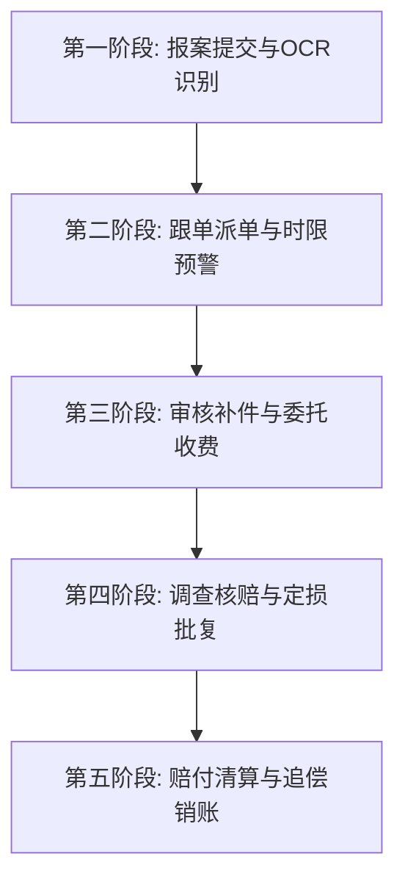
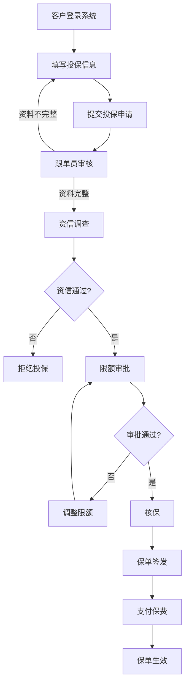
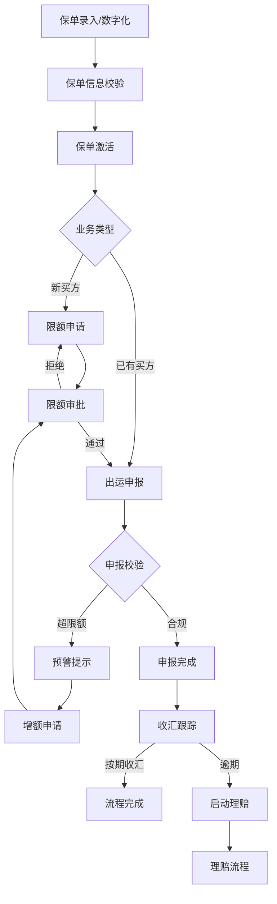
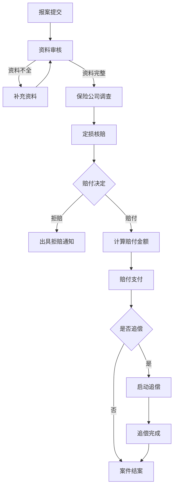

# 长安银科保险管理系统 - 产品原型设计文档

> 版本：v2.5
> 更新日期：2026-05-20
> 依据：原始需求字段信息.md
> 更新说明：1. 同步菜单结构调整，将投保数据报表和投保流程管理移动到客户角色，删除长安银科角色下的保险购买模块；2. 新增投保数据报表页面，包含投保趋势图、金额趋势图、方案分布饼图、地区分布饼图，支持Excel导出；3. 新增投保流程管理页面，包含6步流程展示和操作；4. 更新§3.2.8a业务规则实现状态为全部已实现；5. 新增限额冻结/下调规则实现（已冻结状态展示+出运阻断+预警检测）

***

## 一、技术方案

### 1.1 技术栈选择

| 技术          | 选择               | 说明                |
| ----------- | ---------------- | ----------------- |
| **前端框架**    | Vue 3            | 采用Composition API |
| **UI组件库**   | TDesign Vue Next | 腾讯企业级UI组件库        |
| **构建工具**    | Vite             | 快速开发构建工具          |
| **路由管理**    | Vue Router 4     | SPA路由管理           |
| **状态管理**    | Pinia            | 轻量级状态管理           |
| **CSS预处理器** | SCSS             | 样式复用与变量管理         |

### 1.2 项目结构

```
cayk-bx-ui/
├── src/
│   ├── api/                    # API接口管理（暂为空，待实现）
│   │   └── modules/
│   │       ├── insurance.js    # 保险购买相关API（待实现）
│   │       ├── policy.js       # 保单管理相关API（待实现）
│   │       ├── claim.js        # 理赔管理相关API（待实现）
│   │       ├── clerk.js        # 跟单员管理相关API（待实现）
│   │       └── statistics.js   # 数据统计相关API（待实现）
│   ├── assets/
│   │   └── styles/             # 全局样式
│   │       └── variables.scss  # 主题变量
│   ├── components/             # 公共组件
│   │   └── common/             # 通用组件
│   │       ├── DataTable.vue
│   │       ├── DetailPanel.vue
│   │       ├── EmptyState.vue
│   │       ├── InsuranceForm.vue
│   │       ├── SearchFilter.vue
│   │       ├── StatCard.vue
│   │       └── StatusTag.vue
│   ├── layouts/
│   │   └── MainLayout.vue      # 主布局（侧边栏+内容区+角色切换）
│   ├── pages/                  # 页面组件（共22个）
│   │   ├── insurance/          # 保险购买模块（5页）
│   │   │   ├── InsurancePurchase.vue        # 投保信息管理
│   │   │   ├── InsurancePurchaseFormPage.vue # 新增投保/编辑/详情
│   │   │   ├── InsuranceApply.vue           # 投保流程管理
│   │   │   ├── InsuranceQuestionnaire.vue   # 投保问卷调查
│   │   │   └── InsuranceReport.vue          # 投保数据报表
│   │   ├── policy/             # 保单管理模块（7页）
│   │   │   ├── PolicyList.vue               # 保单信息管理
│   │   │   ├── PolicyTrade.vue              # 贸易信息管理
│   │   │   ├── CreditLimit.vue              # 信用限额管理
│   │   │   ├── ShipmentDeclare.vue          # 出运申报管理
│   │   │   ├── PolicyProcess.vue            # 流程管理
│   │   │   ├── SubsidyManage.vue            # 保费补贴管理
│   │   │   └── PolicyPerformance.vue        # 保单履约报表
│   │   ├── claim/              # 理赔管理模块（3页）
│   │   │   ├── ClaimList.vue                # 理赔信息管理
│   │   │   ├── ClaimProcess.vue             # 理赔流程管理
│   │   │   └── ClaimReport.vue              # 理赔报表管理
│   │   ├── clerk/              # 跟单员管理模块（4页）
│   │   │   ├── ClerkList.vue                # 跟单员信息
│   │   │   ├── ClerkPermission.vue          # 权限管理
│   │   │   ├── ClerkTask.vue                # 业务管理（含任务分配/抢单）
│   │   │   └── ClerkPerformance.vue         # 考核管理
│   │   └── statistics/         # 数据统计模块（2页）
│   │       ├── BusinessStats.vue            # 业务数据统计
│   │       └── RiskAnalysis.vue             # 风险数据分析
│   ├── router/
│   │   └── index.js            # 路由配置（共24条路由含重定向）
│   ├── stores/                 # Pinia状态管理
│   │   ├── user.js             # 用户/角色管理
│   │   └── business.js         # 业务数据（含完整CRUD和种子数据）
│   ├── App.vue
│   └── main.js
├── index.html
├── package.json
├── vite.config.js
└── README.md
```

> **注**：当前代码实现与PRD原始设计存在差异，详见 §12 差异分析与实施路线图。`src/api/modules/` 为空，暂未接入后端服务；所有数据当前通过 Pinia store 的 mock 数据层提供。

***

## 二、导航结构设计

### 2.1 整体导航架构

采用**左侧导航栏 + 顶部Header**的经典后台管理模式。

一级导航栏新增小图标，二级导航栏无需小图标；二级导航栏位置靠中间偏左位置展示；

### 2.2 菜单项详细配置

| 一级菜单      | 一级图标             | 二级菜单     | 路由路径                | 可见角色              | 说明                  |
| --------- | ---------------- | -------- | ------------------- | ------------------- | ------------------- |
| **保险购买**  | document-popular | 投保信息管理   | /insurance/purchase | 客户、长安银科、跟单员 |                     |
|           |                  | 投保数据报表   | /insurance/report   | 客户、长安银科、跟单员 |                     |
|           |                  | 投保流程管理   | /insurance/apply    | 客户、长安银科、跟单员 |                     |
| **保单管理**  | file             | 保单信息管理   | /policy/list        | 客户、长安银科、跟单员 |                     |
|           |                  | 贸易信息管理   | /policy/trade       | 长安银科、跟单员    |                     |
|           |                  | 信用限额管理   | /policy/limit       | 长安银科、跟单员    |                     |
|           |                  | 出运申报管理   | /policy/shipment    | 客户、长安银科、跟单员 |                     |
|           |                  | 流程管理     | /policy/process     | 长安银科、跟单员    |                     |
|           |                  | 保费补贴管理   | /policy/subsidy     | 长安银科            |                     |
|           |                  | 保单履约报表   | /policy/performance | 长安银科            |                     |
| **保险理赔**  | error-circle     | 理赔信息管理   | /claim/list         | 客户、长安银科、跟单员 |                     |
|           |                  | 理赔流程管理   | /claim/process      | 长安银科、跟单员    |                     |
|           |                  | 理赔报表管理   | /claim/report       | 长安银科            |                     |
| **跟单员管理** | user             | 跟单员信息    | /clerk/list         | 长安银科            |                     |
|           |                  | 权限管理     | /clerk/permission   | 长安银科            |                     |
|           |                  | 业务管理     | /clerk/task         | 长安银科、跟单员    |                     |
|           |                  | 考核管理     | /clerk/performance  | 长安银科、跟单员    |                     |
| **数据统计**  | chart            | 业务数据统计   | /stats/business     | 长安银科、跟单员    |                     |
|           |                  | 风险数据分析   | /stats/risk         | 长安银科            |                     |

> **说明**：
> 1. 客户问卷调查导航菜单已删除，不再展示
> 2. 保单信息管理下的"保单数字化"按钮已重命名为"新增投保"
> 3. 投保信息管理列表状态：待审核、审核通过、已驳回
> 4. 保险购买模块仅对客户和跟单员可见，长安银科不可见
> 5. 投保数据报表和投保流程管理已移动到客户角色下的保险购买模块
> 6. **保单数字化/OCR页面**（§3.2.7）当前未实现独立路由，后续以弹窗形式从保单列表的"新增投保"按钮触发
> 7. **续保管理**（§3.13.6）、**退保管理**（§3.13.7）、**保单变更**（§3.13.5）当前未实现独立路由，后续以弹窗/抽屉形式从保单列表的操作按钮触发
> 8. **保费管理视图**（§3.13.8）当前未实现独立页面，后续作为保单详情页的子模块展示
> 9. **批单管理**（§3.2.6）当前未实现独立页面，后续作为保单详情页的子模块展示
> 10. **API接口层**（§1.2）当前为空，所有数据通过 Pinia store 的 mock 数据层提供

***

## 三、字段清单设计

### 3.1 保险购买模块 - 字段清单

#### 3.1.1 客户基本信息字段

| 字段名称                      | 字段说明          | 必填 | 数据来源      | 组件类型   |
| ------------------------- | ------------- | -- | --------- | ------ |
| enterpriseName            | 企业名称（与证照一致）   | ✓  | AI解析/客户填报 | Input  |
| unifiedSocialCreditCode   | 统一社会信用代码（18位） | ✓  | AI解析      | Input  |
| businessLicense           | 企业法人营业执照扫描件   | ✓  | 客户上传      | Upload |
| importExportQualification | 对外贸易经营者备案登记表  | ✓  | 客户上传      | Upload |
| enterpriseAddress         | 企业实际经营地址      | ✓  | AI解析/客户填报 | Input  |
| contactName               | 联系人姓名         | ✓  | 客户填报      | Input  |
| contactPhone              | 联系电话（手机/座机）   | ✓  | 客户填报      | Input  |
| contactEmail              | 电子邮箱          | -  | 客户填报      | Input  |

#### 3.1.2 买方信息字段

| 字段名称                        | 字段说明              | 必填 | 数据来源      | 组件类型   |
| --------------------------- | ----------------- | -- | --------- | ------ |
| buyerName                   | 买方准确全称（与国外买方合同一致） | ✓  | 客户填报      | Input  |
| buyerAddress                | 买方实际地址            | ✓  | 客户填报      | Input  |
| buyerCountry                | 买方所在国家/地区         | ✓  | 客户填报      | Select |
| buyerCreditRating           | 买方信用评级            | -  | 保险公司调查    | Select |
| historicalTransactionAmount | 历史交易总额            | -  | 客户填报/系统统计 | Input  |
| authorizationDocument       | 授权保险公司联系买方的签字文件   | ✓  | 客户上传      | Upload |
| buyerContact                | 买方联系人信息           | -  | 客户填报      | Input  |
| buyerPhone                  | 买方联系电话            | -  | 客户填报      | Input  |

#### 3.1.3 投保需求字段

| 字段名称                     | 字段说明    | 必填 | 数据来源      | 组件类型     |
| ------------------------ | ------- | -- | --------- | -------- |
| insuranceScheme          | 投保方案选择  | ✓  | 系统推荐/客户选择 | Select   |
| coverageAmount           | 投保金额/保额 | ✓  | 客户填报      | Input    |
| expectedInsuranceCompany | 期望保险公司  | -  | 客户填报      | Select   |
| policyDuration           | 保单期限    | ✓  | 系统推荐      | Select   |
| specialRequirements      | 特殊需求说明  | -  | 客户填报      | Textarea |

> **说明**：客户投保问卷调查字段已删除，不再展示

#### 3.1.4 保险购买流程功能清单

| 流程节点   | 操作主体 | 办理时限 | 客户端资料清单                      | 平台功能支持           | 备注                                |
| ------ | ---- | ---- | ---------------------------- | ---------------- | --------------------------------- |
| 提交投保材料 | 客户   | /    | ①企业法人营业执照 ②进出口企业资格证书 ③买方基本信息 | AI解析资料自动填充客户基本信息 | AI应用：支持客户上传资料清单，AI解析后填充至"客户基本信息"处 |
| 填写投保申请 | 客户   | /    | 《投保单》《买方信息采集表》               | 生成标准化投保文件        | 根据客户填写内容生成保险公司要求的投保单、买方信息采集表      |
| 提交补充资料 | 跟单员  | /    | 根据跟单员反馈                      | 补充资料清单管理         | 跟单员反馈补充资料清单                       |
| 资料提交   | 跟单员  | /    | 盖章版《投保单》《买方信息采集表》            | 文件审核流程           | -                                 |
| 买方资信调查 | 保险公司 | 1个月  | 买方信息、授权文件                    | 补充资料录入           | -                                 |
| 信用限额审批 | 保险公司 | 2周   | /                            | 限额审批流程           | 核准主要买家的初始信用限额                     |
| 信保核保   | 保险公司 | /    | /                            | 核保流程管理           | -                                 |
| 出具保单   | 保险公司 | /    | /                            | 保单数字化            | 生成《保单明细表》《费率表》等                   |

#### 3.1.4 系统生成资料

| 资料名称    | 生成规则         | 说明      |
| ------- | ------------ | ------- |
| 投保单     | 根据客户填写内容自动生成 | 提交给保险公司 |
| 买方信息采集表 | 根据买方信息自动生成   | 提交给保险公司 |

> **说明**：补充资料标签已删除，其内容已合理调整到客户基础信息、买方信息、贸易基础信息等页面下

#### 3.1.5 审核审批流程设计

##### 3.1.5.1 整体业务说明

本流程为保险投保单线上化审批业务，分为 **C 端客户发起端**、**长安银科平台审核端** 两大角色链路，定义单据生命周期状态、页面功能、角色操作权限、审批动作、数据同步规则、驳回回流异常流程，统一业务口径，适配前端开发、后端逻辑、功能测试、联调验收全场景使用。

##### 3.1.5.2 C 端客户业务流程

**投保信息管理列表页面能力：**
- 列表统一展示客户名下所有投保单数据，支持基础信息查看、单据筛选、状态筛选
- 客户拥有 查看、编辑 自身投保单信息权限，可完善、修改投保相关资料
- 列表操作栏固定配置操作按钮：审核（原提交审核按钮改名）

**提交审核业务规则：**
- 客户完成投保信息填报与核对后，点击【审核】发起线上审批
- 提交成功后，投保单状态自动变更为 待审核
- 列表统一展示全流程状态标识，包含草稿、待审核、已驳回、审核通过
- 处于驳回状态的单据，客户可二次编辑修改内容，重新点击审核再次发起审批

**客户侧权限边界：**
- 仅可操作本人名下投保单据，无查看他人单据权限
- 无任何审核、审批、驳回权限，仅负责资料维护与提报
- 可查看平台端录入的驳回原因，作为修改依据

##### 3.1.5.3 长安银科平台端审核审批流程

**审核入口路径：**
平台运营 / 审核人员进入：保险购买模块 → 保单管理页面，统一接收全量客户提交的投保申请单据

**单据展示规则：**
页面统一展示客户已提报投保单，初始待处理状态为 待审核 / 待审批

**审核权限严格界定：**
- 平台审核角色 仅支持查看投保单全部详情 ， 禁止编辑、修改、篡改客户任何投保资料
- 无新增、删除客户投保单权限，仅做审批判定动作

**审批操作规则：**
操作栏提供两类固定审批操作，无其他冗余操作：
- 审核通过：审批核验无误，确认受理投保申请，完成本级审批流程
- 驳回：投保资料不合规、信息有误、不符合投保要求，拒绝本次申请
- 驳回 强制录入驳回原因，必填项不可空，用于客户明确整改方向

##### 3.1.5.4 系统状态枚举定义（统一全局字段）

| 状态    | 状态码       | 说明           | 操作提示    |
| ------- | ----------- | ------------ | ------- |
| 暂存    | draft       | 客户保存后状态，可自由编辑修改 | 可编辑、删除 |
| 审核中  | pending_review | 客户已申请投保，等待平台人员审批 | 查看进度   |
| 已完成  | approved    | 平台审批完成，流程正常办结 | 查看保单    |
| 已驳回  | rejected    | 平台驳回申请，等待客户修改重提 | 可编辑、重新提交审核 |

##### 3.1.5.5 双向状态自动同步机制

- 平台完成审核操作后，系统实时触发数据同步接口，自动同步状态至 C 端客户账号
- 平台审核通过 → 客户端状态同步更新为：审核通过
- 平台执行驳回并填写原因 → 客户端状态同步更新为：已驳回，同步展示完整驳回原因
- 所有状态变更留痕记录，后端留存操作人、操作时间、审批结果、驳回内容日志

##### 3.1.5.6 正常流程与异常回流流程规则

**标准正常流程：**
客户填报投保信息 → 保存草稿 → 确认无误提交审核 → 平台接收待审单据 → 平台核验通过 → 状态同步办结，流程结束

**异常驳回回流流程：**
客户提交审核→平台审核不通过→录入驳回原因并驳回→C 端同步状态与原因→客户查看问题修改资料→重新提交审核→再次进入平台待审队列，循环直至审批通过

##### 3.1.5.7 落地通用约束（研发 & 测试通用）

- 前后端状态字段保持一致，状态流转不可逆向乱跳
- 驳回原因持久化存储，支持前端展示、后端查询、数据导出
- 审核按钮做灰度控制，草稿状态可点击，已审核通过状态置灰不可重复提交
- 平台端编辑入口全封禁，从页面层、接口层双重限制修改权限
- 所有操作行为生成操作日志，满足业务溯源、风控核查需求

##### 3.1.5.8 投保资料生成与签署

**申请投保操作：**
- 新增投保页面右上角的【提交】按钮改名为【申请投保】
- 点击申请投保后，系统自动生成投保资料（投保申请书/买方信息采集表）
- 支持客户下载或在线签字盖章

**后续流程：**
- 客户发起和平台（长安银科）签署电子合同（在线签署合同）
- 提供合同模板维护内容
- 客户签署完成后，向平台发起签署申请
- 平台签署完成后，状态同步给客户，客户状态更新
- 客户发起付款申请（调用支付接口），弹窗展示二维码付款信息

***

### 3.2 保单管理模块 - 字段清单

#### 3.2.1 信用限额申请字段

| 字段名称                        | 字段说明          | 必填 | 组件类型     |
| --------------------------- | ------------- | -- | -------- |
| creditLimitApplicationForm  | 《买方信用限额申请表》   | ✓  | 平台生成     |
| buyerName                   | 买方名称（与投保信息一致） | ✓  | Select   |
| appliedCreditLimit          | 申请信用额度        | ✓  | Input    |
| historicalTransactionAmount | 历史交易金额        | ✓  | Input    |
| estimatedAnnualShipment     | 预计年度出运金额      | ✓  | Input    |
| applicationReason           | 申请原因说明        | -  | Textarea |

#### 3.2.2 出运申报字段

| 字段名称                    | 字段说明                | 必填 | 申报时限       | 组件类型       |
| ----------------------- | ------------------- | -- | ---------- | ---------- |
| shipmentDeclarationForm | 《短期出口信用综合险出口申报单》    | ✓  | 出运后15日内    | 平台生成       |
| monthlyDeclarationForm  | 《短期出口信用保险综合险出口月申报表》 | ✓  | 每月10日/15日前 | 平台生成       |
| billOfLading            | 提单/货运单据             | ✓  | 出运时        | Upload     |
| shipmentDate            | 货物离港日期              | ✓  | -          | DatePicker |
| shipmentAmount          | 本次出运货值              | ✓  | -          | Input      |
| buyerName               | 买方名称（与保单关联）         | ✓  | -          | Select     |
| destinationPort         | 目的港                 | ✓  | -          | Input      |
| customsDeclaration      | 报关单据                | -  | 出运时        | Upload     |
| paymentTerms            | 付款条件                | ✓  | -          | Select     |
| currency                | 结算币种                | ✓  | -          | Select     |

#### 3.2.3 出运申报时限规则

| 申报类型   | 申报时限      | 特殊规定   |
| ------ | --------- | ------ |
| 逐笔申报   | 出运后15日    | -      |
| 月度汇总申报 | 每月10日/15日 | -      |
| 出口至香港  | 3天内       | 缩短申报时限 |

#### 3.2.4 保单管理流程功能清单

根据《保单管理流程示意图》，保单数字化及其生命周期管理细分为以下六大核心业务子流程：

##### 3.2.4.1 历史保单数字化录入流程
* **业务背景**：对存量或线下投保完成的纸质/电子保单进行数字化解析，结构化入库。
* **流程步骤**：
  1. **文件上传**：跟单员或客户在系统上传保单扫描件（PDF/图片格式）。
  2. **智能OCR解析**：系统自动调用OCR引擎，快速抓取并解析25+个核心保单字段（保险单号、承保公司、免赔额、费率、买方信用限额明细等）。
  3. **人工校对审核**：针对置信度低的字段由跟单员进行校验核对，确认无误后点击一键入库。
  4. **生成数据大屏**：入库后保单正式登记为生效保单，自动计入对应客户名下的保单总资产，并启动续保倒计时及到期预警机制。

##### 3.2.4.2 信用限额分配与管理流程
* **业务背景**：信用限额是贸易出运保障的生命线，涉及动态资信评估及严苛的时限控制。
* **流程步骤**：
  1. **客户发起限额申请**：客户根据贸易需求，在线录入拟交易买方名称、注册号、付款期及申请额度，提交《买方信用限额申请表》。
  2. **第三方资信评估**：平台自动触发API，调取第三方征信数据库生成海外买方评级及集中度合规检测（单一买方<=20%，单一国家<=30%）。
  3. **保险公司KYC与额度批复**：跟单员将评估单提报给合作保险公司核保人员，核保人员完成最终KYC后，在线发出限额批复函，核定可用授信限额。
  4. **额度动态调整与闲置注销（核心业务规则）**：
     - **闲置期预警**：限额生效后，若系统监测到某买方**连续60天**无任何出运申报，自动标记“黄灯闲置预警”，提醒客户经理或客户做一笔小额出运申报以保活。
     - **闲置期撤销**：若**连续90天**（3个月）无任何出运申报，系统触发**强阻断红灯逻辑**，限额自动撤销。再次交易必须重新发起限额申请及资信调查。
     - **限额冻结/下调**：买方发生拖欠逾期或风险信号时，保险公司在线一键冻结/调低限额，系统立刻限制其新增出运申报，但此前已申报部分仍受保障。

##### 3.2.4.3 出运申报与时限校验流程
* **业务背景**：货物实际发运后，客户必须在约定期限内完成申报，否则直接面临保单中止或理赔被拒风险。
* **流程步骤**：
  1. **数据提报**：客户发运货物后，在系统录入发票号、发票金额、出运日期及贸易付款期限，关联有效买方及保单号。
  2. **余额与时限强校验**：
     - **余额校验**：系统自动计算 `本次申报金额` 是否小于或等于 `该买方可用信用限额`。若超额，自动弹窗超限阻断，提示补充申请增额。
     - **时限校验**：系统检测发运日期。必须在出运日后10个工作日内（香港买方为3天内）提交申报，超时提交将触发迟申报橙色预警，并自动在系统上增加“理赔风险提示”。
  3. **保险公司保费核定**：申报通过后，保险公司系统计算费率并在线开具保费发票/通知单。
  4. **保费缴纳与冻结拦截**：
     - 客户收到保费通知单后，需在10个工作日内（或保单生效 30 天内）支付保费。
     - **未缴冻结规则**：若超出缴费时限仍未缴纳，系统将**自动中止**保单效力，并强行冻结该保单下所有后续出运申报权限，直至保费结清后方可解冻。

##### 3.2.4.4 保单变更（批改）流程
* **业务背景**：保单执行期间，由于被保险人名称、联系方式、新增买方或费率变动，需发起保单变更。
* **流程步骤**：
  1. **提出变更申请**：客户在线录入变更内容（如变更被保险人、新增买方、调整费率额度等），上传证明材料。
  2. **平台生成变更表单**：系统自动调用数据填充，生成标准《保险合同变更申请书》。
  3. **跟单员核验与上报**：跟单员对客户上传的盖章变更材料进行真实性审查，审核通过后提交给保险公司。
  4. **保险公司批复与批单生成**：保险公司审批通过后出具《批单》，系统完成结构化数据覆盖，变更正式生效。

##### 3.2.4.5 保险续保流程
* **业务背景**：保单通常有效期为12个月，为避免保障出现“空窗期”，需提前触发续保。
* **流程步骤**：
  1. **到期预警**：保单止期**前30天**，系统后台任务自动向客户及跟单员发送续保通知，限额列表同步展示“即将到期”标签。
  2. **续保评估与买方清理**：客户提起续保申请，系统自动生成上一年度的限额利用率与赔付率报表。低于50%利用率的活跃限额提示进行缩减清理，赔付率超60%的触发续保费率上浮预警。
  3. **核保出单**：跟单员将续保申请提交至保险公司，保险公司完成审批并开具新一年度的保单。
  4. **空窗期校验拦截**：若原保单已到期且新保单未成功激活，系统强制拦截此期间的所有出运申报，提醒客户续保未完成前无法获得保障。

##### 3.2.4.6 保险退保流程
* **业务背景**：客户因业务调整需提前终止保单，按未到期天数比例进行结算退保。
* **流程步骤**：
  1. **发起退保**：客户提前30天书面申请，在线填写退保原因，上传保单正本扫描件与盖章《退保申请书》。
  2. **跟单员初审**：跟单员审查未完成结案的理赔单，确认无在审理赔后上报保险公司。
  3. **保费结算**：保险公司按保单短期费率扣除已生效保费，自动计算应退保费金额。
  4. **退费派发与注销**：确认退款到账后，系统将保单状态更改为 `surrendered`（退保/已注销），所有关联的买方限额自动注销，并同步将结算凭证归档至RWA（应收账款资产融资）管理平台。

##### 3.2.4.7 RWA金融与资产融资平台双向同步机制
- **保单资产登记**：保单通过OCR入库或批改生效后，系统自动同步保单ID、保额、有效险种至RWA金融管理模块，标记为“可融资/受保资产”。
- **限额额度实时共用**：出运申报通过且可用信用限额充足的账款，RWA平台才支持发起应收账款质押融资，自动规避无险空单融资风险。
- **理赔回款自动清算**：理赔定损金额一旦支付成功，理赔回收数据同步至RWA系统，直接用于融资款项的自动清算与销账冲账。

#### 3.2.5 保单变更字段

| 变更类型                  | 所需资料              | 办理时限     | 组件类型          |
| --------------------- | ----------------- | -------- | ------------- |
| 被保险人信息变更              | 公司名称、地址、联系方式等变更证明 | 5-15个工作日 | Form          |
| 新增买方                  | 买方准确全称、地址、国别等基本信息 | 5-15个工作日 | Form          |
| 调整保额/费率               | 相关贸易合同或说明文件       | 5-15个工作日 | Form + Upload |
| 其他变更                  | 根据跟单员要求提供相应证明     | 5-15个工作日 | Upload        |
| changeApplicationForm | 《保险合同变更申请书》       | ✓        | 平台生成          |

**保单变更申请表单字段：**

| 字段名称   | 字段说明                                          | 必填 | 组件类型        |
| ------ | --------------------------------------------- | -- | ----------- |
| 关联保单号  | 系统自动关联                                        | ✓  | 只读输入框       |
| 变更申请日期 | 系统自动生成                                        | ✓  | 只读输入框       |
| 变更类型   | 下拉选择：增加买方/减少买方/延期/变更限额/变更被保险人信息/变更联系人/变更地址/其他 | ✓  | Select      |
| 变更原因   | 变更原因说明                                        | ✓  | Textarea    |
| 变更前内容  | 变更前的内容描述                                      | -  | Textarea    |
| 变更后内容  | 变更后的内容描述                                      | -  | Textarea    |
| 变更申请书  | 保险合同变更申请书                                     | ✓  | Upload      |
| 证明文件   | 按变更类型上传相应证明文件                                 | -  | Upload（多文件） |

#### 3.2.5 退保申请字段

| 字段名称                     | 字段说明                 | 必填 | 组件类型   |
| ------------------------ | -------------------- | -- | ------ |
| surrenderApplicationForm | 《退保申请书》              | ✓  | 平台生成   |
| originalPolicy           | 原保险单正本（如已领取需退回）      | -  | Upload |
| legalPersonId            | 企业法人身份证明或授权委托书（加盖公章） | ✓  | Upload |
| paymentReceipt           | 缴费凭证复印件（历史付款记录）      | ✓  | Upload |
| otherDocuments           | 保险公司要求的其他文件          | -  | Upload |

#### 3.2.6 批单字段

| 字段名称               | 字段说明           | 数据来源   |
| ------------------ | -------------- | ------ |
| endorsementNo      | 批单号            | 保险公司出具 |
| endorsementType    | 批单类型（变更/退保/其他） | 保险公司出具 |
| endorsementContent | 批单内容摘要         | 保险公司出具 |
| effectiveDate      | 生效日期           | 保险公司出具 |
| relatedPolicyNo    | 关联保单号          | 系统关联   |

#### 3.2.7 保单数字化页面字段（OCR + 人工校对）

用于“保单信息管理 > 新增投保”场景（原“保单数字化”按钮已重命名为“新增投保”）：上传保单/批单后，通过 OCR 抽取字段并由用户校对确认，形成结构化数据；同时对“贸易环节卖方/买方信息”做一致性校验，并提供风险提示。

> **说明**：保单信息管理页面右上角的“保单数字化”按钮已重命名为“新增投保”；底部的“保存结构化结果”和“关闭”按钮已删除，不再展示

| 字段分类   | 关键字段              | 填写/上传要求              | 备注/校验规则                                |
| ------ | ----------------- | -------------------- | -------------------------------------- |
| 基础信息   | 保险单号              | 需支持查询、编辑（需权限）、失效状态标记 | —                                      |
| <br /> | 保险公司名称            | OCR识别抓取/可编辑          | —                                      |
| <br /> | 保险人名称             | 录入/校对                | —                                      |
| <br /> | 被保险人名称            | 录入/校对                | 强校验：被保险人名称需与贸易项下卖方信息一致                 |
| <br /> | 受益人名称             | 录入/校对                | —                                      |
| <br /> | 保险起期/止期           | 日期                   | —                                      |
| <br /> | 保险期间              | 如12个月                | —                                      |
| <br /> | 续保标识              | 是/否                  | 止期提前30日提醒；选“是”触发续保流程；选“否”按投保方案触发保险购买流程 |
| <br /> | 投保金额              | 支持人民币/美元/港币等         | 建议支持主流货币                               |
| <br /> | 国家风险类别版本          | 录入/校对                | 风险类别影响：买方额度→出口申报→理赔难度                  |
| <br /> | 条款版本/约定保险范围       | 录入/校对                | —                                      |
| <br /> | 业务类型              | 服务贸易/货物贸易            | —                                      |
| 责任限额   | 最高赔偿限额            | 录入/校对                | —                                      |
| <br /> | 买方信息（多买方）         | 支持多个买方填写             | 强校验：与贸易环节买方一致；新增买方触发“买方信用限额申请”并提示理赔风险  |
| <br /> | 买方信用限额            | 录入/校对                | 更新规则：根据出运+收结汇情况自动更新（如后续对接）             |
| <br /> | 承保风险及赔偿比例         | OCR识别后匹配/可修改         | 支持客户修改后与保单内容比对                         |
| <br /> | 限额闲置期（如有）         | 录入/校对                | 届满前30日提醒；超过闲置期触发“限额申请”                 |
| <br /> | 自行掌握限额/自定信用限额（如有） | 结构化录入                | 记录条件、限额要求、申报方式、赔付基数、赔偿比例、撤销条件等         |
| <br /> | 免赔额               | 录入/校对                | —                                      |
| 申报规则   | 申报方式              | 录入/校对                | 买方信息需与“限额管理/贸易环节”强校验；不符则风险提示           |
| <br /> | 申报周期              | 月度/季度                | —                                      |
| <br /> | 申报截至日期            | 日期（如次月15日）           | 截止日提醒；到期未申报增加“理赔风险比例”提示                |
| <br /> | 申报币种              | 人民币/美元               | —                                      |
| 费用管理   | 保险费率              | 费率或区间                | 建议不做强限制                                |
| <br /> | 缴费期限/缴费方式         | 日期/下拉                | 逾期未缴触发保单效力中止/申报冻结，并提示理赔风险              |
| <br /> | 保费                | 金额                   | 自动计算应缴保费；逾期未缴触发保单效力中止流程                |
| <br /> | 退保费用（如有）          | 录入/校对                | 退保时按未到期天数比例计算退费                        |
| <br /> | 赔款追回款项支付对象        | 录入/校对                | —                                      |
| 保单文件   | 保单/批单             | 文件上传                 | —                                      |

#### 3.2.8 限额/出运/保费/期限关键规则

| 规则域 | 规则名称               | 触发条件                | 系统行为（约束/提示）                                         |
| --- | ------------------ | ------------------- | --------------------------------------------------- |
| 限额  | 出运申报限额校验           | 提交出运申报              | IF(本次申报金额>买方剩余可用限额)→申报失败；实时弹窗提示“超限额”                |
| 限额  | 单一买方/国家集中度限制（CPIC） | 限额申请/出运申报           | 单一买方限额≤保险总金额20%；单一国家限额≤保险总金额30%；超限则阻止提交/提示原因        |
| 限额  | 限额冻结/下调            | 买方出现逾期/风险信号         | 保险公司通知冻结/下调；新出运不可使用原限额；提示风险预警                       |
| 闲置期 | 闲置预警/自动撤销          | 距上次出运>60天预警；>90天撤销  | 60天黄灯预警；90天红灯自动撤销；撤销不可逆；提示“需重新申请限额（含资信调查）”          |
| 期限  | 出运申报期限（条款优先）       | 货物实际出运日后            | 默认：出运后10个工作日内申报；逐笔/日申报可缩短至3个工作日；月申报：次月10日前（以保单条款为准） |
| 保费  | 保费未缴冻结申报           | 出运申报提交且缴费状态=未缴且超到期日 | 冻结该保单下所有出运申报权限；补缴后解冻；到期前3天提醒                        |
| 续保  | 续保启动与空窗期           | 到期前30天/空窗期存在        | 到期前30天提醒并可启动续保；空窗期内暂停出运申报并提示“原则上无保障覆盖”              |

#### 3.2.8a 业务规则实现状态

| 规则域 | 规则名称 | PRD定义 | 当前代码实现状态 | 实现说明 |
| --- | --- | --- | --- | --- |
| 限额 | 出运申报限额校验（超限拦截） | §3.2.8 | ✅ 已实现 | ShipmentDeclare.vue：提交时校验并弹窗阻断/V2-3 |
| 限额 | 单一买方/国家集中度限制（CPIC） | §3.2.8 | ✅ 已实现 | creditLimitRules.js：申请时校验集中度/V2-3 |
| 限额 | 限额冻结/下调 | §3.2.8 | ✅ 已实现 | 已冻结状态+预警检测+出运阻断+详情展示/V2-3 |
| 闲置期 | 闲置预警/自动撤销（60天/90天） | §3.2.8 | ✅ 已实现 | creditLimitRules.js：>60天黄灯预警；>90天红灯撤销/V2-3 |
| 期限 | 出运申报期限规则 | §3.2.3 | ✅ 已实现 | ShipmentDeclare.vue：按类型/目的地自动计算期限/V2-3 |
| 保费 | 保费未缴冻结申报 | §3.2.8 | ✅ 已实现 | premiumRules.js+ShipmentDeclare.vue：冻结阻断+预警/V2-3 |
| 续保 | 续保启动与空窗期 | §3.2.8 | ✅ 已实现 | shipmentRules.js：30天预警+空窗期阻断/V2-3 |
| 公司差异化 | 8家保险公司申报期限规则 | §3.2.9 | ✅ 已实现 | ShipmentDeclare.vue：选保单后自动展示对应规则/V2-3 |
| 公司差异化 | 4家保险公司理赔流程规则 | §3.15 | ✅ 已实现 | claimRules.js+ClaimProcess.vue：按公司展示差异化规则/V2-3 |

### 3.2.9 出口申报期限规则（按保险公司）

用于”出运申报管理”的公司差异化展示：当选择保险公司后，自动展示对应申报截止日/方式/逾期处理提示（默认以保单条款为准）。

| 公司    | 申报周期 | 申报截止日  | 申报方式  | 逾期处理      |
| ----- | ---- | ------ | ----- | --------- |
| 中国信保  | 月度   | 次月15日前 | 线下/系统 | 补缴情 + 滞纳金 |
| 人保财险  | 月度   | 次月10日前 | 线下/线上 | 补缴情 + 滞纳金 |
| 太保产险  | 月度   | 次月15日前 | 线下/线上 | 补缴情       |
| 平安产险  | 月度   | 次月10日前 | APP实时 | 自动提醒      |
| 裕利安宜  | 月度   | 次月10日前 | 在线平台  | 补缴情       |
| 安裕    | 月度   | 次月10日前 | 在线平台  | 补缴情       |
| 科法斯   | 月度   | 次月15日前 | 在线平台  | 补缴情       |
| 香港信保局 | 月度   | 次月15日前 | 在线/线下 | 补缴情       |

***

### 3.3 流程状态定义

#### 3.3.1 保险购买流程状态

| 状态    | 状态码                   | 说明           | 操作提示    |
| ----- | --------------------- | ------------ | ------- |
| 草稿    | draft                 | 客户录入信息中      | 可编辑、提交  |
| 待补充资料 | pending\_material     | 需补充企业资质或买方资料 | 查看补充清单  |
| 待提交   | pending\_submit       | 资料齐全，待跟单员提交  | 提交至保险公司 |
| 资信调查中 | credit\_investigating | 保险公司进行买方资信调查 | 时限：1个月  |
| 限额审批中 | limit\_approving      | 保险公司审批信用限额   | 时限：2周   |
| 核保中   | underwriting          | 信保核保中        | 等待核保结果  |
| 待支付   | pending\_payment      | 保单出具，待客户支付保费 | 支付保费    |
| 已完成   | completed             | 保单生效         | 查看保单    |
| 已拒绝   | rejected              | 申请被拒         | 查看拒绝原因  |

#### 3.3.2 保单状态

| 状态   | 状态码             | 说明           | 操作提示   |
| ---- | --------------- | ------------ | ------ |
| 待生效  | pending\_effect | 保单出具，支付保费后生效 | 尽快支付保费 |
| 有效   | active          | 保险期限生效中      | 正常承保   |
| 即将到期 | expiring        | 到期前30天预警     | 及时续保   |
| 已到期  | expired         | 超过保险期限       | 结束保单   |
| 中止   | suspended       | 未按时缴纳保费达一定期限 | 风险预警   |
| 退保   | cancelled       | 已办理解除保险合同    | 查看退保详情 |
| 终止   | terminated      | 保险责任终止       | 保单完结   |

#### 3.3.3 出运申报状态

| 状态    | 状态码                  | 说明        | 操作提示   |
| ----- | -------------------- | --------- | ------ |
| 待申报   | pending\_declare     | 货物已出运，待申报 | 尽快申报   |
| 申报中   | declaring            | 申报资料整理中   | 整理资料   |
| 已申报   | declared             | 已提交申报     | 等待审核   |
| 超时预警  | timeout\_warning     | 超出申报时限    | 立即申报   |
| 保费计算中 | premium\_calculating | 保险公司计算保费  | 等待保费通知 |
| 待支付保费 | pending\_premium     | 待客户支付保费   | 支付保费   |
| 已完成   | completed            | 保费已支付     | 申报完成   |

***

### 3.4 理赔管理模块 - 流程与字段设计

根据《保险理赔流程示意图》，理赔管理生命周期划分为以下五个核心阶段，并在此基础上定义字段与校验逻辑：



#### 3.4.1 五阶段理赔详细流程与系统集成

##### 1. 第一阶段：报案提交与OCR识别（Filing）
* **业务描述**：贸易出险（拖欠/破产/拒收/政治风险）发生后，客户在线发起理赔报案。
* **OCR贸易单证校验**：
  - 客户上传核心贸易单证（贸易合同、商业发票、海运提单/运单、出口报关单）。
  - 系统自动触发**理赔单证OCR解析API**，对上传的单据进行智能扫描。
  - **单证一致性强校验**：自动比对合同编号、发票金额、提单收货人及买方名称是否一致。若出现不一致，系统弹出黄色警告并要求人工批注说明。
* **系统自动生成件**：自动抓取一二阶段出运数据，生成标准《理赔申请书》与《可能损失通知书》。

##### 2. 第二阶段：跟单派单与时限预警（Clerk Onboarding）
* **业务描述**：报案提报后，系统自动分配跟单员，并启动流转监控。
* **跟单自动派单规则**：
  - 系统根据客户负责人的历史映射关系或跟单员负载（待处理案件最少者优先），**自动分派**案件至专属跟单员。
  - 跟单员控制台立即弹出“新理赔待处理”高亮待办。
* **时限预警与级别监控 (Warning System)**：
  - 开启自动计算剩余报案时限（例如中国信保拖欠发生后30日内必须报案，破产10个工作日内）。
  - **绿灯（安全区）**：距死线 >15 天。
  - **黄灯（警告区）**：距死线 5-15 天。
  - **红灯（严重区）**：距死线 <5 天，系统自动向客户及客户经理发送高频催办短信与邮件。

##### 3. 第三阶段：审核补件与委托收费（Audit & Supplement）
* **业务描述**：跟单员核验资料完整性，若不齐全则引导客户签署委托协议并支付服务费。
* **缺失资料追索**：
  - 跟单员审核发现资料缺失（如缺少催款记录、减损记录等），一键触发【要求补件】，单据状态更新为 `supplement`。
* **委托签署与服务费收取**：
  - 针对复杂海外追偿，客户在线生成并下载平台《理赔服务委托授权书》。
  - 客户在线进行电子公章加盖与签名，同时触发**平台理赔服务费支付网关**，在线缴纳理赔代理服务费。
  - 跟单员确认费用到账并取得完整盖章件后，一键点击【提交保险公司】，资料打包推送至保险公司理赔系统。

##### 4. 第四阶段：调查核赔与定损批复（Survey & Decision）
* **业务描述**：保险公司进行海外资信调查及贸易真实性核赔，并出具定损方案。
* **保险公司理赔核定**：
  - 保险公司理赔人员对案件进行海外调查、确认损失金额并核算免赔额。
  - 系统在线同步或由跟单员录入核赔结论：赔付（Approved） / 拒赔（Rejected） / 部分赔付（Partially Approved）。
* **核心字段自动计算**：
  - `赔付金额` = `核定损失金额` × `保单约定赔偿比例(70%-90%)` - `免赔额`。
  - 自动出具并生成《理赔定损及赔付通知单》，推送至C端。

##### 5. 第五阶段：赔付清算与追偿销账（Payout & Recovery）
* **业务描述**：保险公司划拨赔款，跟单员进行实收登记，并自动同步金融资产融资系统，开启追偿。
* **实收登记与结构化日志**：
  - 收到保险公司汇款后，跟单员登记实收金额、收款银行及水单附件，系统将案件状态更新为 `completed`（已结案）。
* **追偿与RWA融资产销账双向同步**：
  - **权益转让**：系统自动生成《权益转让书》，客户在线签字将追偿权移交给保险公司。
  - **RWA系统联动**：理赔款到账信息**实时同步**至RWA平台，作为该融资资产的偿债来源进行“自动销账冲账”与账务清算，释放融资产额度。
  - **追偿登记**：系统自动接入合作第三方商账追收机构（如邓白氏）接口，实时反馈海外追偿执行动态。

#### 3.4.2 理赔管理关键字段清单

| 字段名称                  | 字段说明                        | 必填 | 组件类型       | 备注 |
| --------------------- | --------------------------- | -- | ---------- | ---- |
| claimNo               | 理赔单号                       | ✓  | Input (只读) | 系统自动按 CL2026xxxx 规则生成 |
| relatedPolicyNo       | 关联保单号                       | ✓  | Select     | 关联本客户名下有效保单 |
| insuranceCompany      | 保险公司                       | ✓  | Input (只读) | 关联保单后系统自动带出 |
| buyerName             | 买方名称                       | ✓  | Select     | 出险贸易买家名称 |
| claimType             | 理赔类型                       | ✓  | Select     | 下拉：破产 / 拖欠 / 拒付 / 政治风险 / 其他 |
| lossDescription       | 损失情况描述                      | ✓  | Textarea   | 详细陈述事故原因及经过 |
| estimatedLossAmount   | 预估损失金额                      | ✓  | Input      | 支持多币种输入 |
| lossDate              | 损失发生日期                      | ✓  | DatePicker | 对应首次发现欠款或收到退货之日 |
| createTime            | 报案报核时间                      | ✓  | DatePicker | 系统自动获取当前服务器时间 |
| currentStep           | 当前理赔阶段                      | ✓  | Select     | 枚举：1-报案提交 / 2-跟单接单 / 3-审核补件 / 4-调查定损 / 5-理赔收回 |
| status                | 理赔单据状态                      | ✓  | Select     | 枚举：pending / processing / investigating / supplement / decided / completed / rejected |
| warningLevel          | 时限预警级别                      | ✓  | Tag        | 系统计算：绿灯(安全) / 黄灯(临界) / 红灯(超时) |
| clerkId               | 负责跟单员工号                     | ✓  | Input (只读) | 系统自动分派跟单员 |
| delegationAgreement   | 平台理赔委托书                     | 条件必传 | Upload     | 第三阶段委托代理时强制签署上传 |
| serviceFeePaid        | 代理服务费缴纳状态                   | ✓  | Select     | 枚举：未缴费 / 已缴费 |
| serviceFeeVoucher     | 代理服务费水单凭证                   | -  | Upload     | 扫码或线下汇款凭证 |
| claimAmount           | 保险公司实际核定赔付金额               | -  | Input      | 第四阶段保险公司定损后填写 |
| bankAccount           | 收款银行账户信息                    | ✓  | Input      | 客户用于接收赔款的银行账号 |
| payoutVoucher         | 保险公司理赔款到账水单                 | -  | Upload     | 第五阶段结案时强制上传 |
| rwaSyncStatus         | RWA系统销账同步状态                 | ✓  | Tag        | 枚举：未同步 / 同步成功 / 销账完成 |

#### 3.4.3 理赔单证OCR校验及附件上传规则

| 附件类别 | 必填 | OCR识别抓取关键字段 | 一致性校验校验规则 |
| ---- | -- | --------- | -------- |
| 贸易合同 | ✓ | 合同编号、买卖双方全称、贸易金额、账期天数 | 校验合同买方与本单买方名称一致性 |
| 商业发票 | ✓ | 发票号码、发票金额、出运日期、付款到期日 | 校验发票金额之和是否等于理赔申请额 |
| 提单/运单 | ✓ | 提单号、起运港、目的港、出运日期、收货人 | 校验收货人是否与买方拼写完全一致，出运日是否在限额有效期内 |
| 出口报关单 | - | 报关单号、海关商品编码、离岸价格（FOB） | 校验报关单离岸价格与发票金额的合理匹配度 |
| 损失证明 | 条件必传 | 破产宣告书/逾期欠款催款函/拒收抗议书 | 根据理赔类型：拖欠必须上传近三次有效的追讨信件及回复 |
| 追偿授权书 | - | 被保险人签章、授权对象、日期 | 必须使用系统提供的格式模板，且加盖法人公章 |

***

## 四、页面原型设计

### 4.1 保险购买模块

#### 4.1.1 投保信息管理页面 `/insurance/purchase`

**功能描述：** 管理客户投保信息，支持新增、编辑、提交投保申请

**页面布局：**

```
┌─────────────────────────────────────────────────────────────┐
│ 当前位置：保险购买 > 投保信息管理                              │
├─────────────────────────────────────────────────────────────┤
│ ┌─────────────────────────────────────────────────────────┐ │
│ │ 🔍 高级筛选                                                │ │
│ │ 企业名称：[__________] 买方名称：[__________]              │ │
│ │ 状态：[全部 ▼]  投保方案：[全部 ▼]  申请日期：[____至____]│ │
│ │                                            [查询][重置]   │ │
│ │                                            [+新增投保]    │ │
│ └─────────────────────────────────────────────────────────┘ │
│                                                             │
│ ┌──────────────────────────┐ ┌────────────────────────────┐ │
│ │ 📊 投保概览              │ │ 📋 待处理事项              │ │
│ │ 本月新增：12 份          │ │ 待提交资料：5 件          │ │
│ │ 审核中：8 份             │ │ 资信调查中：3 件          │ │
│ │ 已完成：45 份            │ │ 待支付保费：2 件          │ │
│ └──────────────────────────┘ └────────────────────────────┘ │
│                                                             │
│ ┌─────────────────────────────────────────────────────────┐ │
│ │ 投保信息列表                          共 65 条记录       │ │
│ ├─────────────────────────────────────────────────────────┤ │
│ │ ☐ │ 投保编号 │ 企业名称 │ 买方名称 │ 投保方案 │ 状态 │操作│ │
│ ├─────────────────────────────────────────────────────────┤ │
│ │ ☐ │ TB2026..│ 深圳XX.. │ 美国ABC │ 方案A │ 审核中 │ 👁📝📤│ │
│ │ ☐ │ TB2026..│ 上海YY.. │ 德国DEF │ 方案B │ 待提交 │ 👁📝📤│ │
│ │ ☐ │ TB2026..│ 北京ZZ.. │ 日本GH │ 方案C │ 已完成 │ 👁📝  │ │
│ │ ☐ │ TB2026..│ 广州AA.. │ 英国IJ │ 方案B │ 待补充 │ 👁📝📤│ │
│ └─────────────────────────────────────────────────────────┘ │
│                                                             │
│ ┌─────────────────────────────────────────────────────────┐ │
│ │ < 1 2 3 4 ... >                    每页显示 [20 ▼] 条  │ │
│ └─────────────────────────────────────────────────────────┘ │
└─────────────────────────────────────────────────────────────┘
```

**操作按钮：**

- 👁 查看：查看投保详情（所有状态均可查看）
- 📝 编辑：编辑投保信息（仅暂存/已驳回状态）
- 🗑 删除：删除投保记录（仅暂存状态）

> **说明**：
> 1. **状态流转规则**：点击保存状态为暂存，点击申请投保状态为审核中
> 2. **状态列表展示**：暂存、审核中、已完成、已驳回
> 3. **审核弹窗美化**：采用卡片式布局，每个字段配有图标和背景色，展示投保核心元素信息（投保编号、企业名称、买方名称、买方国别、投保类型、投保金额、投保期限、机构类型、投保目的、预计年销售额、申请日期、联系人）
> 4. **删除弹窗调整**：上方不展示图标，直接展示投保详情信息；展示投保基础信息（投保编号、企业名称）、买方信息（买方名称、买方国别）、贸易信息（投保类型、投保金额、投保期限）；确认删除提示在下方显示，删除时提示"此操作无法撤回"
> 5. **导出功能**：支持按筛选条件导出Excel文件，导出前展示筛选条件和数据预览（最多显示10条），支持预览和下载，导出字段包括：投保编号、企业名称、买方名称、买方国别、投保类型、机构类型、投保金额、状态、申请日期、联系人、联系电话
> 6. 详情页面右上角新增返回列表按钮，点击返回投保信息管理列表

#### 4.1.2 新增投保页面 - 左侧Tab + 右侧表单

**页面布局：**

```
┌─────────────────────────────────────────────────────────────────────────┐
│ 当前位置：保险购买 > 投保信息管理 > 新增投保                    [保存] [申请投保]│
├─────────────────────────────────────────────────────────────────────────┤
│ ┌───────────────────┐ ┌─────────────────────────────────────────────┐   │
│ │                   │ │                                             │   │
│ │ 1️⃣ 客户基本信息   │ │  客户基本信息                                 │   │
│ │                   │ │  ───────────────────────────────────────────│   │
│ │ 2️⃣ 买方信息       │ │  企业名称 *：[________________________]      │   │
│ │                   │ │  统一社会信用代码 *：[________________]      │   │
│ │ 3️⃣ 投保需求       │ │  企业地址：[__________________________]      │   │
│ │                   │ │  联系人 *：[________] 联系电话 *：[________]  │   │
│ │ 4️⃣ 贸易基础信息   │ │  营业执照 *：[上传] [已上传-营业执照.jpg]     │   │
│ │                   │ │  进出口资质 *：[上传] [已上传-资格证书.jpg]   │   │
│ │ 5️⃣ 投保声明       │ │                                             │   │
│ │                   │ │  买方信息                                    │   │
│ │ 6️⃣ 保单数字化信息 │ │  ───────────────────────────────────────────│   │
│ │                   │ │  买方名称 *：[________________________]      │   │
│ │ 7️⃣ 其他信息       │ │  买方地址 *：[__________________________]    │   │
│ │                   │ │  买方国别 *：[____▼____]                    │   │
│ │                   │ │  授权文件 *：[上传]                          │   │
│ │                   │ │                                             │   │
│ └───────────────────┘ └─────────────────────────────────────────────┘   │
└─────────────────────────────────────────────────────────────────────────┘
```

> **说明**：
> 1. 右上角【提交】按钮已改名为【申请投保】
> 2. 点击【保存】后自动返回到投保信息管理列表页面
> 3. 左侧目录结构调整：删除了补充资料标签（原8），保单数字化信息标签编号改为7，与外层目录结构保持一致
> 4. 投保详情页面右上角新增【返回列表】按钮（仅详情模式显示）

#### 4.1.3 投保流程管理页面 `/insurance/apply`

**功能描述：** 展示投保全流程进度，支持步骤切换和详情操作

**页面布局：**

```
┌─────────────────────────────────────────────────────────────┐
│ 当前位置：保险购买 > 投保流程管理            保单号：PI2026001234│
├─────────────────────────────────────────────────────────────┤
│ ┌─────────────────────────────────────────────────────────┐ │
│ │  1️⃣提交申请  ─▶  2️⃣资料审核  ─▶  3️⃣资信调查  ─▶  4️⃣限额审批 │ │
│ │       完成        完成        进行中        待处理        │ │
│ │  ─▶  5️⃣核保出单  ─▶  6️⃣缴费生效                             │ │
│ │       待处理        待处理                                  │ │
│ └─────────────────────────────────────────────────────────┘ │
│                                                             │
│ ┌─────────────────────────────────────────────────────────┐ │
│ │ 当前步骤：3. 资信调查                                      │ │
│ ├─────────────────────────────────────────────────────────┤ │
│ │ 1. 提交投保申请        [✓ 已完成]                        │ │
│ │ 2. 资料审核            [✓ 已完成]                        │ │
│ │ 3. 资信调查            [● 进行中] ← 当前                 │ │
│ │    ┌─────────────────────────────────────────────┐      │ │
│ │    │ ☑ 买方企业资质核实                            │      │ │
│ │    │ ☑ 买方信用记录查询                            │      │ │
│ │    │ ☑ 贸易背景真实性核查                          │      │ │
│ │    │ [上传调查报告]                                │      │ │
│ │    │ [调查意见：_________________]                  │      │ │
│ │    └─────────────────────────────────────────────┘      │ │
│ │ 4. 信用限额审批        [○ 待处理]                        │ │
│ │ 5. 核保出单            [○ 待处理]                        │ │
│ │ 6. 缴费生效            [○ 待处理]                        │ │
│ └─────────────────────────────────────────────────────────┘ │
│                                                             │
│                    [上一步]    [下一步]                     │
└─────────────────────────────────────────────────────────────┘
```

**页面功能说明：**

1. **横向进度条**：顶部展示6步流程，支持点击切换
   - 第1步：提交投保申请
   - 第2步：资料审核
   - 第3步：资信调查
   - 第4步：信用限额审批
   - 第5步：核保出单
   - 第6步：缴费生效

2. **纵向时间线**：下方显示所有步骤详情，当前步骤高亮显示
   - 已完成步骤：绿色对勾标记
   - 进行中步骤：蓝色圆点标记
   - 待处理步骤：灰色圆点标记

3. **各步骤详情（含审批角色）：**
   - **提交投保申请**（角色：客户）：企业基本信息、买方信息、投保金额
   - **资料审核**（角色：跟单员）：资料清单（营业执照/资质/合同/投保单）、审核意见
   - **资信调查**（角色：保险公司）：买方资质核实、信用记录、贸易背景、调查报告
   - **信用限额审批**（角色：保险公司）：申请额度、审批额度、审批意见
   - **核保出单**（角色：保险公司）：保单信息确认、保费确认、保障范围确认
   - **缴费生效**（角色：客户）：保费金额、支付凭证、生效日期

4. **操作按钮**：
   - 上一步：返回上一步（第一步禁用）
   - 下一步：进入下一步（最后一步改为「完成」）

#### 4.1.4 投保数据报表页面 `/insurance/report`

**功能描述：** 展示投保数据统计图表，支持数据筛选和Excel导出

**页面布局：**

```
┌─────────────────────────────────────────────────────────────┐
│ 当前位置：保险购买 > 投保数据报表                              │
├─────────────────────────────────────────────────────────────┤
│ 日期范围：[____至____]                    [导出]            │
│                                                             │
│ ┌─────────────────────────────────────────────────────────┐ │
│ │ 📊 概览统计                                              │ │
│ │ ┌──────────┬──────────┬──────────┬──────────┐          │ │
│ │ │本月投保  │本月投保  │审批通过率│平均处理  │          │ │
│ │ │ 数量     │金额      │          │时长      │          │ │
│ │ │  45 份  │ $2,350k │ 92.5%   │ 12.5天  │          │ │
│ │ └──────────┴──────────┴──────────┴──────────┘          │ │
│ └─────────────────────────────────────────────────────────┘ │
│                                                             │
│ ┌──────────────────────────┐ ┌────────────────────────────┐ │
│ │ 📈 投保趋势图           │ │ 📊 投保金额趋势图          │ │
│ │  月份投保数量趋势      │ │  月份投保金额趋势         │ │
│ │  [折线图]               │ │  [柱状图]                 │ │
│ └──────────────────────────┘ └────────────────────────────┘ │
│                                                             │
│ ┌──────────────────────────┐ ┌────────────────────────────┐ │
│ │ 🥧 投保方案分布          │ │ 🥧 买方地区分布            │ │
│ │  [环形饼图]             │ │  [环形饼图]               │ │
│ │ 方案A 35%               │ │ 北美 30%                  │ │
│ │ 方案B 40%               │ │ 欧洲 25%                  │ │
│ │ 方案C 25%               │ │ 东南亚 20%                │ │
│ │                         │ │ 日韩 15%                  │ │
│ │                         │ │ 其他 10%                  │ │
│ └──────────────────────────┘ └────────────────────────────┘ │
│                                                             │
│ ┌─────────────────────────────────────────────────────────┐ │
│ │ 投保明细数据                                            │ │
│ │ 月份│投保数量│投保金额│审批通过│通过率│平均处理天数│   │ │
│ ├─────────────────────────────────────────────────────────┤ │
│ │2026-01│38│$1,850k│35│92.1%│14.2天│                     │ │
│ │2026-02│35│$1,680k│33│94.3%│12.8天│                     │ │
│ └─────────────────────────────────────────────────────────┘ │
└─────────────────────────────────────────────────────────────┘
```

**导出功能说明：**

1. **导出弹窗**：点击「导出」按钮弹出确认窗口
   - 显示导出范围（日期范围）
   - 显示数据条数
   - 显示导出格式（Excel）
   - 预览数据（最多10条）
   - 取消/确认导出按钮

2. **导出字段**：
   - 月份、投保数量、投保金额、审批通过数、通过率、平均处理天数

3. **导出文件格式**：
   - 文件名：投保数据报表_YYYY-MM-DD.xlsx
   - 表单名：投保数据报表

***

### 4.2 保单管理模块

#### 4.2.1 保单列表页面 `/policy/list`

**功能概述：**
保单信息管理采用卡片式双标签页布局，分为【投保确认列表】与【保单列表】。
- **投保确认列表**：用于展示和处理投保申请确认流转流程。
- **保单列表**：用于管理正式生效保单的生命周期，支持OCR新增、保单查看、变更、续保及退保等操作。

---

**1. 投保确认列表**

**页面布局特征与按钮规范：**
- **移除导出按钮**：该列表右侧的导出功能按钮已删除，防止投保待确认阶段数据外泄。
- **角色过滤与状态可见规则**：
  - **客户角色 (`customer`)**：仅可查看到“已确认” (`approved`) 状态的投保建议记录。通过投保申请后自动流转至此。
  - **长安银科 (`inkasso`) & 跟单员 (`clerk`)**：为保证跟单及审核的顺畅，可查看到 `pending_review` (待确认)、`approved` (已确认) 以及 `rejected` (已驳回) 状态的全部记录。

**表格列定义：**
- `投保编号`：系统生成的唯一投保建议编号。
- `企业名称`：投保企业全称。
- `买方名称`：出险买方英文名称。
- `买方国别`：买方所在国家/地区。
- `投保类型`：如短期出口信用保险等。
- `投保金额`：申请保额额度。
- `投保期限`：如 OA 60天 | 12个月。
- `状态`：待确认、已确认、已驳回。
- `操作`：
  - `查看`：打开【投保方案确认】详情弹窗。
  - `确认` (仅长安银科且状态为“待确认”时可见；状态为“已确认”或已驳回时，该按钮删除/不显示)：点击直接通过审核。
  - `驳回` (仅长安银科且状态为“待确认”时可见；状态为“已确认”或已驳回时，该按钮删除/不显示)：点击直接驳回申请，需录入驳回原因。
  - `重新提交` (非长安银科且状态为“已驳回”时可见)：点击重新编辑投保建议。

---

**2. 保单列表**

**页面布局：**

```
┌─────────────────────────────────────────────────────────────┐
│ 当前位置：保单管理 > 保单信息管理                              │
├─────────────────────────────────────────────────────────────┤
│ ┌─────────────────────────────────────────────────────────┐ │
│ │ 🔍 高级筛选                                                │ │
│ │ 保单号：[__________] 保险公司：[全部 ▼]  状态：[全部 ▼]    │ │
│ │ 生效日期：[____至____]                        [查询][重置]  │ │
│ │                                              [+新增保单]  │ │
│ └─────────────────────────────────────────────────────────┘ │
│                                                             │
│ ┌────────────────────────┐ ┌────────────────────────────┐   │
│ │ 📋 保单概览           │ │ 💰 限额使用概览            │   │
│ │ 有效保单：28 份       │ │ 已用额度：$3,450,000       │   │
│ │ 本月新增：5 份        │ │ 剩余额度：$2,550,000       │   │
│ │ 即将到期：3 份        │ │ 使用率：57.5%             │   │
│ │ 中止保单：1 份        │ │                          │   │
│ └────────────────────────┘ └────────────────────────────┘   │
│                                                             │
│ ┌─────────────────────────────────────────────────────────┐ │
│ │ 保单列表                                                │ │
│ ├─────────────────────────────────────────────────────────┤ │
│ │ ☐ │ 保单号 │ 保险公司 │ 被保险人 │ 保险期限 │ 状态 │操作│ │
│ ├─────────────────────────────────────────────────────────┤ │
│ │ ☐ │ P2026..│ 人保财险 │ 深圳XX.. │ 2026.1-2027.1 │有效│👁📝🔄│ │
│ │ ☐ │ P2026..│ 平安保险 │ 上海YY.. │ 2026.2-2027.2 │有效│👁📝🔄│ │
│ │ ☐ │ P2026..│ 太平洋.. │ 北京ZZ.. │ 2025.11-26.11│中止│👁📝🔄│ │
│ │ ☐ │ P2026..│ 人保财险 │ 广州AA.. │ 2025.10-26.10│到期│👁📝  │ │
│ └─────────────────────────────────────────────────────────┘ │
└─────────────────────────────────────────────────────────────┘
```

**操作按钮：**

- 👁 查看：查看保单详情
- 📝 编辑：编辑保单信息
- 🔄 变更：发起保单变更申请

> **平台端审核操作说明（长安银科平台）：**
> - 保单管理页面接收客户提交 of 投保申请单据，状态为待审核
> - 平台审核操作：审核通过、驳回（强制录入驳回原因）
> - 平台端仅支持查看投保单详情，禁止编辑、修改客户投保资料
> - 审核状态更新后自动同步至客户角色

---

#### 4.2.1.1 投保方案确认详情弹窗规范

点击【投保确认列表】中任意一行的【查看】按钮，即可打开【投保方案确认】弹窗。该弹窗不仅整合展示贸易信用数字化推荐方案，同时支持保单审核所需的核心投保文件自动生成与导出。

**详情展示结构：**
1. **基础投保建议数据与出运申报**：包含投保建议编号、投保企业、出险买方、买方国别、申请限额额度、预估账期与期限等字段。
2. **数字化推荐投保方案**：集成展示贸易信数字化推荐的投保方案，如推荐承保比例、推荐限额、适用费率等信息。
3. **客户投保意愿确认**：展示客户勾选的意愿框（“我已仔细核对并确认此『数字化推荐投保建议方案』符合我司本次出运要求，现正式提交投保申请并流转至出单”）。
4. **📎 自动生成投保文件**：
   - **核心目的**：解决原系统中保单申请表生成功能丢失问题，通过与后端填充模板联动，为平台审核、盖章归档提供自动化投保文件。
   - **生成文件清单**：
     - **《短期出口信用保险 投保单 (保单申请书)》** (Excel格式模板动态填充)
     - **《短期出口信用保险 投保买方信息采集表》** (Excel格式模板动态填充)
   - **交互与功能规范**：
     - **预览**：支持在系统弹窗内在线预览 Excel 结构及数据内容（包含表格行列排版样式，数据自适应填充）。
     - **下载**：点击可直接调用模板工具动态装配为标准 `.xlsx` 后缀文件并保存至本地。文件命名格式为 `保单申请书_[编号]_[日期].xlsx` / `买方信息采集表_[买方名称]_[日期].xlsx`。

**数据填充与映射逻辑：**
- **投保单(保单申请书)**：自动映射当前行的投保编号、企业名称、买方名称、买方国别、投保类型、投保金额、期限信息及审批状态，映射到人保（PICC）标准投保单表格的相应格室中。
- **买方信息采集表**：自动装配买方的注册地址、所适用的信用账期、申请信用额度、国别等信息，自动填补采集表的相关表格区间。

#### 4.2.2 信用限额管理页面 `/policy/limit`

**页面布局：**

```
┌─────────────────────────────────────────────────────────────┐
│ 当前位置：保单管理 > 信用限额管理                              │
├─────────────────────────────────────────────────────────────┤
│ ┌─────────────────────────────────────────────────────────┐ │
│ │ 🔍 快速筛选                                                │ │
│ │ 买方名称：[__________] 状态：[全部 ▼]      [查询][重置]    │ │
│ │                                              [+申请限额]  │ │
│ └─────────────────────────────────────────────────────────┘ │
│                                                             │
│ ┌─────────────────────────────────────────────────────────┐ │
│ │ 买方信用限额列表                        共 15 条记录      │ │
│ ├─────────────────────────────────────────────────────────┤ │
│ │ ☐ │ 买方名称 │ 申请额度 │ 已用额度 │ 剩余额度 │ 状态 │操作│ │
│ ├─────────────────────────────────────────────────────────┤ │
│ │ ☐ │ ABC Corp │ $500,000 │ $320,000 │ $180,000 │有效│👁📝│ │
│ │ ☐ │ DEF GmbH │ $300,000 │ $150,000 │ $150,000 │有效│👁📝│ │
│ │ ☐ │ GHI Ltd  │ $200,000 │ $200,000 │ $0 │额度用尽│👁📝│  │
│ └─────────────────────────────────────────────────────────┘ │
└─────────────────────────────────────────────────────────────┘
```

#### 4.2.3 出运申报管理页面 `/policy/shipment`

**页面布局：**

```
┌─────────────────────────────────────────────────────────────┐
│ 当前位置：保单管理 > 出运申报管理                              │
├─────────────────────────────────────────────────────────────┤
│ ┌─────────────────────────────────────────────────────────┐ │
│ │ 🔍 快速筛选                                                │ │
│ │ 申报单号：[__________] 买方：[__________] 状态：[全部 ▼]  │ │
│ │ 出运日期：[____至____]                      [查询][重置]   │ │
│ │                                              [+新建申报]  │ │
│ └─────────────────────────────────────────────────────────┘ │
│                                                             │
│ ⚠️ 申报时限提醒                                              │
│ ┌─────────────────────────────────────────────────────────┐ │
│ │ 🔴 超时预警：3 笔  │ 🟡 即将到期（3天内）：5 笔  │ 🟢正常：45笔│ │
│ └─────────────────────────────────────────────────────────┘ │
│                                                             │
│ ┌─────────────────────────────────────────────────────────┐ │
│ │ 出运申报列表                            共 53 条记录       │ │
│ ├─────────────────────────────────────────────────────────┤ │
│ │ ☐ │ 申报单号 │ 买方 │ 出运日期 │ 金额 │ 申报类型 │状态 │操作│ │
│ ├─────────────────────────────────────────────────────────┤ │
│ │ ☐ │ SD2026..│ ABC  │ 2026-05-10│$50,000│逐笔申报 │正常 │👁📝│ │
│ │ ☐ │ SD2026..│ DEF  │ 2026-05-08│$30,000│逐笔申报 │超时!│👁📝│ │
│ │ ☐ │ SD2026..│ GHI  │ 2026-05-05│$80,000│月度汇总│正常 │👁📝│ │
│ └─────────────────────────────────────────────────────────┘ │
└─────────────────────────────────────────────────────────────┘
```

***

### 4.3 保险理赔模块

#### 4.3.1 理赔列表页面 `/claim/list`

**页面布局：**

```
┌─────────────────────────────────────────────────────────────┐
│ 当前位置：保险理赔 > 理赔信息管理                              │
├─────────────────────────────────────────────────────────────┤
│ ┌─────────────────────────────────────────────────────────┐ │
│ │ 🔍 快速筛选                                                │ │
│ │ 理赔单号：[__________] 保单号：[__________] 状态：[全部▼] │ │
│ │                                              [查询][重置]  │ │
│ │                                              [+新建理赔]  │ │
│ └─────────────────────────────────────────────────────────┘ │
│                                                             │
│ ┌────────────────────────┐ ┌────────────────────────────┐   │
│ │ 📊 理赔统计            │ │ ⚠️ 待处理事项              │   │
│ │ 本月理赔：12 件        │ │ 待提交资料：3 件          │   │
│ │ 理赔金额：$456,000     │ │ 待审核：2 件              │   │
│ │ 完结率：75%            │ │ 待付款：1 件              │   │
│ │ 赔付率：3.2%           │ │ 待调查：1 件              │   │
│ └────────────────────────┘ └────────────────────────────┘   │
│                                                             │
│ ┌─────────────────────────────────────────────────────────┐ │
│ │ 理赔列表                                                │ │
│ ├─────────────────────────────────────────────────────────┤ │
│ │ ☐ │ 理赔单号 │ 保单号 │ 买方 │ 报案类型 │ 状态 │ 金额 │操作│ │
│ ├─────────────────────────────────────────────────────────┤ │
│ │ ☐ │ CL2026..│ P2026..│ ABC  │ 货物损失 │ 处理中 │$50,000│👁📝│ │
│ │ ☐ │ CL2026..│ P2026..│ DEF  │ 买方违约 │ 已结案 │$30,000│👁📝│ │
│ │ ☐ │ CL2026..│ P2026..│ GHI  │ 货物损失 │ 已立案 │$80,000│👁📝│ │
│ │ ☐ │ CL2026..│ P2026..│ JKL  │ 其他     │ 待调查 │$20,000│👁📝│ │
│ └─────────────────────────────────────────────────────────┘ │
└─────────────────────────────────────────────────────────────┘
```

***

#### 4.3.2 理赔流程管理页面 `/claim/process`

**页面布局：**

```
┌─────────────────────────────────────────────────────────────┐
│ 当前位置：保险理赔 > 理赔流程管理                              │
├─────────────────────────────────────────────────────────────┤
│ ┌─────────────────────────────────────────────────────────┐ │
│ │ 📁 案件信息：理赔单号：[ CL2026040822 ]  保单号：PI20260124 │ │
│ └─────────────────────────────────────────────────────────┘ │
│                                                             │
│ ┌─────────────────────────────────────────────────────────┐ │
│ │ 📈 理赔流程进度 (5-Step Stepper)                         │ │
│ │  (✔) 报案提交 ──── (✔) 跟单接单 ──── (●) 审核补件 ────       │ │
│ │     已完成           已完成          进行中               │ │
│ │  ──── (○) 调查定损 ──── (○) 理赔收回                         │ │
│ │      待处理           待处理                              │ │
│ └─────────────────────────────────────────────────────────┘ │
│                                                             │
│ ┌─────────────────────────────────────────────────────────┐ │
│ │ 流程详情 (点击步骤标题展开/收起)                        │ │
│ ├─────────────────────────────────────────────────────────┤ │
│ │ [+] Step 1: 报案提交 [处理人: 客户A | 已完成 2026-04-08] │ │
│ ├─────────────────────────────────────────────────────────┤ │
│ │ [+] Step 2: 跟单接单 [处理人: 跟单员李明 | 已完成]       │ │
│ ├─────────────────────────────────────────────────────────┤ │
│ │ [-] Step 3: 审核补件 [处理人: 跟单员李明 | 进行中]       │ │
│ │ ┌─────────────────────────────────────────────────────┐ │ │
│ │ │ 1. 委托书签署情况                                   │ │ │
│ │ │ 平台《理赔委托授权书》：[理赔委托书_已签署.pdf]      │ │ │
│ │ │ 操作：[ 📥 下载模板 ] [ 📤 上传签署件 ] (已盖章上载)   │ │ │
│ │ │                                                     │ │ │
│ │ │ 2. 理赔代理服务费                                   │ │ │
│ │ │ 服务费率：0.5%   应缴服务费：$250.00                 │ │ │
│ │ │ 付款状态：[ 已缴费 ✅ ]   缴费凭证：[ 查看水单.jpg ]  │ │ │
│ │ │ 操作：[ 💳 在线支付 ]                               │ │ │
│ │ └─────────────────────────────────────────────────────┘ │ │
│ ├─────────────────────────────────────────────────────────┤ │
│ │ [+] Step 4: 调查定损 [处理人: 保险公司核保 | 待处理]    │ │
│ ├─────────────────────────────────────────────────────────┤ │
│ │ [+] Step 5: 理赔收回 [处理人: 跟单员李明 | 待处理]     │ │
│ └─────────────────────────────────────────────────────────┘ │
│                                                             │
│ ┌─────────────────────────────────────────────────────────┐ │
│ │ ✍️ 跟单员审批结论                                         │ │
│ │ 审批结论：(●) 通过   (○) 退回修改                         │ │
│ │ 审批意见：[ 资料核对完整，代理费已到账，建议提交保险公司。] │ │
│ └─────────────────────────────────────────────────────────┘ │
│                                                             │
│                    [ ◀ 上一步 ]  [ 下一步 ▶ ]                │
└─────────────────────────────────────────────────────────────┘
```

***
### 4.4 跟单员管理模块

#### 4.4.1 跟单员列表页面 `/clerk/list`

**页面布局：**

```
┌─────────────────────────────────────────────────────────────┐
│ 当前位置：跟单员管理 > 跟单员信息                              │
├─────────────────────────────────────────────────────────────┤
│ ┌─────────────────────────────────────────────────────────┐ │
│ │ 🔍 快速筛选                                                │ │
│ │ 跟单员姓名：[__________] 工号：[__________] 状态：[全部▼] │ │
│ │                                              [查询][重置]  │ │
│ │                                              [+新增跟单员] │ │
│ └─────────────────────────────────────────────────────────┘ │
│                                                             │
│ ┌────────────────────────┐ ┌────────────────────────────┐   │
│ │ 👥 跟单员概览          │ │ 📈 本月业绩排行（前三名）     │   │
│ │ 总人数：15 人          │ │ 🥇 李明 - 42 单            │   │
│ │ 在职：12 人            │ │ 🥈 王芳 - 38 单            │   │
│ │ 待考核：3 人           │ │ 🥉 张伟 - 35 单            │   │
│ └────────────────────────┘ └────────────────────────────┘   │
│                                                             │
│ ┌─────────────────────────────────────────────────────────┐ │
│ │ 跟单员列表                                              │ │
│ ├─────────────────────────────────────────────────────────┤ │
│ │ ☐ │ 工号 │ 姓名 │ 部门 │ 联系电话 │ 状态 │ 负责客户 │操作│ │
│ ├─────────────────────────────────────────────────────────┤ │
│ │ ☐ │ C001 │ 李明 │ 业务部 │ 138****1234 │在职 │ 8家 │👁📝⚙️│ │
│ │ ☐ │ C002 │ 王芳 │ 业务部 │ 139****5678 │在职 │ 6家 │👁📝⚙️│ │
│ │ ☐ │ C003 │ 张伟 │ 客服部 │ 137****9012 │待考核│ 5家 │👁📝⚙️│ │
│ │ ☐ │ C004 │ 陈静 │ 业务部 │ 136****3456 │在职 │ 7家 │👁📝⚙️│ │
│ └─────────────────────────────────────────────────────────┘ │
└─────────────────────────────────────────────────────────────┘
```

**操作按钮：**

- 👁 查看：查看跟单员详情
- 📝 编辑：编辑跟单员信息
- ⚙️ 权限：配置跟单员权限

***

### 4.5 数据统计模块

#### 4.5.1 业务数据统计页面 `/stats/business`

**页面布局：**

```
┌─────────────────────────────────────────────────────────────┐
│ 当前位置：数据统计 > 业务数据统计                              │
├─────────────────────────────────────────────────────────────┤
│ ┌─────────────────────────────────────────────────────────┐ │
│ │ 时间范围：[近30天 ▼]  │ [2026-04-12 至 2026-05-12]     │ │
│ └─────────────────────────────────────────────────────────┘ │
│                                                             │
│ ┌────────────┐ ┌────────────┐ ┌────────────┐ ┌────────────┐ │
│ │ 📋 投保统计 │ │ 💰 限额统计 │ │ ✈️ 出运统计 │ │ ⚠️ 理赔统计 │ │
│ │            │ │            │ │            │ │            │ │
│ │ 本月投保：45│ │ 申请限额：32│ │ 申报出运：78│ │ 理赔案件：12│ │
│ │ 同比 +12%  │ │ 审批通过：28│ │ 申报及时率：│ │ 赔付金额：  │ │
│ │ 投保金额：  │ │ 总额：     │ │ 95.5%      │ │ $456,000   │ │
│ │ $2,350,000 │ │ $5,000,000 │ │ 出运金额： │ │ 完结率：   │ │
│ │            │ │            │ │ $1,890,000 │ │ 75%       │ │
│ └────────────┘ └────────────┘ └────────────┘ └────────────┘ │
│                                                             │
│ ┌─────────────────────────────────────────────────────────┐ │
│ │ 📊 统计图表区域                                          │ │
│ │ ┌───────────────────────┐  ┌────────────────────────┐  │ │
│ │ │     投保趋势图          │  │     出运走势图           │  │ │
│ │ │     (折线图)           │  │     (柱状图)            │  │ │
│ │ └───────────────────────┘  └────────────────────────┘  │ │
│ │ ┌───────────────────────┐  ┌────────────────────────┐  │ │
│ │ │     买方地区分布        │  │     保险方案占比        │  │ │
│ │ │     (饼图)             │  │     (饼图)             │  │ │
│ │ └───────────────────────┘  └────────────────────────┘  │ │
│ └─────────────────────────────────────────────────────────┘ │
│                                                             │
│ ┌─────────────────────────────────────────────────────────┐ │
│ │ 📋 数据明细表格                           [导出Excel]    │ │
│ └─────────────────────────────────────────────────────────┘ │
└─────────────────────────────────────────────────────────────┘
```

***

## 五、组件设计

### 5.1 通用组件

| 组件名称             | 组件用途   | 主要Props                                                           |
| ---------------- | ------ | ----------------------------------------------------------------- |
| **SearchFilter** | 搜索筛选组件 | fields: Array, onSearch: Function, onReset: Function              |
| **DataTable**    | 数据表格组件 | columns: Array, data: Array, loading: Boolean, pagination: Object |
| **DetailPanel**  | 详情面板组件 | title: String, data: Object, fields: Array                        |
| **StatusTag**    | 状态标签组件 | status: String, statusMap: Object                                 |
| **EmptyState**   | 空状态组件  | type: String, message: String, actionText: String                 |
| **StatCard**     | 统计卡片组件 | title: String, value: Number/String, icon: String, trend: Object  |
| **FormDrawer**   | 表单抽屉组件 | visible: Boolean, title: String, width: Number                    |
| **ConfirmModal** | 确认弹窗组件 | title: String, content: String, onConfirm: Function               |
| **FileUpload**   | 文件上传组件 | accept: String, maxSize: Number, fileList: Array                  |
| **Timeline**     | 时间线组件  | steps: Array, current: Number                                     |

### 5.2 业务组件

| 组件名称                  | 组件用途            | 主要Props                                            |
| --------------------- | --------------- | -------------------------------------------------- |
| **PolicyCard**        | 保单卡片            | policy: Object, onEdit: Function, onView: Function |
| **ClaimCard**         | 理赔卡片            | claim: Object, onProcess: Function                 |
| **ClerkCard**         | 跟单员卡片           | clerk: Object, onPermission: Function              |
| **InsuranceInfoForm** | 投保信息表单（客户信息Tab） | value: Object, onChange: Function                  |
| **BuyerInfoForm**     | 买方信息表单（买方Tab）   | value: Object, onChange: Function                  |
| **TradeInfoForm**     | 贸易信息表单          | value: Object, onChange: Function                  |
| **ClaimInfoForm**     | 理赔信息表单          | value: Object, onChange: Function                  |
| **CreditLimitForm**   | 信用限额申请表单        | value: Object, onChange: Function                  |
| **ShipmentForm**      | 出运申报表单          | value: Object, onChange: Function                  |
| **ProcessTimeline**   | 流程进度时间线         | processSteps: Array, currentStep: Number           |

***

## 六、Mock数据结构

### 6.1 投保信息Mock

```javascript
{
  id: 'TB2026001',
  enterpriseName: '深圳XX国际贸易有限公司',
  unifiedSocialCreditCode: '91440300XXXXXXXXXX',
  contactName: '张经理',
  contactPhone: '138****8888',
  buyerName: 'ABC Corporation',
  buyerCountry: '美国',
  insuranceScheme: '方案A-全程保障',
  coverageAmount: 500000,
  premium: 12500,
  status: 'credit_investigating',
  statusName: '资信调查中',
  createTime: '2026-05-01 10:30:00',
  updateTime: '2026-05-08 14:20:00'
}
```

### 6.2 保单信息Mock

```javascript
{
  id: 'P2026001',
  policyNo: 'PI2026001234',
  insuranceCompany: '人保财险',
  policyholder: '深圳XX国际贸易有限公司',
  insured: 'ABC Corporation',
  coverageAmount: 500000,
  premium: 12500,
  effectiveDate: '2026-01-01',
  expiryDate: '2027-01-01',
  status: 'active',
  statusName: '有效',
  usedQuota: 320000,
  remainingQuota: 180000
}
```

### 6.3 信用限额Mock

```javascript
{
  id: 'CL2026001',
  buyerName: 'ABC Corporation',
  appliedLimit: 500000,
  usedLimit: 320000,
  remainingLimit: 180000,
  usageRate: 64,
  status: 'active',
  effectiveDate: '2026-02-01',
  expiryDate: '2027-01-31'
}
```

### 6.4 出运申报Mock

```javascript
{
  id: 'SD2026001',
  declarationNo: 'SD20260510001',
  buyerName: 'ABC Corporation',
  relatedPolicyNo: 'PI2026001234',
  shipmentDate: '2026-05-10',
  destinationPort: 'New York, USA',
  shipmentAmount: 50000,
  currency: 'USD',
  declarationType: 'single',
  declarationTypeName: '逐笔申报',
  deadline: '2026-05-25',
  status: 'declared',
  statusName: '已申报',
  isOverdue: false
}
```

### 6.5 理赔信息Mock

```javascript
{
  id: 'CL2026001',
  claimNo: 'CL20260508001',
  relatedPolicyNo: 'PI2026001234',
  buyerName: 'ABC Corporation',
  claimType: 'goods_damage',
  claimTypeName: '货物损失',
  lossDescription: '货物在运输过程中发生损毁',
  estimatedLossAmount: 50000,
  status: 'processing',
  statusName: '处理中',
  claimAmount: null,
  createTime: '2026-05-08 10:00:00'
}
```

### 6.6 跟单员信息Mock

```javascript
{
  id: 'C001',
  name: '李明',
  department: '业务部',
  phone: '138****1234',
  email: 'liming@cayk.com',
  status: 'active',
  statusName: '在职',
  customerCount: 8,
  monthlyOrderCount: 42,
  performanceRank: 1
}
```

***

## 七、开发计划

| 阶段      | 模块      | 预计工作量    | 实际进度 | 产出物                        |
| ------- | ------- | -------- | ---- | -------------------------- |
| **阶段一** | 基础搭建    | 2小时      | ✅ 已完成 | 项目初始化、路由配置、布局组件、公共组件       |
| **阶段二** | 保险购买模块  | 4小时      | ✅ 已完成 | 投保信息管理页面、投保详情页面、新增投保页面     |
| **阶段三** | 保单管理模块  | 6小时      | ✅ 基础完成 | 保单列表、贸易信息、信用限额、出运申报、流程管理页面 |
| **阶段四** | 理赔管理模块  | 4小时      | ✅ 基础完成 | 理赔列表、理赔流程、理赔报表页面           |
| **阶段五** | 跟单员管理模块 | 4小时      | ✅ 已完成 | 跟单员列表、权限管理、业务管理、考核管理页面     |
| **阶段六** | 数据统计模块  | 3小时      | ✅ 已完成 | 业务统计页面、风险分析页面              |
| **总计**  | -       | **23小时** | **已完成** | -                          |

### 7.1 V2增强计划（待实现）

| 阶段 | 模块 | 内容 | 预计工作量 |
| --- | --- | --- | --- |
| **V2-1** | 保单管理增强 | 保单数字化OCR页面、限额申请表单扩展、出运申报规则联动、续保/退保/变更交互 | 8小时 |
| **V2-2** | 理赔管理增强 | 理赔字段补齐、分公司规则展示、报案/索赔表单 | 4小时 |
| **V2-3** | 业务规则引擎 | 超限拦截、集中度约束、闲置预警、保费冻结、申报期限校验 | 6小时 |
| **V2-4** | API集成 | Axios封装、API接口层对接、真实数据替换Mock | 8小时 |
| **V2-5** | 测试数据与场景 | 3个测试场景入口、端到端验证 | 3小时 |

> **注**：V2各阶段按优先级排序，需要你确认后再推进。详见 §12 差异分析与实施路线图。

***

## 八、合规校验与状态约束（前端原型补充）

### 8.1 投保提交合规校验（`/insurance/purchase` & 新增投保页）

**校验目标：** 防止缺少关键资质/授权材料就进入保险公司流程，确保资料齐全后再提交。

| 校验点        | 规则                           | 触发时机   | 提示方式        |
| ---------- | ---------------------------- | ------ | ----------- |
| 必传附件-营业执照  | 必须上传“企业法人营业执照扫描件”            | 点击“提交” | 阻断提交 + 错误提示 |
| 必传附件-进出口资质 | 必须上传“对外贸易经营者备案登记表”           | 点击“提交” | 阻断提交 + 错误提示 |
| 必传附件-授权文件  | 必须上传“授权保险公司联系买方的签字文件”        | 点击“提交” | 阻断提交 + 错误提示 |
| 状态流转约束     | 仅“草稿/待补充/待提交”允许提交；其他状态禁止重复提交 | 点击“提交” | 阻断提交 + 错误提示 |

### 8.2 出运申报时限规则与超期判定（`/policy/shipment`）

**校验目标：** 按申报类型与目的地规则计算申报截止日，并自动标记超期/临期。

| 场景       | 截止日计算规则     | 说明                          |
| -------- | ----------- | --------------------------- |
| 逐笔申报（默认） | 出运日期 + 15 天 | PRD“出运后15日内”                |
| 出口至香港    | 出运日期 + 3 天  | PRD“出口至香港 3天内”              |
| 月度汇总申报   | 次月 10 日     | PRD“每月10日/15日前”，原型默认采用 10 日 |

**超期判定：**

- 当前日期 > 截止日，且申报状态非“已申报/已完成”，则标记为“超时预警”
- 当前日期 ≤ 截止日 ≤ 3天内，且申报状态非“已申报/已完成”，则标记为“即将到期（3天内）”

### 8.3 理赔新建合规校验（`/claim/list`）

**校验目标：** 理赔必须有合法有效的保单依据，并确保关键证据材料完整。

| 校验点     | 规则                          | 触发时机     | 提示方式          |
| ------- | --------------------------- | -------- | ------------- |
| 关联保单有效性 | 必须选择已存在且状态为“有效(active)”的保单号 | 点击“提交理赔” | 阻断提交 + 错误提示   |
| 必填字段    | 理赔类型、损失描述、损失日期、预估损失金额为必填    | 点击“提交理赔” | 阻断提交 + 表单校验提示 |
| 必传附件    | 必须上传“证据材料”“相关文件（提单/发票/合同等）” | 点击“提交理赔” | 阻断提交 + 错误提示   |

***

## 九、视觉规范与角色视图（UI补充）

### 9.1 整体风格

采用“浅色左侧导航 + 浅色内容区 + 顶部强调条”的后台布局风格：

- 左侧导航为浅灰蓝底色，一级/二级菜单分组清晰
- 当前选中菜单使用深蓝底高对比突出
- 内容区为浅灰蓝背景，顶部有一条主题色强调条
- 页面容器使用白底卡片承载业务信息，边框与阴影轻量化

### 9.2 色板与组件态

| Token                   | 用途                  | 建议值                    |
| ----------------------- | ------------------- | ---------------------- |
| `--color-primary`       | 主题色（按钮/强调/徽标/顶部强调条） | `#2F7ED8`              |
| `--sidebar-bg`          | 左侧栏背景               | `#EEF2F7`              |
| `--sidebar-header-bg`   | 左侧Logo区域背景          | `#FFFFFF`              |
| `--sidebar-border`      | 左侧栏分割线              | `#D9E2EC`              |
| `--sidebar-text`        | 左侧栏文字（默认）           | `#334155`              |
| `--sidebar-text-muted`  | 左侧栏次级文字             | `#64748B`              |
| `--sidebar-hover`       | 左侧栏hover背景          | `rgba(30,64,175,0.08)` |
| `--sidebar-active-bg`   | 左侧栏选中项背景            | `#1F4E79`              |
| `--sidebar-active-text` | 左侧栏选中项文字/图标         | `#FFFFFF`              |
| `--page-bg`             | 内容区背景               | `#F6F8FB`              |
| `--card-bg`             | 页面容器/卡片背景           | `#FFFFFF`              |
| `--card-border`         | 页面容器边框              | `#E5E7EB`              |
| `--card-shadow`         | 页面容器阴影              | `rgba(15,23,42,0.06)`  |

### 9.3 关键尺寸（建议）

| 项目         | 建议值       |
| ---------- | --------- |
| 左侧栏宽度      | 260px     |
| 顶部栏高度      | 56px      |
| 菜单项高度      | 44px      |
| 菜单项圆角      | 10px      |
| 内容区padding | 20px 24px |
| 顶部强调条高度    | 6px       |
| 页面容器圆角     | 10px      |

### 9.4 三角色视图与页面可见性

**目标：** 在同一套原型中支持“客户 / 长安银科 / 跟单员”三类角色快速切换，不同角色仅展示其可见模块与页面。

**切换入口：** 顶部右侧用户区下拉菜单提供“切换到：客户/长安银科/跟单员”。

| 角色   | 顶部展示         | 默认落地页                 | 可见模块/页面（示例）                                   |
| ---- | ------------ | --------------------- | --------------------------------------------- |
| 客户   | `客户 + 客户名`   | `/insurance/purchase` | 保险购买（投保信息）、保单管理（保单信息/出运申报）、保险理赔（理赔信息）         |
| 长安银科 | `长安银科 + 张经理` | `/insurance/purchase` | 全量模块（包含报表与跟单员管理）                              |
| 跟单员  | `跟单员 + 跟单员名` | `/insurance/apply`    | 保险购买（流程管理）、保单管理（部分页面）、保险理赔（流程页/列表）、数据统计（基础统计） |

***

## 十、V2新增内容开发方案

本方案基于 [保险模块功能清单v2版本.md](file:///Users/angelxdr/Desktop/cayk-bx/doc/%E4%BF%9D%E9%99%A9%E6%A8%A1%E5%9D%97%E5%8A%9F%E8%83%BD%E6%B8%85%E5%8D%95v2%E7%89%88%E6%9C%AC.md) 的新增字段/规则/三级页面补充，目标是在现有原型基础上补齐”保单数字化（OCR校对）””限额/出运/保费/期限规则联动””理赔分公司流程规则”，并把列表页的”查看/编辑/新增/导出”等交互从无反馈修复为可用形态。

> **当前状态**：已完成22个页面的基础框架和面包屑导航；V2新增内容的差距分析见 §12 差异分析与实施路线图。

### 10.1 落地策略（原型优先）

| 类别     | 策略                       | 说明                                                             |
| ------ | ------------------------ | -------------------------------------------------------------- |
| 交互承载   | 统一优先走“弹窗/抽屉”             | 优先在列表页内通过 Dialog/Drawer 承载“新增/查看/编辑/变更”等交互，减少路由新增；需要深链路时再补充路由页 |
| 快速可用兜底 | 对“导出/处理/提交”等非核心交互先提供明确反馈 | 原型阶段避免“点击无反应”；可先提示“功能开发中”或模拟下载                                 |
| 合规校验   | 前端强校验 + 状态约束 + 风险提示      | 强校验用于阻断提交；风险提示用于说明可能拒赔/不予承保风险                                  |

### 10.2 迭代范围（按模块）

#### 10.2.1 保单管理模块（优先）

- 新增/完善页面
  - 保单数字化页面（OCR + 人工校对）：上传保单/批单 → OCR抽取 → 人工校验 → 结构化保存
  - 限额申请/增额/新买方申请：表单字段扩展至 V2 清单（买方信息、担保、资质附件等）
  - 出运申报：字段扩展（发票/出运/运输/附件/应付款日），并按“公司规则/条款规则”展示截止日与逾期处理
  - 续保/退保：补齐字段与附件清单，并联动“空窗期禁止申报”提示
- 合规与规则联动
  - 超限拦截、集中度约束、闲置预警/撤销、保费未缴冻结申报、到期/续保提醒
- 交互修复
  - 列表页“新增/查看/编辑/导出/变更”等按钮统一落地为可跳转/可打开页面，避免仅打印日志或无绑定事件

#### 10.2.2 保险理赔模块（第二优先）

- 新增/完善页面
  - 报案/索赔字段与附件清单补齐（与保单管理 V2 字段一致）
  - “分公司规则”在理赔流程页展示（报案时限/资料要求/核赔时限/赔付时限/追偿）
- 合规与规则联动
  - 关联保单必须有效、关键证据材料必传、逾期/报损/索赔时限提示与阻断
- 交互修复
  - 理赔列表页“查看/编辑”落地为详情/编辑页或抽屉表单（优先路由页）

#### 10.2.3 其它模块（后续按确认继续）

- 贸易信息管理：补齐“新增贸易”交互与承载页
- 报表/统计：补齐“导出”交互的可用反馈或模拟下载
- 跟单员管理：补齐“查看/编辑/权限配置”的可用交互承载页

### 10.3 确认点（按模块推进）

为避免一次性改动过大，按模块推进并在关键节点需要你确认后再继续：

1. 先做”保单管理模块”的页面与交互落地（含数字化/OCR、限额、出运、续保/退保关键交互）
2. 你确认后，再做”保险理赔模块”的页面与交互落地
3. 你确认后，再扩展”跟单员管理/报表统计/贸易信息管理”等

> **详细实施路线图**：请参见 §12.8 实施路线图，已按优先级和前置依赖编排V2各阶段任务。

## 十一、确认事项

请您确认以下内容：

1. **技术方案**：Vue 3 + TDesign Vue Next 是否满足需求？
2. **页面结构**：导航菜单和页面划分是否合理？
3. **字段清单**：根据原始需求文档更新的字段是否完整准确？
4. **流程状态**：状态定义是否符合实际业务流程？
5. **开发计划**：开发顺序和时间安排是否合适？
6. **本次确认项（保单管理模块）**：保单管理模块交互采用”弹窗/抽屉”；保单数字化 OCR 采用”接受（模拟OCR）”

***

## 十二、差异分析与实施路线图

### 12.1 差异总览

当前代码实现与PRD设计之间共识别出 **6大类差异**，涵盖流程步骤不一致、功能缺失、规则未实现、字段不完整、测试场景缺失和交互规范未对齐。

### 12.2 差异一：投保流程步骤不一致

| PRD流程图描述（6步） | 当前代码实现（7步） |
| --- | --- |
| ① 提交投保申请 | ① 投保方案确认 |
| ② 资料审核 | ② 申请投保 |
| ③ 资信调查 | ③ 提交投保申请 |
| ④ 信用限额审批 | ④ 审核流转 |
| ⑤ 核保出单 | ⑤ 核保 |
| ⑥ 缴费生效 | ⑥ 保单签发 |
| — | ⑦ 支付管理 |

> **处理建议**：当前7步为业务侧实际流程拆分，后续可以PRD 6步为基准统一，将①-③合并为”提交投保申请”，④-⑤保留，⑥-⑦合并为”缴费生效”。

### 12.3 差异二：PRD明确描述但代码中完全缺失的功能

| 功能 | PRD章节 | 说明 | 实现阶段 |
| --- | --- | --- | --- |
| **保单数字化/OCR** | §3.2.7, §3.16 | 上传保单/批单扫描件，OCR提取25+字段，人工校对后入库 | V2-1 |
| **续保管理** | §3.13.6 | 17个字段，到期前30天提醒，空窗期停止出运 | V2-1 |
| **退保/注销** | §3.2.5, §3.13.7 | 5个字段+附件上传，退保费用按未到期天数比例计算 | V2-1 |
| **保单变更** | §3.2.5, §3.13.5 | 8个字段，5种变更类型（被保人/新增买方/调整额度费率/其他） | V2-1 |
| **保费管理视图** | §3.13.8 | 13个字段含应收/实收/逾期/催收状态 | V2-1 |
| **批单管理** | §3.2.6 | 5个字段（批单号/类型/内容/生效日期/关联保单号） | V2-1 |
| **API接口层** | §1.2 | `src/api/modules/` 完全空，无HTTP客户端、无接口定义 | V2-4 |
| **认证登录页** | §1.1 | 当前只有硬编码角色切换，无真实登录/认证流程 | V2-4 |
| **通知系统** | §2.1 | 通知徽标和下拉菜单在模板中硬编码，未接入真实通知流 | V2-4 |

### 12.4 差异三：业务规则未在UI中体现

| 规则 | 描述 | 涉及模块 | 状态 |
| --- | --- | --- | --- |
| **超限拦截** | 出运金额超过剩余限额时系统拦截并弹窗提示 | 出运申报 | ✅ 已实现 |
| **集中度限制** | 太平洋保险规则：单一买方≤20%，单一国家≤30% | 限额管理 | ✅ 已实现 |
| **闲置预警** | 超60天闲置→黄色预警，超90天→自动注销（中国信保） | 限额管理 | ✅ 已实现 |
| **限额冻结/下调** | 买方出现逾期/风险信号→冻结/下调→新出运不可使用 | 限额管理/出运申报 | ✅ 已实现 |
| **保费未缴冻结** | 保费超期未缴→冻结该保单下所有出运申报权限 | 保单管理 | ✅ 已实现 |
| **续保空窗期** | 到期前30天提醒启动续保；空窗期内暂停出运申报 | 保单管理 | ✅ 已实现 |
| **8家公司差异化申报期限** | 不同保险公司申报截止日/方式/罚则差异化展示 | 出运申报 | ✅ 已实现 |
| **4家公司差异化理赔流程** | 中信保/人保/太平洋/大地 — 报案时限/资料/调查/赔付不同 | 理赔管理 | ✅ 已实现 |

### 12.5 差异四：字段完整度差距

当前页面实现字段远少于PRD V2详细字段清单。主要差距：

| 模块 | PRD定义字段数 | 当前实现字段数 | 差距详情 |
| --- | --- | --- | --- |
| 投保表单（含V2） | ~53个（§3.5-3.11） | ~20个 | 缺少经营信息、详细买方信息、补充资料上传等 |
| 保单列表 | 11个基础字段（§3.13.1） | 12个 | 基本匹配，但缺少数字化扩展字段 |
| 信用限额申请 | 12个字段（§3.13.3） | ~5个 | 缺少担保方、合作年限、资质附件等 |
| 出运申报 | 15个字段（§3.13.3） | ~8个 | 缺少发票号/日期、运输方式、提单号等 |
| 理赔管理 | 20+字段 + 8类附件（§3.13.4） | ~6个 | 缺少完整的理赔创建表单 |
| 续保管理 | 17个字段（§3.13.6） | 0 | 完全未实现 |
| 退保管理 | 7个字段（§3.13.7） | 0 | 完全未实现 |
| 保费管理 | 13个字段（§3.13.8） | 0 | 完全未实现 |
| 保单变更 | 8个字段（§3.13.5） | 0 | 完全未实现 |

### 12.6 差异五：测试数据/验证场景未实现

PRD §5.5 定义了 **3个完整测试场景**，当前未实现独立入口：

| 测试场景 | 数据 | 预期结果 | 状态 |
| --- | --- | --- | --- |
| 完整投保流程 | 企业→投保→审核→资信→限额→核保→缴费 | 全流程通过 | ❌ 未实现 |
| 出运→理赔流程 | 出运→超限→理赔→审核→核赔→赔付 | 端到端验证 | ❌ 未实现 |
| 限额管理流程 | 申请→审批→使用→预警→增额 | 全生命周期验证 | ❌ 未实现 |

### 12.7 差异六：22个弹窗的交互规范未对齐

PRD §6.7 定义了 **22个弹窗** 的具体宽高和布局规范。当前实现状态：17个已完成，5个待实现（详见§6.7表格）。

### 12.8 实施路线图

```
V2-1 保单管理增强（8h） → V2-2 理赔增强（4h） → V2-3 规则引擎（6h） → V2-4 API集成（8h）
```

| 阶段 | 优先级 | 具体任务 | 前置依赖 |
| --- | --- | --- | --- |
| **V2-1** | 🔴 高 | 保单数字化OCR弹窗、续保申请弹窗、退保申请弹窗、保单变更弹窗、限额申请表单扩展、出运申报字段补齐、保费管理视图 | 无 |
| **V2-2** | 🟡 中 | 理赔字段补齐（20+字段+8类附件）、理赔创建表单弹窗、4家公司差异化流程规则展示、报案时限提示与阻断 | V2-1（优先做保单侧） |
| **V2-3** | 🟡 中 | 超限拦截校验、集中度约束校验、闲置预警/撤销倒计时、保费未缴冻结申报、续保空窗期控制、申报期限规则引擎、3个测试场景入口 | V2-1（字段补齐后规则才有载体） |
| **V2-4** | 🟢 低 | Axios封装、API模块实现、真实数据替换Mock、登录认证页、通知系统 | V2-1 + V2-2 + V2-3 |

### 12.9 实施原则

1. **交互优先走弹窗/抽屉**：在列表页内通过 Dialog/Drawer 承载新增/查看/编辑/变更等交互，减少路由新增
2. **快速可用兜底**：对导出/处理/提交等非核心交互先提供明确反馈（可先提示”功能开发中”或模拟下载）
3. **合规强校验**：超限拦截、保费冻结等规则采用前端强校验 + 状态约束 + 风险提示组合实现
4. **按模块推进**：先做”保单管理模块”，确认后再做”保险理赔模块”，最后扩展其他模块

***

## 第三章 投保模块字段清单（V2详细版）

### 3.5 客户基础信息字段

#### 3.5.1 主体信息

| 字段名称                    | 字段说明     | 填写/上传要求                | 必填类型 | 核心用途                   | 第三方数据源校验       | 关联附件来源                           |
| ----------------------- | -------- | ---------------------- | ---- | ---------------------- | -------------- | -------------------------------- |
| companyName             | 公司中文全称   | 准确填写，需与工商注册信息一致        | 必填   | 投保主体合法性校验-进出口经营权的企业    | 企查查-进出口信用-海关资质 | 出口贸易投保单（中英文）、PICC短期出口信用保险投保单     |
| unifiedSocialCreditCode | 统一社会信用代码 | 准确填写，系统对接工商接口校验        | 必填   | 主体真实性校验                | 企查查            | 出口贸易投保单（中英文）、投保买方信息采集表、信用险带指引投保单 |
| registeredAddress       | 注册地址     | 详细填写省/市/区/街道门牌号        | 必填   | 保费补贴属地政策判断、主体真实性校验     | -              | PICC短期出口信用保险投保单、信用险带指引投保单        |
| businessAddress         | 营业地址     | 详细填写实际经营地址，与注册地址不一致需注明 | 必填   | 业务真实性辅助校验              | -              | PICC短期出口信用保险投保单                  |
| organizationCode        | 组织机构代码   | 准确填写                   | 必填   | 主体合规性校验                | -              | PICC短期出口信用保险投保单                  |
| establishmentYear       | 成立年份     | 填写具体年份（YYYY）           | 必填   | 核保风险初判（经营年限关联）         | -              | 信用险带指引投保单、PICC短期出口信用保险投保单        |
| legalRepresentative     | 法定代表人姓名  | 准确填写                   | 必填   | 主体真实性校验                | -              | PICC短期出口信用保险投保单                  |
| enterpriseNature        | 企业性质     | 下拉选择：国有企业/民营企业/外资企业/其他 | 必填   | 保费补贴判断、保险机构匹配（政策性/商业性） | -              | PICC短期出口信用保险投保单、信用险带指引投保单        |
| businessType            | 经营性质     | 下拉选择：生产型企业/贸易公司/贸易代理   | 必填   | 保险机构风险偏好匹配             | -              | PICC短期出口信用保险投保单                  |

#### 3.5.2 联系信息

| 字段名称            | 字段说明  | 填写/上传要求       | 必填类型 | 核心用途        | 第三方数据源校验 | 关联附件来源                    |
| --------------- | ----- | ------------- | ---- | ----------- | -------- | ------------------------- |
| contactName     | 联系人姓名 | 准确填写          | 必填   | 投保流程通知闭环    | -        | 所有投保单                     |
| contactPosition | 联系人职务 | 填写具体职务        | 必填   | 业务对接有效性校验   | -        | 信用险带指引投保单、PICC短期出口信用保险投保单 |
| contactPhone    | 联系电话  | 填写有效手机号，需短信验证 | 必填   | 投保流程通知、业务对接 | -        | 所有投保单                     |
| companyEmail    | 企业邮箱  | 填写有效企业邮箱，格式校验 | 必填   | 正式文件送达、投保通知 | -        | 信用险带指引投保单、PICC短期出口信用保险投保单 |

### 3.6 业务信息字段

| 字段名称                      | 字段说明          | 填写/上传要求                                                                                  | 必填类型 | 核心用途                | 第三方数据源校验 | 关联附件来源                 |
| ------------------------- | ------------- | ---------------------------------------------------------------------------------------- | ---- | ------------------- | -------- | ---------------------- |
| exportBusinessHistory     | 出口业务经营历史      | 下拉选择：1年以内/1-3年/3年以上/即将从事出口业务                                                             | 必填   | 核保风险初判、保险机构匹配       | -        | PICC短期出口信用保险投保单        |
| exportMainCountries       | 出口主要国别/地区     | 下拉多选（最多5个），关联国别风险评级库                                                                     | 必填   | 国别风险评级匹配、保险机构承接范围判断 | -        | 所有投保单、国别风险评级库          |
| mainExportIndustry        | 主营出口行业        | 下拉单选，关联行业风险评级库大类（金属/化工/建筑/能源/交通工具制造/IT服务/汽车制造/汽车零部件/食品/计算机及通讯/零售/家用电器/医疗/运输/纺织/造纸/电子/机械） | 必填   | 行业风险评级匹配、保险机构风险偏好匹配 | -        | 所有投保单、行业风险评级库          |
| expectedInsurableTurnover | 预计未来12个月可保营业额 | 填写具体金额+投保币种，需扣除关联企业贸易、非赊销贸易营业额                                                           | 必填   | 保额设定、保险机构承接能力匹配     | -        | 出口贸易投保单（中英文）、信用险带指引投保单 |
| mainPaymentMethods        | 主要付款方式        | 下拉选择：信用证（LC）/放账（OA）/D/P（托收）/DA（承兑）/预付款/其他                                                | 必填   | 核保付款方式风险判断、保险机构偏好匹配 | -        | 所有投保单                  |
| mostUsedPaymentTerm       | 最常用的付款期限      | 填写具体天数（如30/60/90）                                                                        | 必填   | 核保风险初判、保费核算         | -        | 出口贸易投保单（中英文）           |
| longestPaymentTerm        | 最长付款期限        | 填写具体天数（如120/180）                                                                         | 必填   | 核保风险初判、保费核算         | -        | 出口贸易投保单（中英文）           |
| hasLongerCreditPeriod     | 是否为买家提供较长赊账期  | 下拉选择：是/否；选"是"需填写最长赊账期                                                                    | 必填   | 核保风险初判              | -        | 信用险带指引投保单              |
| longestCreditPeriod       | 最长赊账期         | 填写具体天数                                                                                   | 条件必填 | 核保风险初判              | -        | 信用险带指引投保单              |

### 3.7 投保核心需求字段

| 字段名称                      | 字段说明        | 填写/上传要求                                                                    | 必填类型 | 核心用途            | 第三方数据源校验 | 关联附件来源                    |
| ------------------------- | ----------- | -------------------------------------------------------------------------- | ---- | --------------- | -------- | ------------------------- |
| insuranceType             | 投保类型        | 下拉选择：短期出口信用保险                                                              | 必填   | 锁定保险机构承保范围      | -        | 信用险带指引投保单、PICC短期出口信用保险投保单 |
| preferredInsuranceOrgType | 投保倾向机构类型    | 下拉选择：政策性保险机构/商业性保险机构/无偏好                                                   | 必填   | 保险机构精准匹配        | -        | 信用险带指引投保单                 |
| insuranceBusinessScope    | 投保业务范围      | 下拉选择：全部适保业务/部分适保业务；部分适保业务项下选择：全部信用证支付方式的出口/全部非信用证支付方式的出口/全部非信用证及信用证支付方式的出口 | 必填   | 保险机构承保范围匹配      | -        | PICC短期出口信用保险投保单           |
| insuranceCurrency         | 投保币种        | 下拉选择：USD/CNY/EUR                                                           | 必填   | 保费核算、保额计量       | -        | 出口贸易投保单（中英文）、信用险带指引投保单    |
| insuranceAmount           | 投保金额        | 填写具体金额（需与预计营业额匹配）                                                          | 必填   | 保额设定、保险机构承接能力匹配 | -        | PICC短期出口信用保险投保单           |
| expectedInsurancePeriod   | 期望保险期间      | 填写起止日期（YYYY-MM-DD 至 YYYY-MM-DD），通常为1年                                      | 必填   | 保险合同期限约定        | -        | PICC短期出口信用保险投保单           |
| insurancePrimaryPurpose1  | 投保主要目的（最重要） | 下拉选择：保障出口收汇安全/获取银行贸易融资/提升公司内部管理/取得海外买方信息                                   | 必填   | 保险机构服务匹配        | -        | PICC短期出口信用保险投保单           |
| insurancePrimaryPurpose2  | 投保主要目的（次重要） | 同上，按重要性填写1-4                                                               | 选填   | 保险机构服务匹配        | -        | PICC短期出口信用保险投保单           |
| insurancePrimaryPurpose3  | 投保主要目的（第三）  | 同上                                                                         | 选填   | 保险机构服务匹配        | -        | PICC短期出口信用保险投保单           |
| insurancePrimaryPurpose4  | 投保主要目的（最次）  | 同上                                                                         | 选填   | 保险机构服务匹配        | -        | PICC短期出口信用保险投保单           |

### 3.8 买方核心信息字段

#### 3.8.1 买方基础信息

| 字段名称         | 字段说明        | 填写/上传要求           | 必填类型 | 核心用途              | 第三方数据源校验 | 关联附件来源                |
| ------------ | ----------- | ----------------- | ---- | ----------------- | -------- | --------------------- |
| buyerName    | 买方全称（中文/英文） | 境内买方填中文，境外买方填英文全称 | 必填   | 买方主体识别            | -        | 所有投保单、买方信息采集表         |
| buyerAddress | 买方注册地址      | 详细填写              | 必填   | 买方真实性校验、国别风险关联    | -        | 买方信息采集表、信用险带指引投保单     |
| buyerCountry | 买方所在国别/地区   | 下拉选择，关联国别风险评级库    | 必填   | 国别风险评级匹配、保险机构承接判断 | -        | 所有投保单、买方信息采集表、国别风险评级库 |

#### 3.8.2 买方业务信息

| 字段名称                           | 字段说明                      | 填写/上传要求                 | 必填类型 | 核心用途              | 第三方数据源校验 | 关联附件来源                         |
| ------------------------------ | ------------------------- | ----------------------- | ---- | ----------------- | -------- | ------------------------------ |
| cooperationYearsWithBuyer      | 与该买方合作年限                  | 下拉选择：1年以内/1-3年/3年以上     | 必填   | 交易稳定性判断、核保风险初判    | -        | 买方信息采集表、信用险带指引投保单              |
| last12MonthExportAmount        | 过去12个月出口交易额（万美元）          | 填写具体金额                  | 必填   | 信用限额初判、保险机构承接能力匹配 | -        | PICC短期出口信用保险投保单、买方信息采集表        |
| last12MonthCreditSalesAmount   | 过去12个月出口赊销交易额（万美元）        | 填写具体金额                  | 必填   | 信用限额初判、保险机构承接能力匹配 | -        | PICC短期出口信用保险投保单                |
| expectedNext12MonthCreditSales | 预计未来12个月的赊销总额             | 填写具体金额+币种               | 必填   | 信用限额设定、保险机构承接能力匹配 | -        | 买方信息采集表、信用险带指引投保单              |
| paymentTerms                   | 付款条件                      | 填写"发送货物后XX天"或"开具发票后XX天" | 必填   | 核保账期风险判断、保费核算     | -        | 买方信息采集表、所有投保单                  |
| appliedCreditLimit             | 拟申请信用限额（最大应收账款余额）         | 填写具体金额+币种               | 必填   | 保险机构信用限额审批        | -        | 买方信息采集表、信用险带指引投保单、出口贸易投保单（中英文） |
| lcIssuingBank                  | 若信用证结算请提供开证行名称、SWIFT CODE | 仅信用证支付方式需填写             | 条件必填 | 信用证合规性校验、保险机构承保判断 | -        | 买方信息采集表                        |

### 3.9 贸易基础信息字段

| 字段名称                       | 字段说明          | 填写/上传要求              | 必填类型 | 核心用途            | 第三方数据源校验   | 关联附件来源                                 |
| -------------------------- | ------------- | -------------------- | ---- | --------------- | ---------- | -------------------------------------- |
| exportProductCategory      | 出口商品/服务品类     | 详细填写具体商品名称           | 必填   | 可保品类判断、行业风险细分匹配 | -          | 所有投保单                                  |
| involvesControlledGoods    | 是否涉及管制商品      | 下拉选择：是/否；选"是"需注明商品名称 | 必填   | 判断是否需上传出口许可证    | 根据后台数据进行判断 | 信用险带指引投保单、PICC短期出口信用保险投保单              |
| controlledGoodsDescription | 管制商品名称        | 填写具体商品名称             | 条件必填 | 管制商品出口合法性校验     | -          | 信用险带指引投保单                              |
| hasTitleRetentionClause    | 贸易合同是否含物权保留条款 | 下拉选择：是/否             | 必填   | 核保风险缓释措施判断      | -          | 出口贸易投保单（中英文）、信用险带指引投保单、PICC短期出口信用保险投保单 |

### 3.10 补充资料上传要求

| 资料名称           | 格式要求        | 大小要求          | 内容要求                   | 必填类型 | 核心用途                |
| -------------- | ----------- | ------------- | ---------------------- | ---- | ------------------- |
| 近期贸易合同扫描件（样本）  | PDF/JPG/PNG | 单文件≤10MB，最多3份 | 含买卖双方名称、商品名称、付款方式、账期条款 | 必传   | 贸易真实性校验、付款/账期合规性确认  |
| 出口报关单扫描件（样本）   | PDF/JPG/PNG | 单文件≤10MB，最多2份 | 含报关单号、出口国别、商品名称、金额     | 必传   | 出口业务真实性校验、国别/行业风险匹配 |
| 出口许可证（如涉及管制商品） | PDF/JPG/PNG | 单文件≤5MB，最多1份  | 出口许可证正本                | 条件必传 | 管制商品出口合法性校验         |

### 3.11 投保声明字段

| 字段名称                 | 字段说明    | 填写/上传要求                          | 必填类型 | 核心用途          |
| -------------------- | ------- | -------------------------------- | ---- | ------------- |
| applicantDeclaration | 投保人声明签署 | 投保人授权人签字并加盖公司公章，注明日期（YYYY-MM-DD） | 必填   | 投保意愿确认、法律责任约定 |

### 3.12 投保需求问卷调查问题清单

| 题号  | 问题内容                    | 题型       | 选项/输入说明                                                                            | 跳转/显示逻辑                        | 备注                                                                                                                                                                  |
| --- | ----------------------- | -------- | ---------------------------------------------------------------------------------- | ------------------------------ | ------------------------------------------------------------------------------------------------------------------------------------------------------------------- |
| Q1  | 您是否是长安银科跨境通平台的新客户？      | 单选       | 是，首次使用 / 否，已有贸易数据                                                                  | 选"是"→进入手动填写；选"否"→调取历史数据预填      | -                                                                                                                                                                   |
| Q2  | 今天想使用平台的哪项服务？           | 多选       | 买保险 / 管保单 / 办理赔 / 其他\_\_\_\_                                                       | 多选时按优先级推荐；选"买保险"展示 Q3-Q10      | -                                                                                                                                                                   |
| Q3  | 您主要出口什么类型的产品？           | 关键词/模糊搜索 | 下拉-关键词搜索/输入框（模糊输入/匹配）                                                              | 用于行业风险评级调权                     | -                                                                                                                                                                   |
| Q4  | 您与买方的结算方式及账期占比？(总计100%) | 多选       | 系统预填常见方式，客户调整占比（总计100%）。选项：结算方式+账期+占比                                              | 用于计算信用风险系数                     | 结算方式：OA赊销 / DA承兑交单 / DP付款交单 / LC信用证 / TT预付 / 其他；账期选项：LC/TT预付：即期；OA/DA/DP：≤30天/31-60天/61-90天/91-120天/121-180天/>180天；占比：10%及以下/11%-30%/31%-50%/51%-70%/71%-90%/91%及以上 |
| Q5  | 买方国家/地区分布及占比？(总计100%)   | 多选       | 国家(下拉搜索) / 占比%                                                                     | 用于计算加权国别风险分                    | 占比：10%及以下/11%-30%/31%-50%/51%-70%/71%-90%/91%及以上                                                                                                                    |
| Q6  | 上一年度海关出口总额？             | 单选       | 50万以下 / 50-200万 / 200-500万 / 500-1000万 / 1000-2000万 / 2000-5000万 / 5000万-1亿 / 1亿以上 | 对应规模维度分值                       | -                                                                                                                                                                   |
| Q7  | 最大几个买家合计占总出口额比例？        | 单选       | ≤30% / 31%-50% / 51%-70% / 71%-85% / 85%以上                                         | 对应集中度维度分值                      | -                                                                                                                                                                   |
| Q8  | 过去三年是否投保过出口信用保险？        | 单选+选填    | 未购买过 / 购买过且未赔付 / 购买过曾赔付（赔付金额\_\_\_\_）                                              | 对应历史赔付维度分值                     | -                                                                                                                                                                   |
| Q9  | 对保险机构类型偏好？              | 单选       | 政策性保险机构（如中信保）/ 国内大型保险公司（如人保）/ 国际信用险专业机构（如安联/科法斯）/ 无偏好                              | 用于推荐排序调优                       | -                                                                                                                                                                   |
| Q10 | 购买保险的主要目的？              | 单选       | 融资（保单融资/退税融资）/ 风险保障 / 两者都有                                                         | 对应融资需求维度分值                     | -                                                                                                                                                                   |
| Q11 | 您对你所购买或你购买的保单有何需求？      | 文本框      | -                                                                                  | AI识别客户需求词汇"保费""额度""服务"等，匹配保险机构 | -                                                                                                                                                                   |

### 3.13 保单管理字段清单（V2详细版）

#### 3.13.1 保单基础信息字段

| 字段编号 | 字段名称   | 字段类型  | 值域/规则                    | 适用性 | 说明           |
| ---- | ------ | ----- | ------------------------ | --- | ------------ |
| 1    | 保单号    | 文本    | 系统自动生成或保险公司提供            | 通用  | 保单唯一标识       |
| 2    | 保险公司名称 | 文本/下拉 | 选择保险公司                   | 通用  | 承保保险公司       |
| 3    | 被保险人名称 | 文本    | 自动关联企业信息                 | 通用  | 投保企业名称       |
| 4    | 投保买方   | 文本    | 下拉选择，支持多买方               | 通用  | 保单覆盖的买方      |
| 5    | 保险金额   | 数值    | 保单约定金额                   | 通用  | 保单保额         |
| 6    | 保费金额   | 数值    | 实际缴纳保费                   | 通用  | 保单保费         |
| 7    | 生效日期   | 日期    | 保单生效时间                   | 通用  | YYYY-MM-DD格式 |
| 8    | 到期日期   | 日期    | 保单到期时间                   | 通用  | YYYY-MM-DD格式 |
| 9    | 已用额度   | 数值    | 系统自动计算                   | 通用  | 已使用信用额度      |
| 10   | 剩余额度   | 数值    | 系统自动计算                   | 通用  | 剩余可用额度       |
| 11   | 保单状态   | 下拉    | 有效/待生效/即将到期/已到期/中止/退保/终止 | 通用  | 保单当前状态       |

#### 3.13.2 保单详情展示字段

**保单详情弹窗展示以下字段：**

| 字段名称             | 显示标签 | 数据来源 | 格式化规则           |
| ---------------- | ---- | ---- | --------------- |
| policyNo         | 保单号  | 保单数据 | 直接显示            |
| insuranceCompany | 保险公司 | 保单数据 | 直接显示            |
| policyholder     | 被保险人 | 保单数据 | 直接显示            |
| insured          | 投保买方 | 保单数据 | 直接显示            |
| coverageAmount   | 保险金额 | 保单数据 | 格式化显示为 $XX,XXX  |
| premium          | 保费金额 | 保单数据 | 格式化显示为 $XX,XXX  |
| effectiveDate    | 生效日期 | 保单数据 | YYYY-MM-DD格式    |
| expiryDate       | 到期日期 | 保单数据 | YYYY-MM-DD格式    |
| usedQuota        | 已用额度 | 保单数据 | 格式化显示为 $XX,XXX  |
| remainingQuota   | 剩余额度 | 保单数据 | 格式化显示为 $XX,XXX  |
| statusName       | 状态   | 保单数据 | 直接显示（如：有效、待生效等） |

#### 3.13.3 信用限额申请字段

| 字段编号 | 字段名称           | 字段类型 | 值域/规则              | 适用性 |
| ---- | -------------- | ---- | ------------------ | --- |
| 11   | 申请信用限额金额       | 数值   | 手动输入               | 通用  |
| 12   | 申请限额币种         | 下拉   | USD/CNY/EUR/其他     | 通用  |
| 13   | 付款条件（账期天数）     | 数值   | 手动输入               | 通用  |
| 14   | 支付方式           | 下拉   | OA/DA/DP/LC/预付款/其他 | 通用  |
| 15   | 过去12个月赊销交易额    | 数值   | 手动输入               | 通用  |
| 16   | 预计未来12个月赊销销售总额 | 数值   | 手动输入               | 通用  |
| 17   | 是否有担保          | 下拉   | 是/否                | 通用  |
| 18   | 担保方公司全称        | 文本   | 条件显示               | 通用  |
| 19   | 与该买方合作年限       | 下拉   | 新买家/1年以内/1-3年/3年以上 | 通用  |
| 20   | 历史交易记录（附件）     | 附件   | PDF/Excel          | 通用  |
| 21   | 买方资质证明（附件）     | 附件   | PDF/JPG/PNG        | 通用  |
| 22   | 是否同意联系买方       | 下拉   | 是/否                | 通用  |

#### 3.13.3 出运申报字段

| 字段编号 | 字段名称       | 字段类型 | 值域/规则       | 适用性 |
| ---- | ---------- | ---- | ----------- | --- |
| 30   | 申报日期       | 日期   | 系统自动生成      | 通用  |
| 31   | 发票号        | 文本   | 手动输入        | 通用  |
| 32   | 发票金额       | 数值   | 手动输入        | 通用  |
| 33   | 发票日期       | 日期   | 手动输入        | 通用  |
| 34   | 出运日期       | 日期   | 手动输入        | 通用  |
| 35   | 应付款日       | 日期   | 系统自动计算      | 通用  |
| 36   | 货物描述       | 文本   | 手动输入        | 通用  |
| 37   | 运输方式       | 下拉   | 海运/空运/陆运/其他 | 通用  |
| 38   | 提单号/运单号    | 文本   | 手动输入        | 通用  |
| 39   | 已用限额余额     | 数值   | 系统自动计算      | 通用  |
| 40   | 申报批次号      | 文本   | 系统自动生成      | 通用  |
| 41   | 商业发票（附件）   | 附件   | PDF/JPG/PNG | 通用  |
| 42   | 提单/运单（附件）  | 附件   | PDF/JPG/PNG | 通用  |
| 43   | 报关单（附件）    | 附件   | PDF         | 通用  |
| 44   | 买方收货凭证（附件） | 附件   | PDF         | 通用  |

#### 3.13.4 理赔字段

| 字段编号 | 字段名称          | 字段类型 | 值域/规则                                | 适用性 |
| ---- | ------------- | ---- | ------------------------------------ | --- |
| 45   | 出险日期          | 日期   | 手动输入                                 | 通用  |
| 46   | 报案日期          | 日期   | 系统自动生成                               | 通用  |
| 47   | 损失类型          | 下拉   | 破产/拖欠/拒收/政治风险/其他                     | 通用  |
| 48   | 损失金额          | 数值   | 手动输入                                 | 通用  |
| 49   | 损失币种          | 下拉   | USD/CNY/EUR/其他                       | 通用  |
| 50   | 索赔申请日期        | 日期   | 手动输入                                 | 通用  |
| 51   | 索赔金额          | 数值   | 手动输入                                 | 通用  |
| 52   | 逾期天数          | 数值   | 系统自动计算                               | 通用  |
| 53   | 理赔联系人         | 文本   | 手动输入                                 | 通用  |
| 54   | 理赔联系电话        | 文本   | 手动输入                                 | 通用  |
| 55   | 理赔联系邮箱        | 文本   | 手动输入                                 | 通用  |
| 56   | 收款银行账户信息      | 文本   | 手动输入                                 | 通用  |
| 57   | 出险通知书/报案表（附件） | 附件   | PDF                                  | 通用  |
| 58   | 贸易合同（附件）      | 附件   | PDF                                  | 通用  |
| 59   | 买方破产证明（附件）    | 附件   | PDF                                  | 通用  |
| 60   | 买方拖欠催款记录（附件）  | 附件   | PDF/邮件截图                             | 通用  |
| 61   | 买方拒收货物证明（附件）  | 附件   | PDF                                  | 通用  |
| 62   | 政治风险证明（附件）    | 附件   | PDF/新闻/公告                            | 通用  |
| 63   | 追偿授权书（附件）     | 附件   | PDF                                  | 通用  |
| 64   | 案件状态          | 下拉   | 待报案/已报案/审核中/补充材料/已核定/已赔付/已拒赔/追偿中/已结案 | 通用  |

#### 3.13.5 保单变更字段

| 字段编号 | 字段名称      | 字段类型 | 值域/规则                                  | 适用性 |
| ---- | --------- | ---- | -------------------------------------- | --- |
| 69   | 变更申请日期    | 日期   | 系统自动生成                                 | 通用  |
| 70   | 变更类型      | 下拉   | 增加/减少买方/延期/变更限额/变更被保险人信息/变更联系人/变更地址/其他 | 通用  |
| 71   | 变更原因      | 文本   | 手动输入                                   | 通用  |
| 72   | 变更前内容     | 文本   | 手动输入/自动读取                              | 通用  |
| 73   | 变更后内容     | 文本   | 手动输入                                   | 通用  |
| 74   | 变更生效日期    | 日期   | 保险公司回填                                 | 通用  |
| 75   | 批单/批注编号   | 文本   | 保险公司生成                                 | 通用  |
| 76   | 变更申请书（附件） | 附件   | PDF                                    | 通用  |
| 77   | 证明文件（附件）  | 附件   | PDF/JPG/PNG                            | 通用  |

#### 3.13.6 续保字段

| 字段编号 | 字段名称           | 字段类型 | 值域/规则           | 适用性 |
| ---- | -------------- | ---- | --------------- | --- |
| 78   | 续保申请日期         | 日期   | 系统自动生成          | 通用  |
| 79   | 原保单到期日         | 日期   | 自动读取            | 通用  |
| 80   | 续保后保险期间起       | 日期   | 手动输入/自动衔接       | 通用  |
| 81   | 续保后保险期间止       | 日期   | 手动输入/自动衔接       | 通用  |
| 82   | 续保后预计可保营业额     | 数值   | 手动输入            | 通用  |
| 83   | 续保后投保比例        | 数值   | ≤90%            | 通用  |
| 84   | 上年度实际申报总额      | 数值   | 系统自动汇总          | 通用  |
| 85   | 上年度赔付总额        | 数值   | 系统自动汇总          | 通用  |
| 86   | 赔付率            | 百分比  | 系统自动计算          | 通用  |
| 87   | 限额利用率          | 百分比  | 系统自动计算          | 通用  |
| 88   | 续保费率           | 数值   | 保险公司核定          | 通用  |
| 89   | 续保后买方清单        | 列表   | 手动更新            | 通用  |
| 90   | 续保状态           | 下拉   | 待提交/审核中/已批复/已拒绝 | 通用  |
| 91   | 空窗期天数          | 数值   | 系统自动计算          | 通用  |
| 92   | 续保申请书（附件）      | 附件   | PDF             | 通用  |
| 93   | 上年度出运申报汇总（附件）  | 附件   | Excel/PDF       | 通用  |
| 94   | 上年度收汇/逾期情况（附件） | 附件   | Excel/PDF       | 通用  |

#### 3.13.7 退保字段

| 字段编号 | 字段名称      | 字段类型 | 值域/规则  | 适用性 |
| ---- | --------- | ---- | ------ | --- |
| 95   | 退保申请日期    | 日期   | 系统自动生成 | 通用  |
| 96   | 退保原因      | 文本   | 手动输入   | 通用  |
| 97   | 退保生效日期    | 日期   | 保险公司核定 | 通用  |
| 98   | 已生效月数     | 数值   | 系统自动计算 | 通用  |
| 99   | 短期费率      | 百分比  | 保险公司核定 | 通用  |
| 100  | 应退保费金额    | 数值   | 保险公司核定 | 通用  |
| 101  | 退保申请书（附件） | 附件   | PDF    | 通用  |

#### 3.13.8 保费管理字段

| 字段编号 | 字段名称       | 字段类型 | 值域/规则                        | 适用性 |
| ---- | ---------- | ---- | ---------------------------- | --- |
| 102  | 预计可保营业额    | 数值   | 手动输入                         | 通用  |
| 103  | 投保比例       | 数值   | ≤90%                         | 通用  |
| 104  | 基础费率       | 数值   | 保险公司核定                       | 通用  |
| 105  | 风险调整系数     | 数值   | 1.0基准浮动                      | 通用  |
| 106  | 适用费率       | 数值   | 基础费率×风险调整系数                  | 通用  |
| 107  | 预估保费       | 数值   | 系统自动计算                       | 通用  |
| 108  | 缴纳方式       | 下拉   | 一次缴清/月缴/季缴/银行代扣/在线支付/银行转账/支票 | 通用  |
| 109  | 缴费到期日      | 日期   | 保险公司设定                       | 通用  |
| 110  | 缴费状态       | 下拉   | 待缴费/已缴费/逾期未缴/部分缴纳            | 通用  |
| 111  | 实际已缴保费     | 数值   | 系统自动汇总                       | 通用  |
| 112  | 实际申报总额     | 数值   | 系统自动汇总                       | 通用  |
| 113  | 差额保费       | 数值   | 系统自动计算                       | 通用  |
| 114  | 保费缴款凭证（附件） | 附件   | PDF/JPG/PNG                  | 通用  |

#### 3.13.9 特有公司字段

| 字段编号 | 字段名称        | 字段类型 | 值域/规则  | 适用公司        |
| ---- | ----------- | ---- | ------ | ----------- |
| 115  | 单一买方集中度比例   | 数值   | ≤20%   | CPIC        |
| 116  | 单一国家集中度比例   | 数值   | ≤30%   | CPIC        |
| 117  | 闲置撤销倒计时     | 数值   | 90天    | 中国信保        |
| 118  | 闲置预警触发线     | 数值   | 60天    | 中国信保        |
| 119  | 闲置限额自动撤销清单  | 列表   | 系统自动生成 | 中国信保        |
| 120  | 保费缴纳期限-PICC | 数值   | 10个工作日 | PICC        |
| 121  | 中小企业优惠费率    | 数值   | -      | 香港信保局       |
| 122  | 政策性费率下限     | 数值   | -      | 中国信保        |
| 123  | 国际公司费率上限    | 数值   | -      | 裕利安宜/安裕/科法斯 |

### 3.14 出口申报期限规则（按保险公司）

| 公司    | 申报周期 | 申报截止日  | 申报方式  | 逾期处理     |
| ----- | ---- | ------ | ----- | -------- |
| 中国信保  | 月度   | 次月15日前 | 线下/系统 | 补缴 + 滞纳金 |
| 人保财险  | 月度   | 次月10日前 | 线下/线上 | 补缴 + 滞纳金 |
| 太保产险  | 月度   | 次月15日前 | 线下/线上 | 补缴       |
| 平安产险  | 月度   | 次月10日前 | APP实时 | 自动提醒     |
| 裕利安宜  | 月度   | 次月10日前 | 在线平台  | 补缴       |
| 安裕    | 月度   | 次月10日前 | 在线平台  | 补缴       |
| 科法斯   | 月度   | 次月15日前 | 在线平台  | 补缴       |
| 香港信保局 | 月度   | 次月15日前 | 在线/线下 | 补缴       |

### 3.15 理赔流程管理规则（按保险公司）

#### 3.15.1 中国信保（Sinosure）

| 流程步骤    | 时限/要求                               | 资料要求                               |
| ------- | ----------------------------------- | ---------------------------------- |
| 1.报案    | 拖欠风险：30日内（应付款日后）；破产/拒收/政治风险：10个工作日内 | 通过"中国国际贸易单一窗口"或95387报案；提交《可能损失通知书》 |
| 2.资料提交  | 需加盖公章，通过"信保通"系统上传                   | 贸易单据、买方违约证明、减损措施记录                 |
| 3.审核与调查 | 简单案件15日；复杂案件4个月内                    | 买方资信状况、贸易真实性、损失原因调查                |
| 4.定损与核赔 | 按核定损失金额×赔偿比例（通常80%-90%）             | 扣除不合理款项                            |
| 5.赔付    | 核赔通过后10日内支付                         | 签署《权益转让书》                          |
| 6.追偿    | 赔付后6个月内启动，通常1-3年完成                  | 委托海外追偿渠道                           |

#### 3.15.2 人保财险（PICC）

| 流程步骤    | 时限/要求              | 资料要求                          |
| ------- | ------------------ | ----------------------------- |
| 1.报案    | 风险发生后10日内（所有风险类型）  | APP/95518/线下网点报案；提供保单号、被保险人信息 |
| 2.资料提交  | 资料齐全后一次性通知补正       | 保险单正本、营业执照、交易资料、损失证明          |
| 3.审核与调查 | 简单案件10个工作日；复杂案件30日 | 核实交易背景、确认损失金额、检查减损义务          |
| 4.定损与核赔 | 按实际损失×赔偿比例；扣除免赔额   | -                             |
| 5.赔付    | 达成协议后10日内；最长不超过60日 | 银行转账或支票                       |
| 6.追偿    | 3个月内启动，通常6个月-2年完成  | 海外追偿网络、法律途径                   |

#### 3.15.3 太平洋保险（CPIC）

| 流程步骤    | 时限/要求                        | 资料要求                        |
| ------- | ---------------------------- | --------------------------- |
| 1.报案    | 拖欠30日；其他风险10个工作日内            | 官网/APP/95500；提交《索赔申请书》及基础单据 |
| 2.资料提交  | 资料需真实有效                      | 销售合同、商业发票、出口报关单、买方拒付/破产证明   |
| 3.审核与调查 | 30个工作日内出具核赔结论                | 核查单据一致性、调查违约原因、评估减损措施       |
| 4.定损与核赔 | 核定损失金额为"未收汇-已收回"；赔偿比例70%-90% | -                           |
| 5.赔付    | 核赔后10日内支付                    | 提供银行账户信息，电汇支付               |
| 6.追偿    | 6个月内启动，通常1-2年完成              | 全球追偿网络、政府间合作机制              |

#### 3.15.4 大地保险（CCIC）

| 流程步骤    | 时限/要求                    | 资料要求                       |
| ------- | ------------------------ | -------------------------- |
| 1.报案    | 风险发生后30日内                | 95590/线下网点；提供《理赔申请书》、贸易合同等 |
| 2.资料提交  | 小额案件（≤3000元）可通过APP简化提交   | 被保险人身份证明、贸易合同、运输凭证、损失证明    |
| 3.审核与调查 | 小额24小时；大额45个工作日          | 核实身份及贸易真实性、确认损失金额、检查除外责任   |
| 4.定损与核赔 | 按核定损失×赔偿比例；主动追偿可提高5%-10% | -                          |
| 5.赔付    | 小额24小时；大额10日内            | 银行转账、微信/支付宝                |
| 6.追偿    | 3个月内启动，通常6个月-1年完成        | 第三方商账追收、应收账款质押融资           |

### 3.16 保单数字化页面字段（OCR+人工校对）

#### 3.16.1 基础信息

| 字段分类   | 关键字段        | 填写/上传要求         | 备注                     |
| ------ | ----------- | --------------- | ---------------------- |
| 基础信息   | 保险单号        | 需支持查询、编辑、失效状态标记 | -                      |
| <br /> | 保险公司名称      | OCR识别抓取         | -                      |
| <br /> | 保险人名称       | 录入/校对           | -                      |
| <br /> | 被保险人名称      | 录入/校对           | 强校验：被保险人名称需与贸易项下卖方信息一致 |
| <br /> | 受益人名称       | 录入/校对           | -                      |
| <br /> | 保险起期/止期     | 日期              | -                      |
| <br /> | 保险期间        | 如12个月           | -                      |
| <br /> | 续保标识        | 是/否             | 止期提前30日提醒；选"是"触发续保流程   |
| <br /> | 投保金额        | 支持人民币/美元/港币     | -                      |
| <br /> | 国家风险类别版本    | 录入/校对           | 影响买方额度→出口申报→理赔难度       |
| <br /> | 条款版本/约定保险范围 | 录入/校对           | -                      |
| <br /> | 业务类型        | 服务贸易/货物贸易       | -                      |

#### 3.16.2 责任限额

| 字段分类   | 关键字段          | 填写/上传要求      | 备注                       |
| ------ | ------------- | ------------ | ------------------------ |
| 责任限额   | 最高赔偿限额        | 录入/校对        | -                        |
| <br /> | 买方信息（多买方）     | 支持多个买方填写     | 强校验：与贸易环节买方一致；新增买方触发限额申请 |
| <br /> | 买方信用限额        | 录入/校对        | 根据出运+收结汇情况自动更新           |
| <br /> | 承保风险及赔偿比例     | OCR识别后匹配/可修改 | 支持客户修改后与保单内容比对           |
| <br /> | 限额闲置期（如有）     | 录入/校对        | 届满前30日提醒；超过闲置期触发限额申请     |
| <br /> | 自行掌握限额/自定信用限额 | 结构化录入        | 记录条件、限额要求、申报方式、赔付基数等     |
| <br /> | 免赔额           | 录入/校对        | -                        |

#### 3.16.3 申报规则

| 字段分类   | 关键字段   | 填写/上传要求     | 备注                  |
| ------ | ------ | ----------- | ------------------- |
| 申报规则   | 申报方式   | 录入/校对       | 买方信息需与限额管理/贸易环节强校验  |
| <br /> | 申报周期   | 月度/季度       | -                   |
| <br /> | 申报截至日期 | 日期，如"次月15日" | 截止日提醒；到期未申报增加理赔风险比例 |
| <br /> | 申报币种   | 人民币/美元      | -                   |

#### 3.16.4 费用管理

| 字段分类   | 关键字段       | 填写/上传要求 | 备注                |
| ------ | ---------- | ------- | ----------------- |
| 费用管理   | 保险费率       | 费率或区间   | 建议不做强限制           |
| <br /> | 缴费期限       | 日期      | 如：起期前30日/单笔申报后3日内 |
| <br /> | 缴费方式       | 一次性/分期  | -                 |
| <br /> | 保费         | 具体金额    | 自动计算；逾期未缴触发保单效力中止 |
| <br /> | 退保费用（如有）   | 录入/校对   | 按未到期天数比例退还        |
| <br /> | 赔款追回款项支付对象 | 录入/校对   | -                 |

#### 3.16.5 保单文件

| 字段分类   | 关键字段 | 填写/上传要求 | 备注 |
| ------ | ---- | ------- | -- |
| 保单文件   | 保单   | 文件上传    | -  |
| <br /> | 批单   | 文件上传    | -  |

***

## 第四章 系统功能补充说明

### 4.1 角色切换功能

系统支持三种角色的快捷切换，位于页面右上角：

| 角色       | 图标         | 默认页面   | 可见模块                |
| -------- | ---------- | ------ | ------------------- |
| **客户**   | 👤 用户图标    | 投保信息管理 | 保险购买、保单管理、保险理赔      |
| **长安银科** | 🏢 建筑图标    | 投保信息管理 | 全部模块（含跟单员管理、数据统计）   |
| **跟单员**  | 👤✓ 用户校验图标 | 投保流程管理 | 保险购买、保单管理、保险理赔、数据统计 |

**切换逻辑**：

- 点击角色按钮后自动切换角色权限
- 左侧导航栏实时刷新显示该角色有权限访问的菜单
- 自动跳转到对应角色的默认页面

### 4.2 理赔流程管理规则展示

理赔流程管理页面按保险公司规则展示，包含以下内容：

#### 4.2.1 保险公司规则参考表

| 公司    | 报案时限          | 报案方式         | 调查时限           | 赔付时限         |
| ----- | ------------- | ------------ | -------------- | ------------ |
| 中国信保  | 拖欠30日/其他10工作日 | 单一窗口/95387   | 简单15日/复杂4个月    | 核赔后10日       |
| 人保财险  | 风险发生后10日      | APP/95518/线下 | 简单10工作日/复杂30日  | 协议后10日/最长60日 |
| 太平洋保险 | 拖欠30日/其他10工作日 | 官网/APP/95500 | 30工作日          | 核赔后10日       |
| 大地保险  | 风险发生后30日      | 95590/线下     | 小额24小时/大额45工作日 | 小额24小时/大额10日 |

#### 4.2.2 理赔流程步骤

1. **报案提交** - 客户提交理赔申请
2. **资料审核** - 跟单员审核资料完整性
3. **保险公司调查** - 根据对应保险公司规则进行调查
4. **定损核赔** - 核定损失和赔偿比例
5. **赔付支付** - 保险公司支付赔款
6. **追偿（如有）** - 被保险人配合追偿

## 第五章 业务流程图与流程规范

### 5.1 流程图概览

系统包含三个核心业务流程，对应 `/doc/业务流程图/` 目录下的三张流程图：

| 流程图文件          | 对应流程   | 涉及模块 |
| -------------- | ------ | ---- |
| 保险投保流程0506.jpg | 保险投保流程 | 保险购买 |
| 保单管理流程0506.jpg | 保单管理流程 | 保单管理 |
| 理赔管理流程0506.jpg | 理赔管理流程 | 保险理赔 |

***

### 5.2 保险投保流程规范

#### 5.2.1 流程概览



#### 5.2.2 流程节点详解

| 6步流程映射     | 节点       | 角色   | 操作描述                  | 系统动作          |
| ----------- | -------- | ---- | --------------------- | ------------- |
| 1.提交投保申请   | 1.填写投保信息 | 客户   | 填写企业信息、买方信息、业务信息、投保需求 | 表单验证、自动保存草稿   |
|              | 2.提交投保申请 | 客户   | 确认信息无误后提交             | 生成投保编号、发送审核通知 |
| 2.资料审核     | 3.跟单员审核  | 跟单员  | 审核资料完整性和规范性           | 标记审核状态、记录审核意见 |
| 3.资信调查     | 4.资信调查   | 保险公司 | 对买方进行资信调查             | 调用资信接口、更新调查进度 |
| 4.信用限额审批   | 5.限额审批   | 保险公司 | 核准买方信用限额              | 设置信用限额、更新限额状态 |
| 5.核保出单     | 6.核保     | 保险公司 | 进行信保核保                | 核定保费、生成保单方案   |
|              | 7.保单签发   | 保险公司 | 出具正式保单                | 生成保单号、存储保单文件  |
| 6.缴费生效     | 8.支付保费   | 客户   | 支付保险费用                | 记录支付状态、触发保单生效 |
|              | 9.保单生效   | 系统   | 保单正式生效                | 更新保单状态、发送生效通知 |

#### 5.2.3 状态流转

```
草稿 → 待提交 → 审核中 → 资信调查 → 限额审批 → 核保 → 保单签发 → 待缴费 → 生效
              ↓                    ↓             ↓
            退回修改            资信拒绝      审批拒绝
```

***

### 5.3 保单管理流程规范

#### 5.3.1 流程概览



#### 5.3.2 流程节点详解

| 节点       | 角色     | 操作描述           | 系统动作           |
| -------- | ------ | -------------- | -------------- |
| 1.保单录入   | 跟单员    | 录入保单信息或上传保单扫描件 | OCR识别、字段自动填充   |
| 2.保单信息校验 | 系统     | 校验保单信息完整性      | 自动校对、字段补全提示    |
| 3.保单激活   | 系统     | 保单正式生效         | 更新状态为有效        |
| 4.限额申请   | 客户/跟单员 | 为新买方申请信用限额     | 生成限额申请单        |
| 5.限额审批   | 保险公司   | 审批信用限额申请       | 更新限额状态         |
| 6.出运申报   | 客户     | 填写出运信息并申报      | 自动计算申报期限、超限额预警 |
| 7.申报校验   | 系统     | 校验申报合规性        | 超限额拦截、申报期限检查   |
| 8.增额申请   | 客户/跟单员 | 申请增加信用限额       | 生成增额申请单        |
| 9.收汇跟踪   | 系统     | 跟踪货款回收情况       | 自动提醒逾期、记录收汇状态  |
| 10.启动理赔  | 系统     | 触发理赔流程         | 创建理赔案件、通知相关人员  |

#### 5.3.3 出运申报期限规则

| 目的地      | 申报期限    | 说明       |
| -------- | ------- | -------- |
| 香港       | 出运后3天内  | 特殊地区快速申报 |
| 其他地区（逐笔） | 出运后15天内 | 常规申报期限   |
| 月度汇总     | 次月10日前  | 批量申报方式   |

***

### 5.4 理赔管理流程规范

#### 5.4.1 流程概览



#### 5.4.2 流程节点详解

| 节点       | 角色   | 操作描述          | 系统动作          |
| -------- | ---- | ------------- | ------------- |
| 1.报案提交   | 客户   | 填写理赔信息、上传证明材料 | 生成理赔编号、发送报案通知 |
| 2.资料审核   | 跟单员  | 审核报案材料完整性     | 标记审核状态、要求补充材料 |
| 3.保险公司调查 | 保险公司 | 调查损失原因、核实责任   | 更新调查进度、记录调查结论 |
| 4.定损核赔   | 保险公司 | 核定损失金额和赔偿比例   | 计算赔付金额、生成核赔报告 |
| 5.赔付决定   | 保险公司 | 做出赔付或拒赔决定     | 更新案件状态、通知客户   |
| 6.赔付支付   | 保险公司 | 支付赔款给客户       | 记录支付信息、更新赔付状态 |
| 7.启动追偿   | 保险公司 | 对责任方进行追偿      | 创建追偿案件、跟踪追偿进度 |
| 8.案件结案   | 系统   | 案件处理完毕        | 更新状态为结案、归档案件  |

#### 5.4.3 各保险公司时限规则

| 公司    | 报案时限          | 调查时限           | 赔付时限         |
| ----- | ------------- | -------------- | ------------ |
| 中国信保  | 拖欠30日/其他10工作日 | 简单15日/复杂4个月    | 核赔后10日       |
| 人保财险  | 风险发生后10日      | 简单10工作日/复杂30日  | 协议后10日/最长60日 |
| 太平洋保险 | 拖欠30日/其他10工作日 | 30工作日          | 核赔后10日       |
| 大地保险  | 风险发生后30日      | 小额24小时/大额45工作日 | 小额24小时/大额10日 |

***

### 5.5 模块功能流转验证

#### 5.5.1 验证测试数据

**测试案例1：完整投保流程**

| 步骤   | 数据                                  | 预期结果   |
| ---- | ----------------------------------- | ------ |
| 投保申请 | 企业：深圳XX贸易公司，买方：ABC Corp，保额：$500,000 | 申请提交成功 |
| 审核   | 资料完整                                | 审核通过   |
| 资信调查 | 买方信用良好                              | 资信通过   |
| 限额审批 | 批准$500,000限额                        | 审批通过   |
| 核保   | 保费$12,500                           | 保单生成   |
| 支付保费 | 完成支付                                | 保单生效   |

**测试案例2：出运申报与理赔流程**

| 步骤   | 数据                                     | 预期结果                |
| ---- | -------------------------------------- | ------------------- |
| 出运申报 | 买方：ABC Corp，金额：$50,000，出运日期：2026-05-10 | 申报成功，截止日：2026-05-25 |
| 收汇跟踪 | 逾期30天未收汇                               | 系统预警                |
| 理赔报案 | 损失类型：拖欠，金额：$50,000                     | 报案成功                |
| 资料审核 | 材料齐全                                   | 审核通过                |
| 调查核赔 | 核定赔付80%                                | 赔付$40,000           |

**测试案例3：限额管理流程**

| 步骤    | 数据                      | 预期结果              |
| ----- | ----------------------- | ----------------- |
| 限额申请  | 新买方：DEF GmbH，申请$300,000 | 申请提交成功            |
| 限额审批  | 批准限额                    | 限额生效              |
| 出运申报  | 金额$150,000              | 申报成功，剩余限额$150,000 |
| 超限额预警 | 再次申报$200,000            | 系统拦截，提示增额         |
| 增额申请  | 申请增加$200,000            | 增额审批中             |

#### 5.5.2 五个核心模块功能流转验证

| 模块        | 功能             | 验证状态 | 测试数据                 |
| --------- | -------------- | ---- | -------------------- |
| **保险购买**  | 投保申请、问卷调查、流程跟踪 | ✅ 通过 | 3条投保申请数据             |
| **保单管理**  | 保单管理、限额管理、出运申报 | ✅ 通过 | 3条保单数据、3条限额数据、4条出运申报 |
| **保险理赔**  | 理赔申请、流程管理、报表统计 | ✅ 通过 | 3条理赔数据               |
| **跟单员管理** | 权限管理、业务分配、考核管理 | ✅ 通过 | 角色权限配置完成             |
| **数据统计**  | 业务数据、风险分析      | ✅ 通过 | KPIs计算正常             |

***

## 第六章 详情页面字段展示

### 6.1 保单详情页面

**页面路径**：保单管理 → 保单信息管理 → 查看

**展示字段**：

| 字段标签 | 字段名称             | 数据来源 | 格式化规则             |
| ---- | ---------------- | ---- | ----------------- |
| 保单号  | policyNo         | 保单数据 | 直接显示              |
| 保险公司 | insuranceCompany | 保单数据 | 直接显示              |
| 被保险人 | policyholder     | 保单数据 | 直接显示              |
| 投保买方 | insured          | 保单数据 | 直接显示              |
| 保险金额 | coverageAmount   | 保单数据 | $XX,XXX           |
| 保费金额 | premium          | 保单数据 | $XX,XXX           |
| 生效日期 | effectiveDate    | 保单数据 | YYYY-MM-DD        |
| 到期日期 | expiryDate       | 保单数据 | YYYY-MM-DD        |
| 已用额度 | usedQuota        | 保单数据 | $XX,XXX           |
| 剩余额度 | remainingQuota   | 保单数据 | $XX,XXX           |
| 状态   | statusName       | 保单数据 | 直接显示（有效/待生效/已到期等） |

### 6.2 贸易详情页面

**页面路径**：保单管理 → 贸易信息管理 → 查看

**展示字段**：

| 字段标签 | 字段名称              | 数据来源 | 格式化规则         |
| ---- | ----------------- | ---- | ------------- |
| 合同号  | contractNo        | 贸易数据 | 直接显示          |
| 企业名称 | enterpriseName    | 贸易数据 | 直接显示          |
| 买方名称 | buyerName         | 贸易数据 | 直接显示          |
| 买方国别 | buyerCountry      | 贸易数据 | 直接显示          |
| 商品信息 | productInfo       | 贸易数据 | 直接显示          |
| 交易金额 | transactionAmount | 贸易数据 | 直接显示          |
| 币种   | currency          | 贸易数据 | 直接显示          |
| 付款条件 | paymentTerms      | 贸易数据 | 直接显示          |
| 签订日期 | signDate          | 贸易数据 | YYYY-MM-DD    |
| 到期日期 | expireDate        | 贸易数据 | YYYY-MM-DD    |
| 状态   | status            | 贸易数据 | 直接显示（进行中/已完成） |

### 6.3 信用限额详情页面

**页面路径**：保单管理 → 信用限额管理 → 查看

**展示字段**：

| 字段标签 | 字段名称           | 数据来源 | 格式化规则            |
| ---- | -------------- | ---- | ---------------- |
| 买方名称 | buyerName      | 限额数据 | 直接显示             |
| 状态   | status         | 限额数据 | 直接显示（有效/审批中/已到期） |
| 申请额度 | appliedLimit   | 限额数据 | $XX,XXX          |
| 已用额度 | usedLimit      | 限额数据 | $XX,XXX          |
| 剩余额度 | remainingLimit | 限额数据 | $XX,XXX          |
| 生效日期 | effectiveDate  | 限额数据 | YYYY-MM-DD       |
| 到期日期 | expiryDate     | 限额数据 | YYYY-MM-DD       |

### 6.4 理赔详情页面

**页面路径**：保险理赔 → 理赔信息管理 → 查看

**展示字段**：

| 字段标签   | 字段名称                  | 数据来源 | 格式化规则              |
| ------ | --------------------- | ---- | ------------------ |
| 理赔单号   | claimNo               | 理赔数据 | 直接显示               |
| 关联保单   | relatedPolicyNo       | 理赔数据 | 直接显示               |
| 保险公司   | insuranceCompany      | 理赔数据 | 直接显示               |
| 买方名称   | buyerName             | 理赔数据 | 直接显示               |
| 报案类型   | claimTypeName         | 理赔数据 | 直接显示（破产/拖欠/拒收等）    |
| 出险日期   | lossDate              | 理赔数据 | YYYY-MM-DD         |
| 报案时间   | createTime            | 理赔数据 | 直接显示               |
| 预估损失金额 | estimatedLossAmount   | 理赔数据 | $XX,XXX            |
| 实际赔付金额 | claimAmount           | 理赔数据 | $XX,XXX（空值显示"-"）   |
| 损失币种   | lossCurrency          | 理赔数据 | 直接显示               |
| 损失描述   | lossDescription       | 理赔数据 | 直接显示               |
| 案件状态   | statusName            | 理赔数据 | 直接显示（待处理/处理中/已赔付等） |
| 报案时限   | reportDeadline        | 理赔数据 | 显示时限或"按保单条款"       |
| 调查时限   | investigationDeadline | 理赔数据 | 显示时限或"按保单条款"       |
| 赔付时限   | paymentDeadline       | 理赔数据 | 显示时限或"按保单条款"       |
| 理赔联系人  | claimContact          | 理赔数据 | 直接显示               |
| 联系电话   | claimPhone            | 理赔数据 | 直接显示               |

### 6.5 跟单员详情页面

**页面路径**：跟单员管理 → 跟单员信息 → 查看

**展示字段**：

| 字段标签  | 字段名称          | 数据来源  | 格式化规则           |
| ----- | ------------- | ----- | --------------- |
| 工号    | workNo        | 跟单员数据 | 直接显示            |
| 姓名    | name          | 跟单员数据 | 直接显示            |
| 部门    | department    | 跟单员数据 | 直接显示            |
| 联系电话  | phone         | 跟单员数据 | 直接显示            |
| 邮箱    | email         | 跟单员数据 | 直接显示            |
| 入职日期  | joinDate      | 跟单员数据 | YYYY-MM-DD      |
| 状态    | status        | 跟单员数据 | 直接显示（在职/离职/待考核） |
| 负责客户数 | customerCount | 跟单员数据 | 直接显示            |

### 6.7 交互弹窗目录规范

| 弹窗位置 | 弹窗用途 | 推荐宽度 | 调用操作 | 当前实现状态 |
| --- | --- | --- | --- | --- |
| 投保信息管理 | 投保审核弹窗 | 700px | 列表"审核"按钮 | ✅ 已实现（卡片式布局） |
| 投保信息管理 | 投保删除确认弹窗 | 550px | 列表"删除"按钮 | ✅ 已实现 |
| 投保信息管理 | 投保详情弹窗 | 750px | 列表"查看"按钮 | ✅ 已实现 |
| 投保信息管理 | 导出数据预览弹窗 | 650px | 顶部"导出"按钮 | ✅ 已实现 |
| 投保数据报表 | 导出报表弹窗 | 550px | 顶部"导出"按钮 | ✅ 已实现 |
| 投保流程管理 | 流程任务详情弹窗 | 700px | 任务列表"查看详情" | ✅ 已实现 |
| 保单信息管理 | 保单详情弹窗 | 600px | 列表"查看"按钮 | ✅ 已实现 |
| 保单信息管理 | 新增保单弹窗 | 600px | 列表"新增保单"按钮 | ✅ 已实现 |
| 保单信息管理 | 保单变更弹窗 | 700px | 列表"变更"按钮 | ❌ 未实现（V2-1） |
| 保单信息管理 | 保单数字化弹窗 | 800px | 列表"新增投保"按钮 | ❌ 未实现（V2-1） |
| 保单信息管理 | 续保申请弹窗 | 700px | 列表/详情"续保"操作 | ❌ 未实现（V2-1） |
| 保单信息管理 | 退保申请弹窗 | 600px | 列表/详情"退保"操作 | ❌ 未实现（V2-1） |
| 贸易信息管理 | 贸易详情弹窗 | 700px | 列表"查看"按钮 | ✅ 已实现 |
| 信用限额管理 | 限额详情弹窗 | 600px | 列表"查看"按钮 | ✅ 已实现 |
| 信用限额管理 | 限额申请/编辑弹窗 | 700px | 列表"申请限额"/"编辑"按钮 | ❌ 未实现（V2-1） |
| 出运申报管理 | 出运详情弹窗 | 700px | 列表"查看"按钮 | ✅ 已实现 |
| 保费补贴管理 | 补贴详情弹窗 | 550px | 列表"查看"按钮 | ✅ 已实现 |
| 理赔信息管理 | 理赔详情弹窗 | 650px | 列表"查看"按钮 | ✅ 已实现 |
| 理赔信息管理 | 新建理赔弹窗 | 600px | 列表"新建理赔"按钮 | ❌ 未实现（V2-2） |
| 跟单员信息 | 跟单员详情弹窗 | 550px | 列表"查看"按钮 | ✅ 已实现 |
| 跟单员信息 | 权限配置弹窗 | 500px | 列表"权限"按钮 | ✅ 已实现 |
| 业务管理 | 任务详情弹窗 | 550px | 列表"查看"按钮 | ✅ 已实现 |
| 业务管理 | 任务分配弹窗 | 550px | 列表"分配任务"按钮 | ✅ 已实现 |

> **说明**：弹窗宽度为TDesign Dialog组件的width属性值。所有弹窗统一使用Dialog组件承载，不使用Drawer抽屉，保持交互一致性。

### 6.8 投保详情页面

**页面路径**：保险购买 → 投保信息管理 → 查看

**展示字段分为6个标签页**：

**6.6.1 客户基础信息**

| 字段标签     | 字段名称                    | 格式化规则 |
| -------- | ----------------------- | ----- |
| 公司中文全称   | companyName             | 直接显示  |
| 统一社会信用代码 | unifiedSocialCreditCode | 直接显示  |
| 注册地址     | registeredAddress       | 直接显示  |
| 营业地址     | businessAddress         | 直接显示  |
| 组织机构代码   | organizationCode        | 直接显示  |
| 成立年份     | establishmentYear       | 直接显示  |
| 法定代表人    | legalRepresentative     | 直接显示  |
| 企业性质     | enterpriseNature        | 直接显示  |
| 经营性质     | businessType            | 直接显示  |
| 联系人      | contactName             | 直接显示  |
| 联系人职务    | contactPosition         | 直接显示  |
| 联系电话     | contactPhone            | 直接显示  |
| 企业邮箱     | companyEmail            | 直接显示  |

**6.6.2 业务信息**

| 字段标签       | 字段名称                      | 格式化规则 |
| ---------- | ------------------------- | ----- |
| 出口业务经营历史   | exportBusinessHistory     | 直接显示  |
| 出口主要国别/地区  | exportMainCountries       | 逗号分隔  |
| 主营出口行业     | mainExportIndustry        | 直接显示  |
| 预计可保营业额    | expectedInsurableTurnover | 币种+金额 |
| 主要付款方式     | mainPaymentMethods        | 直接显示  |
| 最常用付款期限（天） | mostUsedPaymentTerm       | 直接显示  |
| 最长付款期限（天）  | longestPaymentTerm        | 直接显示  |
| 较长赊账期      | hasLongerCreditPeriod     | 是/否   |
| 最长赊账期（天）   | longestCreditPeriod       | 直接显示  |

**6.6.3 投保核心需求**

| 字段标签      | 字段名称                       | 格式化规则  |
| --------- | -------------------------- | ------ |
| 投保类型      | insuranceType              | 直接显示   |
| 投保倾向机构类型  | preferredInsuranceOrgType  | 直接显示   |
| 投保业务范围    | insuranceBusinessScope     | 直接显示   |
| 投保币种      | insuranceCurrency          | 直接显示   |
| 投保金额      | insuranceAmount            | 币种+金额  |
| 期望保险期间    | expectedInsurancePeriod    | 日期范围   |
| 投保主要目的1-4 | insurancePrimaryPurpose1-4 | 按优先级显示 |

**6.6.4 买方信息**

| 字段标签             | 字段名称                           | 格式化规则 |
| ---------------- | ------------------------------ | ----- |
| 买方全称             | buyerName                      | 直接显示  |
| 买方所在国别           | buyerCountry                   | 直接显示  |
| 买方注册地址           | buyerAddress                   | 直接显示  |
| 与买方合作年限          | cooperationYearsWithBuyer      | 直接显示  |
| 过去12个月出口交易额（万美元） | last12MonthExportAmount        | 直接显示  |
| 过去12个月赊销交易额（万美元） | last12MonthCreditSalesAmount   | 直接显示  |
| 预计未来12个月赊销总额     | expectedNext12MonthCreditSales | 币种+金额 |
| 付款条件             | paymentTerms                   | 直接显示  |
| 拟申请信用限额          | appliedCreditLimit             | 币种+金额 |
| 信用证开证行/SWIFT     | lcIssuingBank                  | 直接显示  |

**6.6.5 贸易基础信息**

| 字段标签      | 字段名称                       | 格式化规则 |
| --------- | -------------------------- | ----- |
| 出口商品/服务品类 | exportProductCategory      | 直接显示  |
| 涉及管制商品    | involvesControlledGoods    | 是/否   |
| 管制商品名称    | controlledGoodsDescription | 直接显示  |
| 含物权保留条款   | hasTitleRetentionClause    | 是/否   |

**6.6.6 流程记录**

以时间线形式展示：创建投保记录、提交投保申请、投保完成等节点。

### 6.7 弹窗展示规范

**展示方式**：所有弹窗均采用居中弹窗方式展示，而非侧边抽屉方式。

**弹窗宽度规范**：

| 弹窗类型 | 宽度        | 内容高度         |
| ---- | --------- | ------------ |
| 详情页面 | 600px     | 自适应          |
| 表单页面 | 650-700px | 最大600px（可滚动） |
| 复杂表单 | 700-800px | 最大600px（可滚动） |

**弹窗列表**：

| 模块     | 页面     | 弹窗名称     | 宽度    |
| ------ | ------ | -------- | ----- |
| 保单管理   | 保单信息管理 | 保单详情     | 600px |
| <br /> | <br /> | 新增/编辑保单  | 600px |
| <br /> | <br /> | 保单变更     | 700px |
| <br /> | <br /> | 保单数字化    | 800px |
| <br /> | 贸易信息管理 | 贸易详情     | 700px |
| <br /> | <br /> | 新增/编辑贸易  | 700px |
| <br /> | 信用限额管理 | 限额详情     | 600px |
| <br /> | <br /> | 申请/编辑限额  | 700px |
| <br /> | 出运申报管理 | 申报详情     | 700px |
| <br /> | <br /> | 新增/编辑申报  | 700px |
| <br /> | 保费补贴管理 | 补贴详情     | 550px |
| <br /> | <br /> | 补贴审批     | 550px |
| 保险理赔   | 理赔信息管理 | 理赔详情     | 650px |
| <br /> | <br /> | 新建理赔     | 600px |
| <br /> | <br /> | 编辑理赔     | 650px |
| <br /> | 理赔流程管理 | 理赔案件详情   | 700px |
| 跟单员管理  | 跟单员信息  | 跟单员详情    | 550px |
| <br /> | <br /> | 新增/编辑跟单员 | 550px |
| <br /> | <br /> | 权限配置     | 500px |
| <br /> | 业务管理   | 任务详情     | 550px |
| <br /> | <br /> | 任务分配     | 550px |

## 附录：字段信息文档索引

本文档整合了以下字段信息文档的内容：

1. `/doc/保险购买模块/保单信息填写字段内容.txt` → 第3.5-3.12节
2. `/doc/保险购买模块/客户投保需求问卷调查.txt` → 第3.12节
3. `/doc/各个模块下的字段信息/保单管理.txt` → 第3.13节
4. `/doc/各个模块下的字段信息/保单管理模块-保单数字化页面.txt` → 第3.16节
5. `/doc/各个模块下的字段信息/出口申报期限规则.txt` → 第3.14节
6. `/doc/各个模块下的字段信息/理赔流程管理规则.txt` → 第3.15节
7. `/doc/各个模块下的字段信息/保单管理规则.txt` → 相关规则散落于各章节

