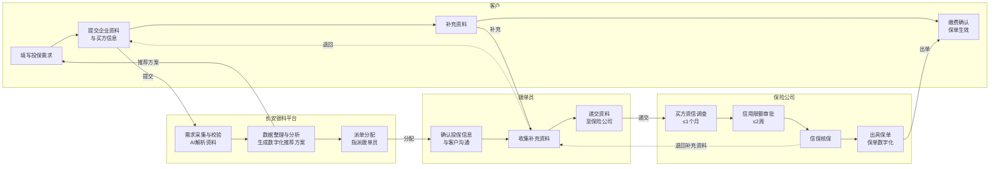
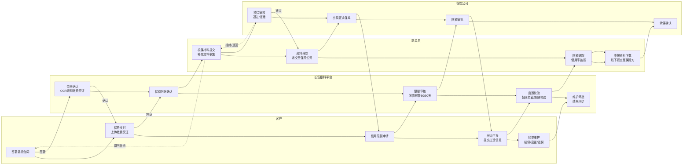
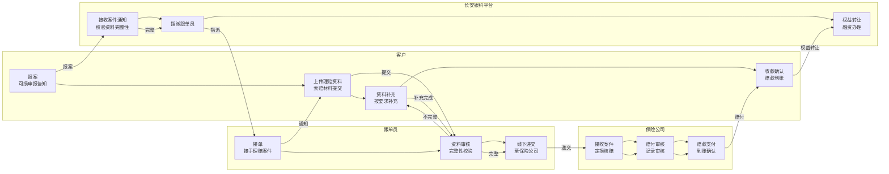

# 长安银科保险管理系统 - 产品原型设计文档

> 版本：v2.8（规范化整理版）
> 更新日期：2026-05-22
> 依据：原始需求字段信息.md

---

## 目录

1. [技术方案](#一技术方案)
2. [导航结构设计](#二导航结构设计)
3. [业务流程图](#三业务流程图)
4. [保险购买模块](#四保险购买模块)
5. [保单管理模块](#五保单管理模块)
6. [保险理赔模块](#六保险理赔模块)
7. [跟单员管理模块](#七跟单员管理模块)
8. [数据统计模块](#八数据统计模块)
9. [合规校验与状态约束](#九合规校验与状态约束)
10. [视觉规范与角色视图](#十视觉规范与角色视图)
11. [开发计划](#十一开发计划)

---

## 一、技术方案

### 1.1 技术栈选择

| 技术          | 选择               | 说明                |
| ----------- | ---------------- | ----------------- |
| **前端框架**    | Vue 3            | 采用Composition API |
| **UI组件库**   | TDesign Vue Next | 腾讯企业级UI组件库        |
| **构建工具**    | Vite             | 快速开发构建工具          |
| **路由管理**    | Vue Router 4     | SPA路由管理           |
| **状态管理**    | Pinia            | 轻量级状态管理           |
| **CSS预处理器** | SCSS             | 样式复用与变量管理         |

### 1.2 项目结构

```
cayk-bx-ui/
├── src/
│   ├── api/                    # API接口管理（暂为空，待实现）
│   ├── assets/styles/          # 全局样式与主题变量
│   ├── components/common/      # 公共组件
│   ├── layouts/MainLayout.vue  # 主布局（侧边栏+内容区+角色切换）
│   ├── pages/                  # 页面组件（共22个）
│   │   ├── insurance/          # 保险购买模块（5页）
│   │   ├── policy/             # 保单管理模块（7页）
│   │   ├── claim/              # 理赔管理模块（3页）
│   │   ├── clerk/              # 跟单员管理模块（4页）
│   │   └── statistics/         # 数据统计模块（2页）
│   ├── router/index.js         # 路由配置（共24条路由含重定向）
│   ├── stores/                 # Pinia状态管理
│   ├── App.vue
│   └── main.js
├── index.html
├── package.json
├── vite.config.js
└── README.md
```

---

## 二、导航结构设计

### 2.1 整体导航架构

采用**左侧导航栏 + 顶部Header**的经典后台管理模式。

### 2.2 菜单项详细配置

| 一级菜单      | 二级菜单     | 路由路径                | 可见角色              | 说明                  |
| --------- | -------- | ------------------- | ------------------- | ------------------- |
| 保险购买     | 投保信息管理   | /insurance/purchase | 客户、长安银科、跟单员     | 投保申请列表与管理         |
|           | 投保流程管理   | /insurance/apply    | 长安银科、跟单员        | 投保审核流程管理          |
|           | 投保数据报表   | /insurance/report   | 长安银科、跟单员        | 投保数据统计报表         |
| 保单管理     | 保单信息管理   | /policy/list        | 客户、长安银科、跟单员     | 保单列表与管理          |
|           | 信用限额管理   | /policy/limit       | 长安银科、跟单员        | 买方信用限额管理         |
|           | 出运申报管理   | /policy/shipment    | 客户、长安银科、跟单员     | 出运申报与管理          |
|           | 流程管理     | /policy/process     | 长安银科、跟单员        | 保单生命周期流程管理       |
| 保险理赔     | 理赔信息管理   | /claim/list         | 长安银科、跟单员        | 理赔列表与管理          |
|           | 理赔流程管理   | /claim/process      | 长安银科、跟单员        | 理赔流程管理          |
|           | 理赔报表管理   | /claim/report       | 长安银科、跟单员        | 理赔数据统计报表         |
| 跟单员管理    | 跟单员信息    | /clerk/list         | 长安银科              | 跟单员列表与管理         |
|           | 权限管理     | /clerk/permission   | 长安银科              | 跟单员权限配置          |
|           | 业务管理     | /clerk/task         | 长安银科、跟单员        | 任务分配与抢单          |
|           | 考核管理     | /clerk/performance  | 长安银科              | 跟单员绩效考核          |
| 数据统计     | 业务数据统计   | /stats/business     | 长安银科、跟单员        | 业务数据分析           |
|           | 风险数据分析   | /stats/risk         | 长安银科、跟单员        | 风险评估与预警          |

---

## 三、业务流程图

> 以下三个泳道图分别对应保险投保、保单管理、保险理赔三大核心业务流程。角色泳道包括：客户、长安银科平台、跟单员、保险公司。流程图涵盖各角色间的协作关系与关键流转节点。

### 3.1 保险投保流程



**流程说明：**
1. 客户在平台填写投保需求并提交企业基本资料与买方信息
2. 长安银科平台AI解析资料，自动填充客户基本信息，生成数字化推荐投保方案
3. 平台派单给跟单员，跟单员与客户沟通确认投保信息
4. 如需补充资料则退回给客户补充，补充完成后跟单员递交资料至保险公司
5. 保险公司进行买方资信调查（1个月内）、信用限额审批（2周内）、核保
6. 核保通过后出具保单，客户缴费确认，保单生效
7. 如核保退回，补充资料后重新递交

### 3.2 保单管理流程



**流程说明：**
1. 客户与长安银科签署委托合同，长安银科确认后进入保费支付环节
2. 客户上传缴费凭证，长安银科进行OCR识别确认缴费到账
3. 跟单员收集核保材料，提交至保险公司核保
4. 保险公司核保通过后出具正式保单，未通过则退回补充资料
5. 客户申请信用限额，平台审核后提交保险公司审批
6. 客户进行出运申报，平台校验超限/期限/保费冻结规则
7. 跟单员下载申报资料，线下提交至保险公司进行承保确认
8. 保单维护阶段支持续保、变更、退保操作，长安银科审批后结果同步

### 3.3 保险理赔流程



**流程说明：**
1. 客户发起报案（可损申报告知），长安银科平台接收案件通知并校验资料完整性
2. 资料完整则指派跟单员，跟单员接单后通知客户上传理赔资料
3. 客户提交索赔材料，跟单员审核资料完整性
4. 如资料不完整退回客户补充，补充完成重新提交
5. 资料完整后跟单员线下递交至保险公司
6. 保险公司进行定损核赔、赔付审核，最终支付赔款
7. 客户确认赔款到账，办理权益转让与融资手续

---

## 四、保险购买模块

### 4.1 字段清单

#### 4.1.1 客户基本信息字段

| 字段名称 | 字段说明 | 必填 | 数据来源 | 组件类型 | 备注 |
| --- | --- | :-: | --- | --- | --- |
| enterpriseName | 企业名称（与证照一致） | ✓ | AI解析/客户填报 | Input | |
| companyEnglishName | 公司英文名称 | ✓ | API接口对接 | Input | **新增**，境外业务必填 |
| unifiedSocialCreditCode | 统一社会信用代码（18位） | ✓ | AI解析 | Input | 对接工商接口校验 |
| registeredAddress | 注册地址（与营业执照一致） | ✓ | AI解析/客户填报 | Input | **新增** |
| enterpriseAddress | 营业地址（实际经营地址） | ✓ | AI解析/客户填报 | Input | 与注册地址不一致需注明 |
| establishedYear | 成立年份（YYYY） | ✓ | API接口对接 | Select | **新增** |
| legalRepresentative | 法定代表人姓名 | ✓ | API接口对接 | Input | **新增** |
| enterpriseNature | 企业性质 | ✓ | 客户填报 | Select | **新增**，国有企业/民营企业/外资企业/其他 |
| businessNature | 经营性质 | ✓ | 客户填报 | Select | **新增**，生产型企业/贸易公司/贸易代理 |
| exportBusinessHistory | 出口业务经营历史 | ✓ | 客户填报 | Select | **新增**，1年以内/1-3年/3年以上/即将从事 |
| businessLicense | 企业法人营业执照扫描件 | ✓ | 客户上传 | Upload | |
| importExportQualification | 对外贸易经营者备案登记表 | ✓ | 客户上传 | Upload | |
| contactName | 联系人姓名 | ✓ | 客户填报 | Input | |
| contactTitle | 联系人职务 | - | 客户填报 | Input | **新增** |
| contactPhone | 联系电话（手机/座机） | ✓ | 客户填报 | Input | 需短信验证 |
| contactEmail | 电子邮箱 | ✓ | 客户填报 | Input | **新增**原为选填，现改为必填；企业邮箱格式校验 |
| faxNumber | 传真号码 | - | 客户填报 | Input | **新增** |
| relatedCompanyList | 关联公司名单及关系 | - | 客户填报 | Textarea | **新增** |
| hasExistingInsurance | 是否有现有信用险保单 | - | 客户填报 | Select | **新增**，是/否；选"是"需填写现保险人、保单号 |

#### 4.1.2 买方信息字段

| 字段名称 | 字段说明 | 必填 | 数据来源 | 组件类型 | 备注 |
| --- | --- | :-: | --- | --- | --- |
| buyerName | 买方准确全称（与国外买方合同一致） | ✓ | 客户填报 | Input | 输入后自动匹配第三方数据源，保留手动修改 |
| buyerNameEnglish | 买方全称（英文） | ✓ | 客户填报 | Input | **新增**，境外买方必填英文全称 |
| buyerCountry | 买方所在国家/地区 | ✓ | 客户填报 | Select | 选择后展示国别风险评级 |
| buyerIndustry | 买方所属行业 | ✓ | 客户填报 | Select | **新增**，选择后展示行业风险评级 |
| buyerAddress | 买方注册地址 | ✓ | 客户填报 | Input | |
| buyerContact | 买方联系方式 | - | 客户填报 | Input | **新增**，电话/邮箱 |
| buyerRegNumber | 买方注册号/税号 | - | 客户填报 | Input | **新增** |
| insuranceType | 投保类型 | 系统预设 | 系统生成 | - | **新增**，默认为"出口信用保险" |
| estimatedAnnualSales | 预计未来12个月赊销总额 | ✓ | 客户填报 | Input | **新增**，美元/人民币 |
| paymentTermDays | 付款条件（账期天数） | ✓ | 客户填报 | Input | **新增**，发送货物后XX天/开具发票后XX天 |
| settlementMethod | 结算方式 | ✓ | 客户填报 | Select | **新增**，赊销OA/信用证LC/DP/DA/预付款/其他 |
| issuingBankName | 开证行全称 | 条件必填 | 客户填报 | Input | **新增**，仅LC方式时显示 |
| swiftCode | 银行SWIFT代码 | 条件必填 | 客户填报 | Input | **新增**，仅LC方式时显示 |
| creditLimitApplied | 拟申请信用限额 | ✓ | 客户填报 | Input | **新增**，最大应收账款余额 |
| cooperationYears | 与该买方合作年限 | ✓ | 客户填报 | Select | **新增**，新买家/1年以内/1-3年/3年以上 |
| historicalTransactionAmount | 近12个月交易总额 | ✓ | 客户填报/系统统计 | Input | **新增**原为选填，现改为必填 |
| historicalOverdue | 历史逾期情况 | - | 客户填报 | Select | **新增**，无逾期/有逾期已结清/有逾期未结清 |
| buyerHasPublicFinance | 买方是否有公开财报 | - | 客户填报 | Radio | **新增**，是/否/未知；选"是"可提供财报链接或上传 |
| buyerIsListed | 买方是否为上市公司 | - | 客户填报 | Radio | **新增**，是/否/未知 |
| buyerHasNegativeNews | 买方是否有负面新闻/诉讼 | - | 客户填报 | Radio | **新增**，是/否/未知；选"是"可简要说明 |
| buyerCreditRating | 买方信用评级 | - | 保险公司调查 | Select | |
| preferredInsuranceOrgType | 倾向的保险机构类型 | - | 客户填报 | MultiSelect | **新增**，政策性/商业性/国际专业/银行系/无偏好 |
| specifyInsuranceCompany | 是否指定具体保险公司 | - | 客户填报 | Select | **新增**，选"是"则下拉选择具体公司 |
| authorizationDocument | 授权保险公司联系买方的签字文件 | ✓ | 客户上传 | Upload | |

#### 4.1.3 投保核心需求字段

| 字段名称 | 字段说明 | 必填 | 数据来源 | 组件类型 | 备注 |
| --- | --- | :-: | --- | --- | --- |
| insuranceScheme | 投保方案选择 | ✓ | 系统推荐/客户选择 | Select | |
| insuranceType | 投保类型 | ✓ | 系统预设 | Select | **新增**，短期出口信用保险 |
| preferredOrgType | 投保倾向机构类型 | ✓ | 客户填报 | Select | **新增**，政策性保险机构/商业性保险机构/无偏好 |
| insuranceBusinessScope | 投保业务范围 | ✓ | 客户填报 | Select | **新增**，全部适保业务/部分适保业务 |
| coverageCurrency | 投保币种 | ✓ | 客户填报 | Select | **新增**，USD/CNY/EUR |
| coverageAmount | 投保金额/保额 | ✓ | 客户填报 | Input | 需与预计营业额匹配 |
| expectedInsurancePeriod | 期望保险期间 | ✓ | 客户填报 | DateRange | **新增**，起止日期，通常为1年 |
| insuranceMainPurpose | 投保主要目的 | ✓ | 客户填报 | Radio | **新增**，按重要性排序：保障出口收汇安全/获取银行贸易融资/提升内部管理/取得海外买方信息 |
| exportMainCountries | 出口主要国别/地区 | ✓ | 客户填报 | MultiSelect | **新增**，最多5个，关联国别风险评级库 |
| exportMainIndustry | 主营出口行业 | ✓ | 客户填报 | Select | **新增**，关联行业风险评级库大类 |
| industrySubCategory | 行业细分品类 | - | 客户填报 | Select | **新增**，关联行业细分评级 |
| estimatedInsurableTurnover | 预计未来12个月可保营业额 | ✓ | 客户填报 | Input | **新增**，需扣除关联企业贸易、非赊销贸易 |
| mainPaymentMethod | 主要付款方式 | ✓ | 客户填报 | Select | **新增**，LC/OA/DP/DA/预付款/其他 |
| commonPaymentTerm | 最常用的付款期限 | ✓ | 客户填报 | Input | **新增**，具体天数(30/60/90) |
| maxPaymentTerm | 最长付款期限 | ✓ | 客户填报 | Input | **新增**，具体天数(120/180) |
| hasLongCreditPeriod | 是否为买家提供较长赊账期 | ✓ | 客户填报 | Select | **新增**，是/否；选"是"需填写最长赊账期 |
| specialRequirements | 特殊需求说明 | - | 客户填报 | Textarea | |

#### 4.1.4 投保贸易基础信息字段（**新增**）

| 字段名称 | 字段说明 | 必填 | 数据来源 | 组件类型 |
| --- | --- | :-: | --- | --- |
| exportProductCategory | 出口商品/服务品类 | ✓ | 客户填报 | Input |
| isControlledGoods | 是否涉及管制商品 | ✓ | 客户填报 | Select |
| controlledGoodsName | 管制商品名称 | 条件必填 | 客户填报 | Input |
| businessSpecialNature | 业务的特殊性 | - | 客户填报 | Textarea |
| hasRetentionTitle | 贸易合同是否含物权保留条款 | ✓ | 客户填报 | Radio |
| exportTotalPast3Years | 近三年出口总额（万美元） | - | 客户填报 | Input |
| creditSalesPast3Years | 近三年赊销总额（万美元） | - | 客户填报 | Input |
| exportSalesComposition | 上一财年出口销售组成 | - | 客户填报 | Input |
| receivableQuarterlyBalance | 最近一年每季度末应收账款余额 | - | 客户填报 | Input |
| overdueReceivableAnalysis | 逾期应收账款分析 | - | 客户填报 | Textarea |
| badDebtHistory5Years | 近五个财务年度的坏账情况 | - | 客户填报 | Textarea |

#### 4.1.5 补充资料上传字段（**新增**）

| 字段名称 | 字段说明 | 必传 | 格式要求 | 备注 |
| --- | --- | :-: | --- | --- |
| tradeContractScan | 近期贸易合同扫描件（样本） | ✓ | PDF/JPG/PNG，≤10MB | 含买卖双方名称、商品名称、付款方式、账期条款 |
| customsDeclarationScan | 出口报关单扫描件（样本） | ✓ | PDF/JPG/PNG，≤10MB | 含报关单号、出口国别、商品名称、金额 |
| exportLicense | 出口许可证（如涉及管制商品） | 条件必传 | PDF/JPG/PNG，≤5MB | |
| buyerQualificationCert | 买方资质证明 | - | PDF/JPG/PNG，≤5MB | 买方营业执照或官网资质截图 |
| retentionTitleDoc | 物权保留条款文件 | - | PDF/JPG/PNG，≤5MB | |
| receivableDetailList | 应收账款明细表 | - | Excel/PDF，≤5MB | 系统提供模板 |
| collectionAndGuarantee | 催收及担保措施说明 | - | Textarea | |
| factoringOrInvoiceDiscount | 保理或发票折扣协议 | - | PDF/JPG/PNG，≤5MB | |
| applicantAttachments | 投保人资料附件 | - | PDF | 营业执照、财务报表、信用管理制度等 |

#### 4.1.6 投保人声明（**新增**）

| 字段名称 | 字段说明 | 必填 | 交互方式 |
| --- | --- | :-: | --- |
| applicantDeclaration | 投保人声明 | ✓ | 投保人确认并粘贴至文本框，内容：卖方知悉并确认其上传的资料真实、合法、有效 |

### 4.2 流程功能清单（**新增详细节点**）

| 阶段 | 流程节点 | 操作主体 | 办理时限/触发规则 | 客户端资料清单 | 平台功能支持 |
| --- | --- | --- | --- | --- | --- |
| 投保提交 | 提交投保材料 | 客户 | / | ①企业法人营业执照 ②进出口企业资格证书 ③买方基本信息 | AI解析资料自动填充客户基本信息 |
| | 填写投保申请资料 | 客户 | / | 《投保单》《买方信息采集表》 | 生成标准化投保文件 |
| | 提交补充资料 | 跟单员 | / | 根据跟单员反馈 | 补充资料清单管理 |
| | 资料提交 | 跟单员 | / | 盖章版《投保单》《买方信息采集表》 | 投保资料打包移送至跟单员 |
| 保险核保 | 买方资信调查 | 保险公司 | 1个月 | 买方信息（补充）、授权文件 | 补充资料录入 |
| | 信用限额审批 | 保险公司 | 2周左右 | / | 系统流程记录，核准初始限额 |
| | 信保核保 | 保险公司 | / | / | 核保流程管理 |
| | 出具保单 | 保险公司 | / | / | 保单数字化 |
| 保费缴纳 | 保费缴纳 | 客户 | 收到发票后10日内 | 缴费凭证 | 缴费记录保存 |
| 限额管理 | 提交限额申请 | 客户/系统触发 | 新增买方、超出限额出运前 | 《买方信用限额申请表》 | 申请资料生成、超额预警提示 |
| | 资料提交 | 跟单员 | / | 《买方信用限额申请表》（盖章版） | 资料打包移送 |
| | 资信评估 | 保险公司 | / | / | 保险公司内部流程 |
| | 限额批复 | 保险公司 | / | / | 更新限额数据，限额实时预警 |
| 出口申报 | 货物出运-贸易 | 客户 | 买方信用限额生效后 | 货运单据（如提单） | 整合货物单据 |
| | 申报出口 | 客户 | 逐笔：出运后15日；月度：次月10/15日；香港：3天 | 出口申报单/月申报表 | 系统整合出运信息 |
| | 资料提交 | 跟单员 | / | 申报资料、贸易数据 | 资料打包移送 |
| | 保费计算 | 保险公司 | / | / | 系统流程记录 |
| | 开具保费发票 | 保险公司 | / | / | |
| | 支付保费 | 客户 | 收到发票后10日内 | 缴费凭证 | 缴费记录保存 |

### 4.3 页面原型设计

#### 4.3.1 投保信息管理页面 `/insurance/purchase`

**页面功能：**
- 投保申请列表展示与筛选
- 新增投保申请入口
- 投保单查看、编辑、删除操作

#### 4.3.2 投保流程管理页面 `/insurance/apply`

**页面功能：**
- 投保审核流程可视化（6步流程）
- 审核操作（通过/退回）
- 审核意见填写

#### 4.3.3 投保数据报表页面 `/insurance/report`

**页面功能：**
- 投保数据统计图表
- 数据导出功能

### 4.4 流程状态定义

| 状态码       | 状态名称    | 说明               |
| --------- | ------- | ---------------- |
| pending_review | 待审核     | 客户提交后等待审核      |
| clerk_review  | 跟单员审核   | 跟单员审核中         |
| approved    | 已通过     | 审核通过            |
| rejected    | 已拒绝     | 审核拒绝            |
| ocr_pending  | OCR待识别   | 保单数字化待处理       |

---

## 五、保单管理模块

### 5.1 字段清单

#### 5.1.1 信用限额申请字段

| 字段名称 | 字段说明 | 必填 | 数据来源 | 组件类型 | 备注 |
| --- | --- | :-: | --- | --- | --- |
| policyNo | 关联保单号 | ✓ | 系统关联 | Select | **新增** |
| buyerName | 买方名称 | ✓ | 客户填报/下拉选择 | Select | |
| buyerNameEnglish | 买方全称（英文） | ✓ | 客户填报 | Input | **新增** |
| buyerCountry | 买方国别 | ✓ | 客户填报 | Select | **新增**，关联国别风险评级库 |
| buyerAddress | 买方注册地址 | ✓ | 客户填报 | Input | **新增** |
| buyerContact | 买方联系方式 | - | 客户填报 | Input | **新增** |
| buyerRegNumber | 买方注册号/税号 | - | 客户填报 | Input | **新增** |
| buyerIndustry | 买方所属行业 | ✓ | 客户填报 | Select | **新增**，关联行业风险评级库 |
| creditLimit | 申请信用限额金额 | ✓ | 客户填报 | Input | |
| creditLimitCurrency | 申请限额币种 | ✓ | 客户填报 | Select | **新增**，USD/CNY/EUR/其他 |
| paymentTermDays | 付款条件（账期天数） | ✓ | 客户填报 | Input | **新增** |
| paymentMethod | 支付方式 | ✓ | 客户填报 | Select | **新增**，OA/DA/DP/LC/预付款/其他 |
| past12MonthsCreditSales | 过去12个月赊销交易额 | ✓ | 客户填报 | Input | **新增** |
| estimatedAnnualCreditSales | 预计未来12个月赊销总额 | ✓ | 客户填报 | Input | **新增** |
| hasGuarantee | 是否有担保 | - | 客户填报 | Select | **新增**，是/否 |
| guarantorName | 担保方公司全称 | 条件必填 | 客户填报 | Input | **新增** |
| cooperationYears | 与该买方合作年限 | ✓ | 客户填报 | Select | **新增**，新买家/1年以内/1-3年/3年以上 |
| historicalTransactionRecord | 历史交易记录（附件） | - | 客户上传 | Upload | **新增**，PDF/Excel |
| buyerQualificationCert | 买方资质证明（附件） | - | 客户上传 | Upload | **新增**，PDF/JPG/PNG |
| allowContactBuyer | 是否同意联系买方 | ✓ | 客户填报 | Select | **新增**，是/否 |
| approvedCreditLimit | 批复限额金额 | - | 保险公司回填 | Input | **新增** |
| approvalDate | 批复日期 | - | 保险公司回填 | Date | **新增** |
| limitEffectiveDate | 限额有效期起 | - | 保险公司回填 | Date | **新增** |
| limitExpiryDate | 限额有效期止 | - | 保险公司回填 | Date | **新增** |
| lastShipmentDate | 最后出运日期 | - | 系统自动更新 | Date | **新增** |
| limitStatus | 限额状态 | - | 系统自动更新 | Select | **新增**，待审批/已批复/已拒绝/已冻结/已撤销/已过期 |
| limitUtilizationRate | 限额使用率 | - | 系统自动计算 | Percent | **新增** |

#### 5.1.2 出运申报字段

| 字段名称 | 字段说明 | 必填 | 数据来源 | 组件类型 | 备注 |
| --- | --- | :-: | --- | --- | --- |
| shipmentNo | 申报批次号 | ✓ | 系统自动生成 | - | **新增** |
| policyNo | 关联保单号 | ✓ | 系统关联 | Select | **新增** |
| buyerName | 买方名称 | ✓ | 下拉选择 | Select | |
| buyerCountry | 买方国别 | ✓ | 系统读取 | - | **新增**，从买方信息自动读取 |
| invoiceNo | 发票号 | ✓ | 客户填报 | Input | **新增**原为选填，现改为必填 |
| invoiceAmount | 发票金额 | ✓ | 客户填报 | Input | **新增** |
| invoiceDate | 发票日期 | ✓ | 客户填报 | Date | **新增** |
| shipmentDate | 出运日期 | ✓ | 客户填报 | Date | |
| paymentDueDate | 应付款日 | ✓ | 系统自动计算 | Date | **新增**，出运日+信用期限 |
| paymentTermDays | 付款条件（账期天数） | ✓ | 客户填报 | Input | **新增** |
| paymentMethod | 支付方式 | ✓ | 客户填报 | Select | **新增**，OA/DA/DP/LC/预付款/其他 |
| goodsDescription | 货物描述 | ✓ | 客户填报 | Input | **新增** |
| transportType | 运输方式 | ✓ | 下拉选择 | Select | **新增**原为选填，现改为必填；海运/空运/陆运/其他 |
| billOfLadingNo | 提单号/运单号 | ✓ | 客户填报 | Input | **新增** |
| usedCreditLimitBalance | 已用限额余额 | - | 系统自动计算 | - | **新增** |
| commercialInvoice | 商业发票（附件） | ✓ | 客户上传 | Upload | **新增**，PDF/JPG/PNG |
| billOfLading | 提单/运单（附件） | ✓ | 客户上传 | Upload | **新增**，PDF/JPG/PNG |
| customsDeclaration | 报关单（附件） | - | 客户上传 | Upload | **新增**，PDF |
| receiptProof | 买方收货凭证（附件） | - | 客户上传 | Upload | **新增**，PDF |

#### 5.1.3 保单数字化页面字段（OCR + 人工校对）（**大量新增**）

| 字段分类 | 字段名称 | 填写/上传要求 | 数据来源 | 备注 |
| --- | --- | --- | --- | --- |
| **基础信息** | 保险单号 | 需支持查询、编辑（需权限）、失效状态标记 | OCR识别/可编辑 | |
| | 保险公司名称 | XXXX保险公司 | OCR识别抓取 | |
| | 保险人名称 | XXXX保险公司 | OCR识别/可编辑 | **新增** |
| | 被保险人名称 | 客户/客户关联企业 | OCR识别/可编辑 | 需与贸易项下卖方信息一致，建议强校验 |
| | 受益人名称 | | OCR识别/可编辑 | **新增** |
| | 保险起期 | 日期 | OCR识别/可编辑 | |
| | 保险止期 | 日期 | OCR识别/可编辑 | |
| | 保险期间 | 如12个月 | OCR识别/可编辑 | **新增** |
| | 续保标识 | 是/否 | 手动选择 | **新增**，保险止期前30天触发提醒 |
| | 投保金额 | 支持人民币、美元、港币 | OCR识别/可编辑 | **新增** |
| | 国家风险类别版本 | | OCR识别/手动录入 | **新增** |
| | 条款版本 | | OCR识别/手动录入 | **新增** |
| | 约定保险范围 | | OCR识别/手动录入 | **新增** |
| | 业务类型 | 服务贸易/货物贸易 | 手动选择 | **新增** |
| **责任限额** | 最高赔偿限额 | | OCR识别/可编辑 | **新增** |
| | 买方信息 | 支持多个买方信息填写 | 手动录入 | 与贸易环节买方信息强校验 |
| | 买方信用限额 | | 录入/校对 | 根据出运+收汇情况自动更新 |
| | 承保风险及赔偿比例 | 商业风险（破产/拖欠/拒收/开证行）、政治风险 | OCR识别后匹配 | **新增**，支持修改后与保单比对 |
| | 限额闲置期（如有） | | 手动录入 | **新增**，届满前30日提醒 |
| | 自行掌握限额/自定信用限额 | 含条件、限额要求、申报方式、赔付基数、赔偿比例等 | OCR识别/可编辑 | **新增** |
| | 免赔额 | | OCR识别/可编辑 | **新增** |
| **申报规则** | 申报方式 | | OCR识别/可编辑 | **新增**，与买方信息强校验 |
| | 申报周期 | 月度/季度 | OCR识别/可编辑 | **新增** |
| | 申报截至日期 | 日期，如"次月15日" | OCR识别/可编辑 | **新增**，设置截止日提醒 |
| | 申报币种 | 人民币/美元 | OCR识别/可编辑 | **新增** |
| **费用管理** | 保险费率 | XX%，可能为费率区间 | OCR识别后匹配/可修改 | |
| | 缴费期限 | 具体日期 | OCR识别/可编辑 | **新增** |
| | 缴费方式 | 年付/季付/月付 | OCR识别/可编辑 | **新增** |
| | 预缴最低保费（如有） | | OCR识别/可编辑 | **新增** |
| | 保费 | 具体金额 | 跟单员录入 | 逾期未缴触发保单效力中止 |
| | 退保费用（如有） | | OCR识别/可编辑 | **新增**，按未到期天数比例退还 |
| | 赔款追回款项支付账户 | 户名/账户/开户行 | 手动录入 | **新增** |
| **保单文件** | 保单 | 文件上传 | 上传 | **新增** |
| | 批单 | 文件上传 | 上传 | **新增** |

### 5.2 关键业务规则（**大量新增**）

| 规则域 | 规则名称 | 触发条件 | 系统行为 | 备注 |
| --- | --- | --- | --- | --- |
| 限额 | 出运申报限额校验（超限拦截） | 提交出运申报 | 超限额时弹窗阻断并提示 | |
| 限额 | 单一买方/国家集中度限制（CPIC） | 限额申请/出运申报 | 超限阻止提交并提示原因 | 单一买方≤保险总金额20%，单一国家≤30% |
| 限额 | 新增买方限额申请 | 开发新客户/拟出运前 | 提交新买方信息→资信调查(≤1个月)→审批 | **新增**，建议提前15-30天申请 |
| 限额 | 增额申请 | 预计交易额超出原限额时 | 提交调增申请+佐证→重新核保→批复 | **新增**，可调高/维持/降低 |
| 限额 | 限额冻结/下调 | 买方出现逾期、风险信号时 | 保险公司主动冻结或调减 | **新增** |
| 限额 | 非取消限额保护 | 已批复非取消限额的买方 | 标记不可单方取消 | **新增**，仅裕利安宜/安裕提供 |
| 闲置期 | 限额闲置预警 | 距上次出运>60天 | 黄灯预警，通知客户经理 | **新增**，距90天撤销剩30天缓冲 |
| 闲置期 | 限额自动撤销 | 限额获批后连续90天无出运 | 红灯自动撤销，不可逆 | **新增**，需重新资信调查 |
| 闲置期 | 保活申报 | 闲置接近90天但仍可能交易 | 客户做小额出运申报→闲置清零 | **新增**，建议闲置80天左右执行 |
| 闲置期 | 主动释放限额 | 确认不再交易的买方 | 客户申请撤销→释放额度空间 | **新增** |
| 期限 | 出运申报期限规则 | 货物实际出运日后 | 逐笔申报：出运后15日；月度汇总：次月10/15日；香港：3天内 | **新增**细化规则 |
| 期限 | 应付款日计算 | 出运日+信用期限 | 系统自动计算，逾期判断起算点 | **新增** |
| 期限 | 逾期状态判定 | 应付款日+1天起 | 进入逾期状态，按天数分段监控 | **新增** |
| 期限 | 拖欠风险报损触发 | 逾期>90天或买方破产/拒收 | 触发"拖欠风险"，5个工作日内报损 | **新增**，逾期85天橙色预警 |
| 期限 | 出险通知期限 | 知道风险发生后 | 5个工作日内通知保险公司 | **新增** |
| 期限 | 索赔申请期限 | 损失发生日 | 损失后60天内提交索赔申请 | **新增** |
| 期限 | 保单到期处理 | 保单止期24时 | 所有限额同步失效 | **新增**，到期前30天续保提醒 |
| 期限 | 续保空窗期处理 | 原保单到期与新保单生效之间 | 空窗期无保障覆盖，暂停出运申报 | **新增** |
| 保费 | 保费计算 | 投保时 | 保费=预计可保营业额×投保比例×费率 | **新增** |
| 保费 | 保费缴纳时限 | 收到保费通知后 | PICC:10个工作日内；行业通用:保单生效后30天内 | **新增** |
| 保费 | 保费缴费状态校验 | 提交出运申报时 | 未缴且超期→冻结出运申报权限 | |
| 保费 | 年度保费结算 | 保单到期时 | 实际>预计→追收差额；实际<预计→通常不退费 | **新增** |
| 保费 | 高赔付率续保费率上浮 | 续保时上年赔付率>60% | 续保费率上浮 | **新增** |
| 保费 | 限额利用率低费率优化 | 续保时限额利用率<50% | 缩减买方清单/调低保额→保费下调 | **新增** |
| 保费 | 退保处理 | 企业主动退保（提前30日书面通知） | 按短期费率计算退费 | **新增** |
| 续保 | 续保启动与空窗期 | 到期前30天/空窗期存在 | 到期前30天提醒，空窗期暂停出运申报 | |
| 续保 | 续保前闲置清理 | 保单到期前1个月 | 清理长期闲置买方 | **新增** |

### 5.3 页面原型设计

#### 5.3.1 保单列表页面 `/policy/list`

**页面功能：**
- 保单列表展示与筛选
- 保单详情查看
- 新增投保入口

#### 5.3.2 信用限额管理页面 `/policy/limit`

**页面功能：**
- 信用限额列表展示
- 限额申请/增额/冻结操作
- 限额使用率统计

#### 5.3.3 出运申报管理页面 `/policy/shipment`

**页面功能：**
- 出运申报列表展示
- 新增出运申报
- 超期预警提示

#### 5.3.4 保单生命周期流程管理页面 `/policy/process`

**页面功能：**
- 7步流程可视化（横向进度条+竖向时间线）
- 各阶段详情展示与操作
- 审批意见填写

### 5.4 流程状态定义

| 状态码 | 状态名称 | 说明 |
| --- | --- | --- |
| pending_inkasso_sign | 待长安银科签署 | 合同待长安银科签署 |
| inkasso_signed | 长安银科已签署 | 长安银科完成签署 |
| paid | 已支付 | 保费已支付 |
| underwriting_submitted | 核保材料已提交 | 核保材料提交完成 |
| underwriting_approved | 核保通过 | 保险公司核保通过 |
| underwriting_rejected | 核保拒绝 | 保险公司拒绝承保 |
| policy_issued | 保单已出具 | 保单已生效 |
| insurance_active | 保险生效中 | 保险责任有效期内 |
| policy_changed | 已变更 | 保单已完成变更 |
| policy_renewed | 已续保 | 保单已完成续保 |
| policy_cancelled | 已退保 | 保单已退保 |
| policy_suspended | 保单中止 | 未按时缴纳保费触发中止 |

### 5.5 出口申报期限规则（**新增**）

| 公司 | 申报周期 | 申报截止日 | 申报方式 | 逾期处理 |
| --- | --- | --- | --- | --- |
| 中国信保 | 月度 | 次月15日前 | 线下/系统 | 补缴+滞纳金 |
| 人保财险 | 月度 | 次月10日前 | 线下/线上 | 补缴+滞纳金 |
| 太保产险 | 月度 | 次月15日前 | 线下/线上 | 补缴 |
| 平安产险 | 月度 | 次月10日前 | APP实时 | 自动提醒 |
| 裕利安宜 | 月度 | 次月10日前 | 在线平台 | 补缴 |
| 安裕 | 月度 | 次月10日前 | 在线平台 | 补缴 |
| 科法斯 | 月度 | 次月15日前 | 在线平台 | 补缴 |
| 香港信保局 | 月度 | 次月15日前 | 在线/线下 | 补缴 |

### 5.6 保单变更/续保/退保字段（**新增**）

#### 5.6.1 保单变更字段

| 字段名称 | 字段说明 | 必填 | 数据来源 |
| --- | --- | :-: | --- |
| changeApplyDate | 变更申请日期 | ✓ | 系统自动生成 |
| changeType | 变更类型 | ✓ | 下拉选择：增加/减少买方/延期/变更限额/变更被保险人信息/变更联系人/变更地址/其他 |
| changeReason | 变更原因 | ✓ | 手动输入 |
| changeBeforeContent | 变更前内容 | ✓ | 手动输入/自动读取 |
| changeAfterContent | 变更后内容 | ✓ | 手动输入 |
| changeEffectiveDate | 变更生效日期 | - | 保险公司回填 |
| endorsementNo | 批单/批注编号 | - | 保险公司生成 |
| changeApplicationDoc | 变更申请书（附件） | ✓ | 客户上传 |
| supportingDoc | 证明文件（附件） | - | 客户上传 |

#### 5.6.2 续保字段

| 字段名称 | 字段说明 | 必填 | 数据来源 |
| --- | --- | :-: | --- |
| renewalApplyDate | 续保申请日期 | ✓ | 系统自动生成 |
| originalPolicyExpiryDate | 原保单到期日 | ✓ | 自动读取 |
| renewalBuyerList | 更新后的买方清单 | ✓ | 客户填报 |
| annualShipmentSummary | 上一年度出运申报汇总 | ✓ | 系统自动生成 |
| annualReceivableStatus | 上一年度收汇/逾期情况 | ✓ | 系统自动生成 |
| changeInfo | 变更信息（如有） | - | 客户填报 |

#### 5.6.3 退保字段

| 字段名称 | 字段说明 | 必填 | 数据来源 |
| --- | --- | :-: | --- |
| surrenderApplyDate | 退保申请日期 | ✓ | 系统自动生成 |
| surrenderReason | 退保原因说明 | ✓ | 客户填报 |
| surrenderAmount | 退费金额 | - | 系统自动计算 |
| surrenderVoucher | 退费凭证 | - | 保险公司提供 |

---

## 六、保险理赔模块

### 6.1 字段清单

#### 6.1.1 理赔关键字段（**大量新增**）

| 字段名称 | 字段说明 | 必填 | 数据来源 | 组件类型 | 备注 |
| --- | --- | :-: | --- | --- | --- |
| claimNo | 理赔编号 | ✓ | 系统生成 | - | |
| policyNo | 关联保单号 | ✓ | 关联选择 | Select | |
| buyerName | 买方名称 | ✓ | 关联选择 | Select | |
| lossType | 损失类型 | ✓ | 客户填报 | Select | 破产/拖欠/拒收/政治风险/其他 |
| lossDate | 损失日期 | ✓ | 客户填报 | Date | |
| lossCurrency | 损失币种 | ✓ | 客户填报 | Select | **新增**，USD/CNY/EUR/其他 |
| lossAmount | 损失金额 | ✓ | 客户填报 | Input | **新增** |
| reportDate | 报案日期 | ✓ | 系统自动记录 | Date | |
| claimSubmitDate | 索赔申请日期 | ✓ | 客户填报 | Date | **新增** |
| claimAmount | 索赔金额 | ✓ | 客户填报 | Input | |
| overdueDays | 逾期天数 | - | 系统自动计算 | - | **新增** |
| claimContactPerson | 理赔联系人 | ✓ | 客户填报 | Input | **新增** |
| claimContactPhone | 理赔联系电话 | ✓ | 客户填报 | Input | **新增** |
| claimContactEmail | 理赔联系邮箱 | ✓ | 客户填报 | Input | **新增** |
| receivingBankAccount | 收款银行账户信息 | ✓ | 客户填报 | Input | **新增**，户名/账户/开户行 |
| caseStatus | 案件状态 | - | 系统自动更新 | Select | **新增**，待报案/已报案/审核中/补充材料/已核定/已赔付/已拒赔/追偿中/已结案 |
| insurerAssessmentResult | 保险公司核定结果 | - | 保险公司回填 | Textarea | **新增** |
| assessedPayoutAmount | 核定赔付金额 | - | 保险公司回填 | Input | **新增** |
| rejectionReason | 拒赔原因 | - | 保险公司回填 | Textarea | **新增** |
| payoutDate | 赔款支付日期 | - | 保险公司回填 | Date | **新增** |

#### 6.1.2 理赔索赔材料清单（**新增**）

| 材料名称 | 必传 | 格式要求 | 适用场景 |
| --- | :-: | --- | --- |
| 出险通知书/报案表（附件） | ✓ | PDF | 通用 |
| 贸易合同（附件） | ✓ | PDF | 证明贸易真实性 |
| 商业发票（附件） | ✓ | PDF/JPG/PNG | 通用 |
| 提单/运单（附件） | ✓ | PDF/JPG/PNG | 通用 |
| 报关单（附件） | ✓ | PDF | 通用 |
| 买方收货凭证（附件） | ✓ | PDF | 证明货物已交付 |
| 买方破产证明（附件） | 条件必传 | PDF | 破产场景 |
| 买方拖欠催款记录（附件） | 条件必传 | PDF/邮件截图 | 拖欠场景 |
| 买方拒收货物证明（附件） | 条件必传 | PDF | 拒收场景 |
| 政治风险证明（附件） | 条件必传 | PDF/新闻/公告 | 政治风险场景 |
| 追偿授权书（附件） | ✓ | PDF | 通用 |
| 减损措施记录 | - | PDF | 仅中国信保要求 |

### 6.2 理赔流程设计

#### 6.2.1 五阶段理赔流程（**新增详细节点**）

| 阶段 | 节点名称 | 操作主体 | 说明 | 时限要求 |
| --- | --- | --- | --- | --- |
| 1 | 报案 | 客户/长安银科 | 发起理赔报案，可损申报告知 | 拖欠风险≤30天；破产/拒收≤10个工作日 |
| 2 | 跟单接单 | 长安银科/跟单员 | 接收案件→校验资料完整性→指派跟单员→接单 | **新增** |
| 3 | 资料准备 | 客户 | 提交索赔材料，资料补充 | 根据跟单员反馈补充 |
| 4 | 定损核赔 | 保险公司 | 损失核定与赔付计算 | 简单案件≤15工作日；复杂≤30-45日 |
| 5 | 赔付到账 | 保险公司 | 赔款支付 | 核赔通过后10日内 |
| 6 | 权益转让与融资 | 长安银科 | 权益转让手续办理 | **新增** |

#### 6.2.2 保险公司差异化规则（**大量新增**）

| 流程节点 | 具体要求 | 中国信保 | 人保财险 | 太平洋保险 | 大地保险 |
| --- | --- | :-: | :-: | :-: | :-: |
| **报案渠道** | 线上渠道（官网/APP/单一窗口） | ✓ | ✓ | ✓ | ✓ |
| | 电话热线 | 95387 | 95518 | 95500 | 95590 |
| | 拖欠风险报案时限≤30天 | ✓ | 不支持(均10日内) | ✓ | ✓ |
| | 破产/拒收等风险≤10个工作日 | ✓ | ✓ | ✓ | ✓ |
| **定损核赔** | 赔付比例80%-90% | ✓ | 依保单约定 | ✓ | 依保单约定 |
| | 小额快审（≤3000元） | ✗ | ✗ | ✗ | ✓ |
| | 审核周期≤15个工作日（简单案件） | ✓ | ✓ | 不支持 | ✓ |
| | 主动追偿提高赔付比例(+5%-10%) | ✗ | ✗ | ✗ | ✓ |
| **赔付到账** | 银行转账支付 | ✓ | ✓ | ✓ | ✓ |
| | 支票支付 | ✗ | ✓ | ✗ | ✗ |
| | 第三方支付（微信/支付宝） | ✗ | ✗ | ✗ | ✓ |
| | 10日内到账 | ✓ | ✓ | ✓ | ✓ |
| **权益转让** | 签署《赔款转让协议》 | ✓ | ✓ | ✓ | ✓ |
| | 直接作为赔偿申请人（无追索权） | ✓ | ✓ | ✓ | ✓ |
| | 出具《承保情况通知书》 | ✓ | ✓ | ✓ | ✓ |
| | 赔款直付银行指定账户 | ✓ | ✓ | ✓ | ✓ |
| | 单一窗口全线上化 | ✓ | ✗ | ✗ | ✗ |
| | 应收账款质押融资 | ✗ | ✗ | ✗ | ✓ |

### 6.3 页面原型设计

#### 6.3.1 理赔列表页面 `/claim/list`

**页面功能：**
- 理赔列表展示与筛选
- 新增理赔报案入口
- 理赔状态跟踪

#### 6.3.2 理赔流程管理页面 `/claim/process`

**页面功能：**
- 5节点理赔流程可视化
- 各阶段详情查看与操作
- 资料上传与审核

### 6.4 流程状态定义

| 状态码 | 状态名称 | 说明 | 备注 |
| --- | --- | --- | --- |
| pending_report | 待报案 | 客户已创建报案但未提交 | **新增** |
| reported | 已报案 | 客户发起报案 | |
| pending_receive | 待接收 | 等待保险公司接收 | |
| received | 已接收 | 保险公司已接收案件 | |
| pending_assign | 待指派 | 等待理赔人员指派 | |
| assigned | 已指派 | 理赔人员已接手 | |
| investigating | 调查中 | 正在进行损失调查 | |
| assessing | 定损中 | 正在进行损失核定 | |
| supplement_material | 补充材料 | 资料不完整需客户补充 | **新增** |
| approved | 已核定 | 损失核定完成 | **新增** |
| paid | 已赔付 | 赔款已支付 | **新增** |
| rejected | 已拒赔 | 保险公司拒绝赔付 | **新增** |
| recovery | 追偿中 | 正在进行追偿 | **新增** |
| settled | 已结案 | 理赔已完成 | |

---

## 七、跟单员管理模块

### 7.1 字段清单

| 字段名称            | 字段说明          | 必填 | 数据来源      |
| ------------- | ------------- | -- | --------- |
| clerkId       | 跟单员编号        | ✓  | 系统生成      |
| clerkName     | 跟单员姓名        | ✓  | 管理员录入     |
| phone         | 联系电话          | ✓  | 管理员录入     |
| email         | 邮箱地址          | ✓  | 管理员录入     |
| department    | 所属部门          | ✓  | 下拉选择      |
| role          | 角色权限          | ✓  | 下拉选择      |
| status        | 在职状态          | ✓  | 下拉选择      |

### 7.2 页面原型设计

#### 7.2.1 跟单员列表页面 `/clerk/list`

**页面功能：**
- 跟单员列表展示与筛选
- 新增/编辑/删除跟单员
- 权限分配入口

#### 7.2.2 权限管理页面 `/clerk/permission`

**页面功能：**
- 角色权限配置
- 菜单权限分配

#### 7.2.3 业务管理页面 `/clerk/task`

**页面功能：**
- 任务列表展示
- 任务分配与抢单
- 任务状态跟踪

#### 7.2.4 考核管理页面 `/clerk/performance`

**页面功能：**
- 绩效考核指标展示
- 业绩统计图表
- 考核结果管理

---

## 八、数据统计模块

### 8.1 页面原型设计

#### 8.1.1 业务数据统计页面 `/stats/business`

**页面功能：**
- 投保数据分析
- 保单数量统计
- 保费收入分析
- 出运申报统计

#### 8.1.2 风险数据分析页面 `/stats/risk`

**页面功能：**
- 风险预警监控
- 买方信用分析
- 限额使用率分析
- 理赔风险评估

---

## 九、合规校验与状态约束

### 9.1 投保提交合规校验

| 校验点 | 规则 | 触发时机 | 提示方式 | 备注 |
| --- | --- | --- | --- | --- |
| 必传附件-营业执照 | 必须上传”企业法人营业执照扫描件” | 点击”提交” | 阻断提交+错误提示 | |
| 必传附件-进出口资质 | 必须上传”对外贸易经营者备案登记表” | 点击”提交” | 阻断提交+错误提示 | |
| 必传附件-授权文件 | 必须上传”授权保险公司联系买方的签字文件” | 点击”提交” | 阻断提交+错误提示 | |
| 必传附件-贸易合同 | 必须上传近期贸易合同扫描件 | 点击”提交” | 阻断提交+错误提示 | **新增** |
| 必传附件-报关单 | 必须上传出口报关单扫描件 | 点击”提交” | 阻断提交+错误提示 | **新增** |
| 必传附件-许可证 | 涉及管制商品必须上传出口许可证 | 点击”提交” | 阻断提交+错误提示 | **新增** |
| 必传附件-投保人声明 | 投保人必须确认声明 | 点击”提交” | 阻断提交+错误提示 | **新增** |
| 状态流转约束 | 仅”草稿/待补充/待提交”允许提交；其他状态禁止重复提交 | 点击”提交” | 阻断提交+错误提示 | |
| 被保险人与卖方一致性校验 | 被保险人名称需与贸易项下卖方信息一致 | 保单数字化提交 | 强校验阻止 | **新增** |
| 买方信息一致性校验 | 申报买方信息与限额管理买方信息一致 | 出运申报提交 | 风险提示 | **新增** |

### 9.2 出运申报时限规则

| 场景 | 截止日计算规则 | 说明 |
| --- | --- | --- |
| 逐笔申报（默认） | 出运日期+15天 | 出运后15日内申报 |
| 出口至香港 | 出运日期+3天 | 出口至香港3天内申报 |
| 月度汇总申报 | 次月10日 | 每月10日前申报 |

### 9.3 保费管理规则（**新增**）

| 规则名称 | 触发条件 | 系统行为 | 备注 |
| --- | --- | --- | --- |
| 保费计算 | 投保时 | 保费=预计可保营业额×投保比例(≤90%)×费率(0.5%-1.8%) | 系统自动计算 |
| 保费缴纳时限 | 收到保费通知后 | PICC:10个工作日内；行业通用:保单生效后30天内 | 缴费截止前3天提醒 |
| 缴费状态校验 | 出运申报提交 | 未缴且超期→冻结出运申报权限 | 补缴后解冻 |
| 年度保费结算 | 保单到期时 | 实际>预计→追收差额；实际<预计→通常不退费(最低保费制) | |
| 高赔付率费率上浮 | 续保时上年赔付率>60% | 续保费率上浮 | |
| 限额利用率低费率优化 | 续保时限额利用率<50% | 缩减买方清单→保费下调 | |

### 9.4 理赔新建合规校验

| 校验点 | 规则 | 触发时机 | 提示方式 | 备注 |
| --- | --- | --- | --- | --- |
| 保单有效性 | 关联保单必须有效 | 选择保单后 | 无效保单不可选 | |
| 报案时限 | 超过报案时限需特殊说明 | 提交理赔时 | 阻断提交+错误提示 | |
| 必传材料-基础单据 | 贸易合同/商业发票/提单/报关单必须上传 | 点击”提交” | 阻断提交+错误提示 | **新增** |
| 必传材料-损失证明 | 破产/拖欠/拒收/政治风险对应证明必须上传 | 点击”提交” | 阻断提交+错误提示 | **新增** |
| 必传材料-追偿授权书 | 必须上传追偿授权书 | 点击”提交” | 阻断提交+错误提示 | **新增** |
| 索赔申请期限 | 损失发生后60天内提交索赔申请 | 提交索赔时 | 超期阻断+提示 | **新增** |
| 拖欠报损时限 | 逾期>90天后5个工作日内报损 | 逾期监控 | 逾期85天橙色预警 | **新增** |

---

## 十、视觉规范与角色视图

### 10.1 整体风格

- **设计语言**：企业级简洁风格
- **主色调**：深蓝色系（#0052D9）
- **辅助色**：绿色（成功）、橙色（警告）、红色（错误）

### 10.2 角色视图权限

| 角色    | 可访问模块          | 不可访问模块        |
| ----- | ------------- | ------------- |
| 客户    | 保险购买、保单管理（部分）、理赔 | 跟单员管理、数据统计   |
| 长安银科 | 全部模块          | 无            |
| 跟单员   | 保险购买（审核）、保单管理、理赔 | 保费补贴管理、履约报表 |

---

## 十一、开发计划

### 11.1 V1基础版本（已完成）

| 阶段 | 模块 | 产出物 |
| --- | --- | --- |
| **阶段一** | 基础搭建 | 项目初始化、路由配置、布局组件、公共组件 |
| **阶段二** | 保险购买模块 | 投保信息管理页面、投保详情页面、新增投保页面 |
| **阶段三** | 保单管理模块 | 保单列表、贸易信息、信用限额、出运申报、流程管理页面 |
| **阶段四** | 理赔管理模块 | 理赔列表、理赔流程、理赔报表页面 |
| **阶段五** | 跟单员管理模块 | 跟单员列表、权限管理、业务管理、考核管理页面 |
| **阶段六** | 数据统计模块 | 业务统计页面、风险分析页面 |

### 11.2 V2增强计划

| 阶段 | 模块 | 内容 |
| --- | --- | --- |
| **V2-1** | 保单管理增强 | 保单数字化OCR页面、限额申请表单扩展、出运申报规则联动、续保/退保/变更交互 |
| **V2-2** | 理赔管理增强 | 理赔字段补齐、分公司规则展示、报案/索赔表单 |
| **V2-3** | 业务规则引擎 | 超限拦截、集中度约束、闲置预警、保费冻结、申报期限校验 |
| **V2-4** | API集成 | Axios封装、API接口层对接、真实数据替换Mock |
| **V2-5** | 测试数据与场景 | 3个测试场景入口、端到端验证 |