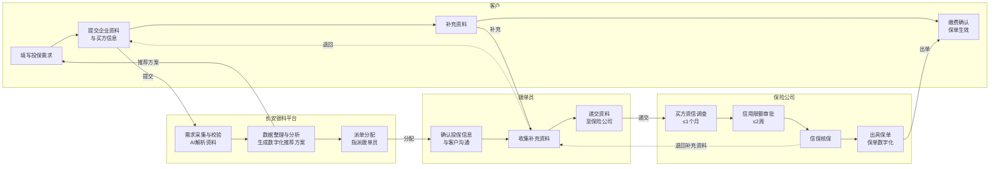
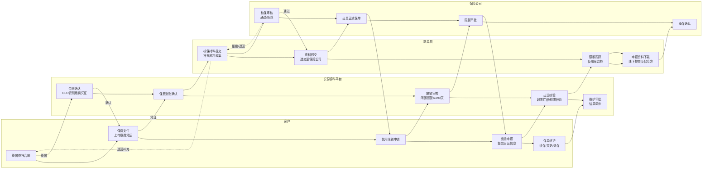
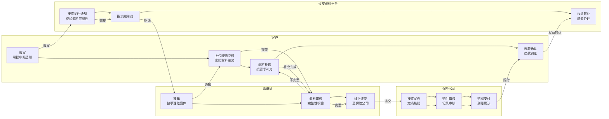

# 长安银科保险管理系统 - 产品原型设计文档

> 版本：v2.8（规范化整理版）
> 更新日期：2026-05-22
> 依据：原始需求字段信息.md

---

## 目录

1. [技术方案](#一技术方案)
2. [导航结构设计](#二导航结构设计)
3. [业务流程图](#三业务流程图)
4. [保险购买模块](#四保险购买模块)
5. [保单管理模块](#五保单管理模块)
6. [保险理赔模块](#六保险理赔模块)
7. [跟单员管理模块](#七跟单员管理模块)
8. [数据统计模块](#八数据统计模块)
9. [合规校验与状态约束](#九合规校验与状态约束)
10. [视觉规范与角色视图](#十视觉规范与角色视图)
11. [开发计划](#十一开发计划)

---

## 一、技术方案

### 1.1 技术栈选择

| 技术          | 选择               | 说明                |
| ----------- | ---------------- | ----------------- |
| **前端框架**    | Vue 3            | 采用Composition API |
| **UI组件库**   | TDesign Vue Next | 腾讯企业级UI组件库        |
| **构建工具**    | Vite             | 快速开发构建工具          |
| **路由管理**    | Vue Router 4     | SPA路由管理           |
| **状态管理**    | Pinia            | 轻量级状态管理           |
| **CSS预处理器** | SCSS             | 样式复用与变量管理         |

### 1.2 项目结构

```
cayk-bx-ui/
├── src/
│   ├── api/                    # API接口管理（暂为空，待实现）
│   ├── assets/styles/          # 全局样式与主题变量
│   ├── components/common/      # 公共组件
│   ├── layouts/MainLayout.vue  # 主布局（侧边栏+内容区+角色切换）
│   ├── pages/                  # 页面组件（共22个）
│   │   ├── insurance/          # 保险购买模块（5页）
│   │   ├── policy/             # 保单管理模块（7页）
│   │   ├── claim/              # 理赔管理模块（3页）
│   │   ├── clerk/              # 跟单员管理模块（4页）
│   │   └── statistics/         # 数据统计模块（2页）
│   ├── router/index.js         # 路由配置（共24条路由含重定向）
│   ├── stores/                 # Pinia状态管理
│   ├── App.vue
│   └── main.js
├── index.html
├── package.json
├── vite.config.js
└── README.md
```

---

## 二、导航结构设计

### 2.1 整体导航架构

采用**左侧导航栏 + 顶部Header**的经典后台管理模式。

### 2.2 菜单项详细配置

| 一级菜单      | 二级菜单     | 路由路径                | 可见角色              | 说明                  |
| --------- | -------- | ------------------- | ------------------- | ------------------- |
| 保险购买     | 投保信息管理   | /insurance/purchase | 客户、长安银科、跟单员     | 投保申请列表与管理         |
|           | 投保流程管理   | /insurance/apply    | 长安银科、跟单员        | 投保审核流程管理          |
|           | 投保数据报表   | /insurance/report   | 长安银科、跟单员        | 投保数据统计报表         |
| 保单管理     | 保单信息管理   | /policy/list        | 客户、长安银科、跟单员     | 保单列表与管理          |
|           | 信用限额管理   | /policy/limit       | 长安银科、跟单员        | 买方信用限额管理         |
|           | 出运申报管理   | /policy/shipment    | 客户、长安银科、跟单员     | 出运申报与管理          |
|           | 流程管理     | /policy/process     | 长安银科、跟单员        | 保单生命周期流程管理       |
| 保险理赔     | 理赔信息管理   | /claim/list         | 长安银科、跟单员        | 理赔列表与管理          |
|           | 理赔流程管理   | /claim/process      | 长安银科、跟单员        | 理赔流程管理          |
|           | 理赔报表管理   | /claim/report       | 长安银科、跟单员        | 理赔数据统计报表         |
| 跟单员管理    | 跟单员信息    | /clerk/list         | 长安银科              | 跟单员列表与管理         |
|           | 权限管理     | /clerk/permission   | 长安银科              | 跟单员权限配置          |
|           | 业务管理     | /clerk/task         | 长安银科、跟单员        | 任务分配与抢单          |
|           | 考核管理     | /clerk/performance  | 长安银科              | 跟单员绩效考核          |
| 数据统计     | 业务数据统计   | /stats/business     | 长安银科、跟单员        | 业务数据分析           |
|           | 风险数据分析   | /stats/risk         | 长安银科、跟单员        | 风险评估与预警          |

---

## 三、业务流程图

> 以下三个泳道图分别对应保险投保、保单管理、保险理赔三大核心业务流程。角色泳道包括：客户、长安银科平台、跟单员、保险公司。流程图涵盖各角色间的协作关系与关键流转节点。

### 3.1 保险投保流程



**流程说明：**
1. 客户在平台填写投保需求并提交企业基本资料与买方信息
2. 长安银科平台AI解析资料，自动填充客户基本信息，生成数字化推荐投保方案
3. 平台派单给跟单员，跟单员与客户沟通确认投保信息
4. 如需补充资料则退回给客户补充，补充完成后跟单员递交资料至保险公司
5. 保险公司进行买方资信调查（1个月内）、信用限额审批（2周内）、核保
6. 核保通过后出具保单，客户缴费确认，保单生效
7. 如核保退回，补充资料后重新递交

### 3.2 保单管理流程



**流程说明：**
1. 客户与长安银科签署委托合同，长安银科确认后进入保费支付环节
2. 客户上传缴费凭证，长安银科进行OCR识别确认缴费到账
3. 跟单员收集核保材料，提交至保险公司核保
4. 保险公司核保通过后出具正式保单，未通过则退回补充资料
5. 客户申请信用限额，平台审核后提交保险公司审批
6. 客户进行出运申报，平台校验超限/期限/保费冻结规则
7. 跟单员下载申报资料，线下提交至保险公司进行承保确认
8. 保单维护阶段支持续保、变更、退保操作，长安银科审批后结果同步

### 3.3 保险理赔流程



**流程说明：**
1. 客户发起报案（可损申报告知），长安银科平台接收案件通知并校验资料完整性
2. 资料完整则指派跟单员，跟单员接单后通知客户上传理赔资料
3. 客户提交索赔材料，跟单员审核资料完整性
4. 如资料不完整退回客户补充，补充完成重新提交
5. 资料完整后跟单员线下递交至保险公司
6. 保险公司进行定损核赔、赔付审核，最终支付赔款
7. 客户确认赔款到账，办理权益转让与融资手续

---

## 四、保险购买模块

### 4.1 字段清单

#### 4.1.1 客户基本信息字段

| 字段名称                      | 字段说明          | 必填 | 数据来源      | 组件类型   |
| ------------------------- | ------------- | -- | --------- | ------ |
| enterpriseName            | 企业名称（与证照一致）   | ✓  | AI解析/客户填报 | Input  |
| unifiedSocialCreditCode   | 统一社会信用代码（18位） | ✓  | AI解析      | Input  |
| businessLicense           | 企业法人营业执照扫描件   | ✓  | 客户上传      | Upload |
| importExportQualification | 对外贸易经营者备案登记表  | ✓  | 客户上传      | Upload |
| enterpriseAddress         | 企业实际经营地址      | ✓  | AI解析/客户填报 | Input  |
| contactName               | 联系人姓名         | ✓  | 客户填报      | Input  |
| contactPhone              | 联系电话（手机/座机）   | ✓  | 客户填报      | Input  |
| contactEmail              | 电子邮箱          | -  | 客户填报      | Input  |

#### 4.1.2 买方信息字段

| 字段名称                        | 字段说明              | 必填 | 数据来源      | 组件类型   |
| --------------------------- | ----------------- | -- | --------- | ------ |
| buyerName                   | 买方准确全称（与国外买方合同一致） | ✓  | 客户填报      | Input  |
| buyerAddress                | 买方实际地址            | ✓  | 客户填报      | Input  |
| buyerCountry                | 买方所在国家/地区         | ✓  | 客户填报      | Select |
| buyerCreditRating           | 买方信用评级            | -  | 保险公司调查    | Select |
| historicalTransactionAmount | 历史交易总额            | -  | 客户填报/系统统计 | Input  |
| authorizationDocument       | 授权保险公司联系买方的签字文件   | ✓  | 客户上传      | Upload |

#### 4.1.3 投保需求字段

| 字段名称                     | 字段说明    | 必填 | 数据来源      | 组件类型     |
| ------------------------ | ------- | -- | --------- | -------- |
| insuranceScheme          | 投保方案选择  | ✓  | 系统推荐/客户选择 | Select   |
| coverageAmount           | 投保金额/保额 | ✓  | 客户填报      | Input    |
| expectedInsuranceCompany | 期望保险公司  | -  | 客户填报      | Select   |
| policyDuration           | 保单期限    | ✓  | 系统推荐      | Select   |
| specialRequirements      | 特殊需求说明  | -  | 客户填报      | Textarea |

### 4.2 流程功能清单

| 流程节点   | 操作主体 | 办理时限 | 客户端资料清单                      | 平台功能支持           |
| ------ | ---- | ---- | ---------------------------- | ---------------- |
| 提交投保材料 | 客户   | /    | ①企业法人营业执照 ②进出口企业资格证书 ③买方基本信息 | AI解析资料自动填充客户基本信息 |
| 填写投保申请 | 客户   | /    | 《投保单》《买方信息采集表》               | 生成标准化投保文件        |
| 提交补充资料 | 跟单员  | /    | 根据跟单员反馈                      | 补充资料清单管理         |
| 资料提交   | 跟单员  | /    | 盖章版《投保单》《买方信息采集表》            | 文件审核流程           |
| 买方资信调查 | 保险公司 | 1个月  | 买方信息、授权文件                    | 补充资料录入           |
| 信用限额审批 | 保险公司 | 2周   | /                            | 限额审批流程           |
| 信保核保   | 保险公司 | /    | /                            | 核保流程管理           |
| 出具保单   | 保险公司 | /    | /                            | 保单数字化            |

### 4.3 页面原型设计

#### 4.3.1 投保信息管理页面 `/insurance/purchase`

**页面功能：**
- 投保申请列表展示与筛选
- 新增投保申请入口
- 投保单查看、编辑、删除操作

#### 4.3.2 投保流程管理页面 `/insurance/apply`

**页面功能：**
- 投保审核流程可视化（6步流程）
- 审核操作（通过/退回）
- 审核意见填写

#### 4.3.3 投保数据报表页面 `/insurance/report`

**页面功能：**
- 投保数据统计图表
- 数据导出功能

### 4.4 流程状态定义

| 状态码       | 状态名称    | 说明               |
| --------- | ------- | ---------------- |
| pending_review | 待审核     | 客户提交后等待审核      |
| clerk_review  | 跟单员审核   | 跟单员审核中         |
| approved    | 已通过     | 审核通过            |
| rejected    | 已拒绝     | 审核拒绝            |
| ocr_pending  | OCR待识别   | 保单数字化待处理       |

---

## 五、保单管理模块

### 5.1 字段清单

#### 5.1.1 信用限额申请字段

| 字段名称            | 字段说明          | 必填 | 数据来源      |
| ------------- | ------------- | -- | --------- |
| buyerName     | 买方名称          | ✓  | 客户填报      |
| creditLimit   | 申请限额          | ✓  | 客户填报      |
| paymentTerm   | 付款期限          | ✓  | 客户填报      |
| guaranteeType | 担保方式          | -  | 客户填报      |
| attachment    | 相关证明文件       | -  | 客户上传      |

#### 5.1.2 出运申报字段

| 字段名称            | 字段说明          | 必填 | 数据来源      |
| ------------- | ------------- | -- | --------- |
| shipmentNo    | 出运编号          | ✓  | 系统生成      |
| buyerName     | 买方名称          | ✓  | 下拉选择      |
| amount        | 申报金额          | ✓  | 客户填报      |
| shipmentDate  | 出运日期          | ✓  | 客户填报      |
| dueDate       | 应付款日          | ✓  | 客户填报      |
| invoiceNo     | 发票编号          | -  | 客户填报      |
| transportMode | 运输方式          | -  | 下拉选择      |

#### 5.1.3 保单数字化页面字段（OCR + 人工校对）

| 字段名称            | 字段说明          | 数据来源          |
| ------------- | ------------- | ------------- |
| policyNo      | 保险单号          | OCR识别/可编辑      |
| insuranceCompany | 保险公司名称      | OCR识别/可编辑      |
| policyholder  | 投保人           | OCR识别/可编辑      |
| insured       | 被保险人          | OCR识别/可编辑      |
| coverageAmount | 承保金额         | OCR识别/可编辑      |
| premiumRate   | 费率            | OCR识别后匹配/可修改   |
| effectiveDate | 生效日期          | OCR识别/可编辑      |
| expiryDate    | 到期日期          | OCR识别/可编辑      |
| buyerInfo     | 买方信息（多买方）   | 支持多个买方填写       |
| creditLimit   | 买方信用限额       | 录入/校对         |

### 5.2 关键业务规则

| 规则域 | 规则名称 | 触发条件 | 系统行为 |
| --- | --- | --- | --- |
| 限额 | 出运申报限额校验（超限拦截） | 提交出运申报 | 超限额时弹窗阻断并提示 |
| 限额 | 单一买方/国家集中度限制（CPIC） | 限额申请/出运申报 | 超限阻止提交并提示原因 |
| 闲置期 | 闲置预警/自动撤销（60天/90天） | 距上次出运>60天/90天 | 60天黄灯预警；90天红灯自动撤销 |
| 期限 | 出运申报期限规则 | 货物实际出运日后 | 默认出运后10个工作日内申报 |
| 保费 | 保费未缴冻结申报 | 出运申报提交且保费未缴 | 冻结出运申报权限，补缴后解冻 |
| 续保 | 续保启动与空窗期 | 到期前30天/空窗期存在 | 到期前30天提醒，空窗期暂停出运申报 |

### 5.3 页面原型设计

#### 5.3.1 保单列表页面 `/policy/list`

**页面功能：**
- 保单列表展示与筛选
- 保单详情查看
- 新增投保入口

#### 5.3.2 信用限额管理页面 `/policy/limit`

**页面功能：**
- 信用限额列表展示
- 限额申请/增额/冻结操作
- 限额使用率统计

#### 5.3.3 出运申报管理页面 `/policy/shipment`

**页面功能：**
- 出运申报列表展示
- 新增出运申报
- 超期预警提示

#### 5.3.4 保单生命周期流程管理页面 `/policy/process`

**页面功能：**
- 7步流程可视化（横向进度条+竖向时间线）
- 各阶段详情展示与操作
- 审批意见填写

### 5.4 流程状态定义

| 状态码       | 状态名称    | 说明               |
| --------- | ------- | ---------------- |
| pending_inkasso_sign | 待长安银科签署 | 合同待长安银科签署      |
| inkasso_signed  | 长安银科已签署 | 长安银科完成签署       |
| paid      | 已支付     | 保费已支付          |
| underwriting_submitted | 核保材料已提交 | 核保材料提交完成      |
| policy_issued | 保单已出具 | 保单已生效          |
| insurance_active | 保险生效中 | 保险责任有效期内      |

---

## 六、保险理赔模块

### 6.1 字段清单

#### 6.1.1 理赔关键字段

| 字段名称            | 字段说明          | 必填 | 数据来源      |
| ------------- | ------------- | -- | --------- |
| claimNo       | 理赔编号          | ✓  | 系统生成      |
| policyNo      | 关联保单号        | ✓  | 关联选择      |
| buyerName     | 买方名称          | ✓  | 关联选择      |
| claimAmount   | 索赔金额          | ✓  | 客户填报      |
| lossType      | 损失类型          | ✓  | 下拉选择      |
| lossDate      | 损失日期          | ✓  | 客户填报      |
| reportDate    | 报案日期          | ✓  | 系统自动记录    |
| status        | 理赔状态          | ✓  | 系统自动更新    |
| attachments   | 索赔材料          | ✓  | 客户上传      |

### 6.2 理赔流程设计

#### 6.2.1 五阶段理赔流程

| 阶段 | 节点名称    | 操作主体 | 说明               |
| --- | ------- | ---- | ---------------- |
| 1   | 报案     | 客户/长安银科 | 发起理赔报案        |
| 2   | 资料准备   | 客户     | 提交索赔材料        |
| 3   | 定损核赔   | 保险公司   | 损失核定与赔付计算     |
| 4   | 赔付到账   | 保险公司   | 赔款支付           |
| 5   | 权益转让与融资 | 长安银科   | 权益转让手续办理      |

#### 6.2.2 保险公司差异化规则

| 公司    | 报案时限 | 核赔时限 | 赔付时限 |
| ----- | ---- | ---- | ---- |
| 中国信保  | 损失后30天 | 60天   | 30天   |
| 人保财险  | 损失后15天 | 45天   | 20天   |
| 太平洋保险 | 损失后20天 | 50天   | 25天   |
| 大地保险  | 损失后15天 | 40天   | 15天   |

### 6.3 页面原型设计

#### 6.3.1 理赔列表页面 `/claim/list`

**页面功能：**
- 理赔列表展示与筛选
- 新增理赔报案入口
- 理赔状态跟踪

#### 6.3.2 理赔流程管理页面 `/claim/process`

**页面功能：**
- 5节点理赔流程可视化
- 各阶段详情查看与操作
- 资料上传与审核

### 6.4 流程状态定义

| 状态码       | 状态名称    | 说明               |
| --------- | ------- | ---------------- |
| reported  | 已报案     | 客户发起报案        |
| pending_receive | 待接收     | 等待保险公司接收      |
| received  | 已接收     | 保险公司已接收案件     |
| pending_assign | 待指派     | 等待理赔人员指派      |
| assigned  | 已指派     | 理赔人员已接手        |
| investigating | 调查中    | 正在进行损失调查      |
| assessing | 定损中     | 正在进行损失核定      |
| settled   | 已结案     | 理赔已完成          |

---

## 七、跟单员管理模块

### 7.1 字段清单

| 字段名称            | 字段说明          | 必填 | 数据来源      |
| ------------- | ------------- | -- | --------- |
| clerkId       | 跟单员编号        | ✓  | 系统生成      |
| clerkName     | 跟单员姓名        | ✓  | 管理员录入     |
| phone         | 联系电话          | ✓  | 管理员录入     |
| email         | 邮箱地址          | ✓  | 管理员录入     |
| department    | 所属部门          | ✓  | 下拉选择      |
| role          | 角色权限          | ✓  | 下拉选择      |
| status        | 在职状态          | ✓  | 下拉选择      |

### 7.2 页面原型设计

#### 7.2.1 跟单员列表页面 `/clerk/list`

**页面功能：**
- 跟单员列表展示与筛选
- 新增/编辑/删除跟单员
- 权限分配入口

#### 7.2.2 权限管理页面 `/clerk/permission`

**页面功能：**
- 角色权限配置
- 菜单权限分配

#### 7.2.3 业务管理页面 `/clerk/task`

**页面功能：**
- 任务列表展示
- 任务分配与抢单
- 任务状态跟踪

#### 7.2.4 考核管理页面 `/clerk/performance`

**页面功能：**
- 绩效考核指标展示
- 业绩统计图表
- 考核结果管理

---

## 八、数据统计模块

### 8.1 页面原型设计

#### 8.1.1 业务数据统计页面 `/stats/business`

**页面功能：**
- 投保数据分析
- 保单数量统计
- 保费收入分析
- 出运申报统计

#### 8.1.2 风险数据分析页面 `/stats/risk`

**页面功能：**
- 风险预警监控
- 买方信用分析
- 限额使用率分析
- 理赔风险评估

---

## 九、合规校验与状态约束

### 9.1 投保提交合规校验

| 校验点        | 规则                           | 触发时机   | 提示方式        |
| ---------- | ---------------------------- | ------ | ----------- |
| 必传附件-营业执照  | 必须上传“企业法人营业执照扫描件”            | 点击“提交” | 阻断提交 + 错误提示 |
| 必传附件-进出口资质 | 必须上传“对外贸易经营者备案登记表”           | 点击“提交” | 阻断提交 + 错误提示 |
| 必传附件-授权文件  | 必须上传“授权保险公司联系买方的签字文件”        | 点击“提交” | 阻断提交 + 错误提示 |
| 状态流转约束     | 仅“草稿/待补充/待提交”允许提交；其他状态禁止重复提交 | 点击“提交” | 阻断提交 + 错误提示 |

### 9.2 出运申报时限规则

| 场景       | 截止日计算规则     | 说明                          |
| -------- | ----------- | --------------------------- |
| 逐笔申报（默认） | 出运日期 + 15 天 | 出运后15日内申报                  |
| 出口至香港    | 出运日期 + 3 天  | 出口至香港3天内申报                 |
| 月度汇总申报   | 次月 10 日     | 每月10日前申报                    |

### 9.3 理赔新建合规校验

| 校验点        | 规则                           | 触发时机   | 提示方式        |
| ---------- | ---------------------------- | ------ | ----------- |
| 保单有效性    | 关联保单必须有效                  | 选择保单后   | 无效保单不可选      |
| 报案时限     | 超过报案时限需特殊说明                | 提交理赔时   | 阻断提交 + 错误提示 |
| 必传材料     | 关键证据材料必须上传                  | 点击“提交” | 阻断提交 + 错误提示 |

---

## 十、视觉规范与角色视图

### 10.1 整体风格

- **设计语言**：企业级简洁风格
- **主色调**：深蓝色系（#0052D9）
- **辅助色**：绿色（成功）、橙色（警告）、红色（错误）

### 10.2 角色视图权限

| 角色    | 可访问模块          | 不可访问模块        |
| ----- | ------------- | ------------- |
| 客户    | 保险购买、保单管理（部分）、理赔 | 跟单员管理、数据统计   |
| 长安银科 | 全部模块          | 无            |
| 跟单员   | 保险购买（审核）、保单管理、理赔 | 保费补贴管理、履约报表 |

---

## 十一、开发计划

### 11.1 V1基础版本（已完成）

| 阶段 | 模块 | 产出物 |
| --- | --- | --- |
| **阶段一** | 基础搭建 | 项目初始化、路由配置、布局组件、公共组件 |
| **阶段二** | 保险购买模块 | 投保信息管理页面、投保详情页面、新增投保页面 |
| **阶段三** | 保单管理模块 | 保单列表、贸易信息、信用限额、出运申报、流程管理页面 |
| **阶段四** | 理赔管理模块 | 理赔列表、理赔流程、理赔报表页面 |
| **阶段五** | 跟单员管理模块 | 跟单员列表、权限管理、业务管理、考核管理页面 |
| **阶段六** | 数据统计模块 | 业务统计页面、风险分析页面 |

### 11.2 V2增强计划

| 阶段 | 模块 | 内容 |
| --- | --- | --- |
| **V2-1** | 保单管理增强 | 保单数字化OCR页面、限额申请表单扩展、出运申报规则联动、续保/退保/变更交互 |
| **V2-2** | 理赔管理增强 | 理赔字段补齐、分公司规则展示、报案/索赔表单 |
| **V2-3** | 业务规则引擎 | 超限拦截、集中度约束、闲置预警、保费冻结、申报期限校验 |
| **V2-4** | API集成 | Axios封装、API接口层对接、真实数据替换Mock |
| **V2-5** | 测试数据与场景 | 3个测试场景入口、端到端验证 |